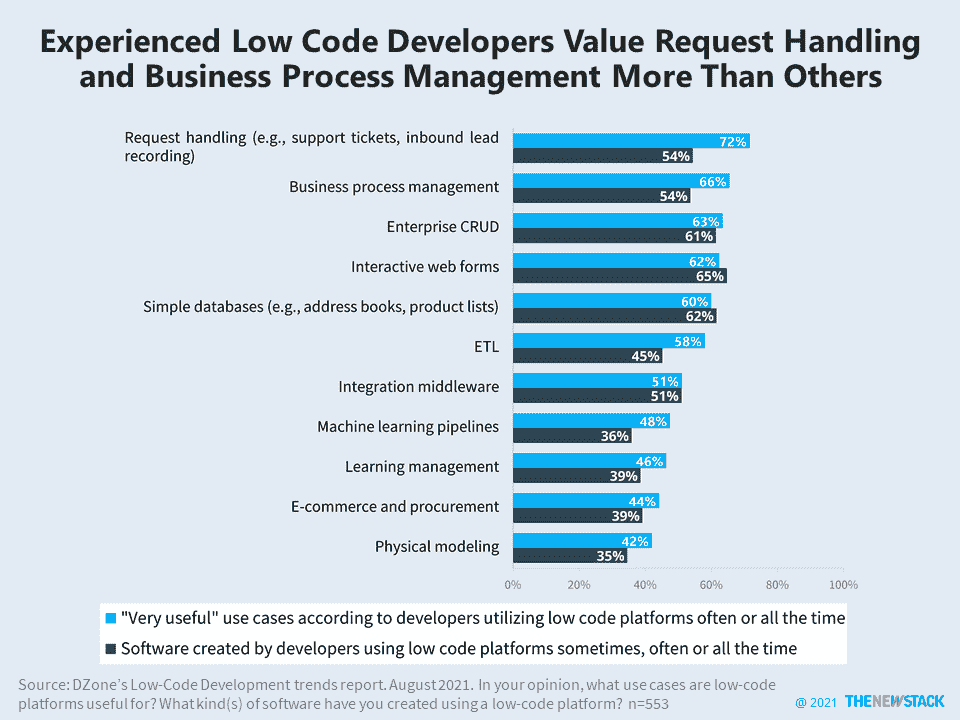

# 低代码和无代码采用是不是好到不真实？

> 原文：<https://thenewstack.io/is-low-code-and-no-code-adoption-too-good-to-be-true/>

大量的开发者和公司已经在使用低代码或无代码的可视化平台，这取决于你对“低代码”和“无代码”的定义在 DZone 最近的[低代码开发](https://dzone.com/trendreports/low-code-development-1)趋势报告的 672 名受访者中，超过 80%的人以前使用低代码平台来构建软件，23%的人经常或一直使用它们。请求处理和业务流程管理是特别有价值的用例，可能已经成熟，可以被新一轮开发人员进一步采用。

72%的低代码平台用户认为它们对请求处理非常有用，66%的用户认为它们对业务流程管理非常有用。然而，只有 54%有低代码经验的开发人员实际上以这种方式使用过平台。[业务自动化](https://thenewstack.io/why-businesses-want-to-enable-no-code-and-low-code-automation/)还没有达到其真正的潜力，根据 Mendix 的[低代码状态 2021](https://www.mendix.com/resources/the-state-of-low-code-report/) ，59%的低代码项目是 IT 和业务用户之间的协作。

Mendix 研究使用了低代码解决方案的广泛定义，包括其可视化软件开发方法。总的来说，77%的调查对象说他们的组织使用低代码，但是几乎同样多的人(72%)说这是一个他们不能错过的趋势。这远高于 TechRepublic 调查报告中使用低代码平台的 47%，也远低于 SlashData [估计的全球 14%的开发人员经常使用可视化开发工具。](https://www.developernation.net/resources/reports/state-of-the-developer-nation-q1-2021)

根据 Mendix 的调查，低代码采用者也看到了巨大的成本节约和投资回报，这就是为什么每个人都必须说他们想知道更多。我们也是，但是有些数字似乎好得不真实。我们期待看到更多长期实施的数据。

<svg xmlns:xlink="http://www.w3.org/1999/xlink" viewBox="0 0 68 31" version="1.1"><title>Group</title> <desc>Created with Sketch.</desc></svg>