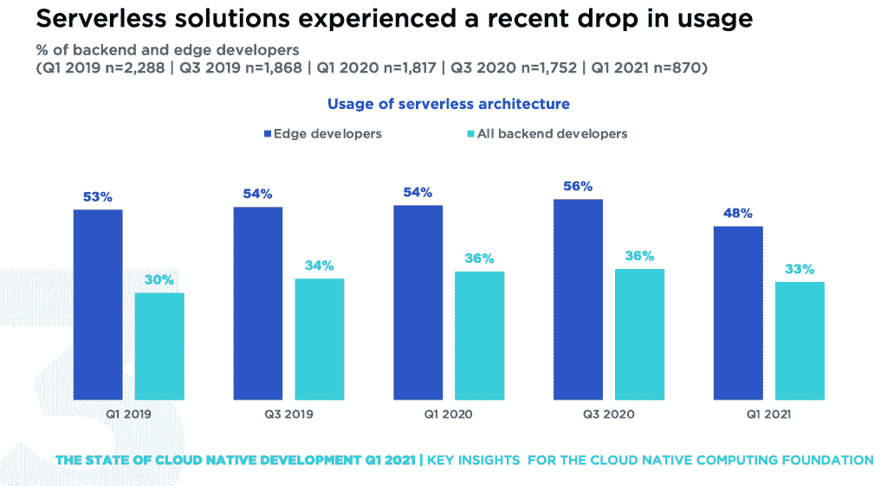

# 无服务器只是事件驱动架构的一个中途站吗？

> 原文：<https://thenewstack.io/is-serverless-just-a-stopover-for-event-driven-architecture/>

我最近审查了由云计算原生计算基金会支持的 SlashData 的云原生开发状态报告，该报告显示，从 2020 年第一季度到 2021 年第一季度，云原生技术有所下降。如果我大胆猜测，如果他们在 2022 年第一季度进行一次类似的调查，最好的情况下，无服务器使用将保持稳定，但更有可能是整体开发人员的百分比下降。

这让我认为围绕无服务器的炒作已经平息，尽管这并不意味着无服务器不会存在很长时间。

 [马克·辛克尔

Mark 在新兴技术和开源领域有着悠久的历史。在共同创立 TriggerMesh 之前，他是 Node.js 基金会的执行董事，也是 Citrix、Cloud.com 和 Zenoss 的高管，在那里他领导了开源项目。](https://www.linkedin.com/in/markrhinkle/) 

也许正如 CNCF 首席技术官克里斯·阿尼斯奇克[告诉](https://www.sdxcentral.com/articles/news/cncf-report-serverless-loses-steam-goes-off-edge/2022/01/) SDX 中心，“这一趋势反映了人们越来越担心无服务器技术缺乏广泛采用所需的灵活性，以及组织不愿意致力于特定的技术或提供商。”

这让我想起了几年前的另一个云趋势，平台即服务(PaaS)。有一段时间，AWS Elastic Beanstalk、Heroku 和 Cloud Foundry 被吹捧为应用程序部署的未来，但它们也受到模板化方法的困扰，缺乏解决企业更广泛需求的灵活性。

这非常类似于今天，无服务器本身可能是事件驱动架构中更大趋势的一个更有限的子模式。

## **无服务器不是失败，而是实现细节**

无服务器的采用在早期增长非常快，在 Node.js 用户中大量采用，他们希望在云中快速部署他们的应用程序，主要是在 AWS Lambda 上。此后不久，Lambda 和其他功能即服务提供商提供了更多的运行时，几乎任何现代代码甚至一些长期部署的[遗留代码](https://aws.amazon.com/blogs/opensource/serverless-cobol-rejuvenating-legacy-code-with-open-source-software/)都可以在无服务器框架中执行。

无服务器确实说明了许多可取的特点。向上扩展和向下扩展都很容易。它由推送的事件触发，而不是通过轮询机制。函数只根据该作业的需求消耗资源，然后退出并释放资源用于其他工作负载。开发人员受益于基础设施的抽象，可以通过 CI/CD 管道轻松地部署代码，而无需考虑如何提供资源。

然而，Aniszczyk 提到的要点是，无服务器不是为许多情况设计的，包括长时间运行的应用程序。对于最终用户来说，它们实际上比在容器、虚拟机或裸机上运行专用应用程序更昂贵。作为一种固执己见的解决方案，它迫使开发人员采用供应商提供的模型。此外，无服务器没有简单的方法来处理状态。

最后，尽管无服务器部署主要部署在云中，但它们不容易跨云提供商部署。用于管理无服务器的工具和机制非常特定于云，尽管也许随着 Knative 向 CNCF 的捐赠，可能会有一个无服务器平台可以在业界的支持下开发和部署，就像 Kubernetes 一样。

关键是，许多使无服务器成功的东西实际上适用于云原生计算中一个更有趣、更大的趋势:事件驱动架构(EDA)。

## **云原生计算中的事件驱动架构**

我认为，无服务器的成功更多地是因为它具有超越无服务器的广泛使用案例的优势。首先，系统能够根据实时变化处理数据的想法是传统批处理应用程序的一大优势。异步生成事件的使用是非阻塞的，允许应用程序继续工作，而不必等待响应。也没有必要轮询应用程序，因为它们是数据的订阅者，而且没有聊天会减少网络 I/O。

我花了相当多的时间思考这个话题，在 TriggerMesh，我们是无服务器的早期采用者。我们首先想到的是，云提供商之间缺乏一致的工具会导致锁定。这是今天发生的事情。不仅如此，并不是所有的无服务器运行时都是平等创建的，这阻止了功能从一个提供者迁移到另一个提供者。此外，这些云提供商中很少有一种机制能够在一个云中或内部将服务触发到另一个云中。我们最初着眼于如何将无服务器功能发布到不同的云，但是这很麻烦，并且需要将运行时从一个云移植到另一个云。我们发现，最终用户真正需要的是创建数据管道的能力，使数据具有可操作性，而不是简单地将数据投入运行。

除了可移植性之外，我们看到，当您想要使用来自无服务器提供商之外的系统的输入来触发函数时，触发这些函数的问题是一场噩梦。我们意识到像 Google EventArc 和 AWS EventBridge 这样的工具在创建更广泛的事件驱动应用程序时缺乏灵活性。所以我们开发了 EventBridge 的开源替代方案[,它不仅可以将数据流发送到任何无服务器平台，还可以用来更容易地构建数据管道，以淹没数据湖并执行其他类型的数据同步。](https://www.triggermesh.com/open-source)

## **事件驱动的数据同步和工作流**

我相信，我们正在走向一个事件和数据驱动的未来，在这个未来，实时处理数据的能力正在成为开展数字业务的一项要求。等式的第一部分需要类似于 AWS Kinesis 的数据流技术，但不是针对单一供应商的。Apache Kafka 和 Apache Pulsar 符合这一要求，因为它们是开源的、与云无关的方式，可以让数据运行起来。然后下一步是采用跨微服务的发布-订阅通信，而不是对 API 进行 REST 调用。

云的未来不一定是一体化供应商。我们曾经走过这样的路，用户为了方便，牺牲了选择同类最佳解决方案的自由，而选择了一家供应商提供的预组装堆栈，这家供应商提供了一种“令人窒息的解决方案”未来是一流技术的可组合系统，而不是来自单一供应商的堆栈。面向云原生用户的新设计模式是可组合的基础设施，因此也是可组合的应用程序，这些应用程序是不同供应商的合并，并通过用于创建自动化工作流的事件流连接在一起。

在科尔曼·巴夏礼进行的名为“伟大的 EDA 迁移”的[调查中，85%的大多数组织认识到采用事件驱动架构的关键商业价值，但采用仍处于早期阶段，只有 13%的组织声称已实现完全的 EDA 成熟。根据这项研究，实时数据的三个最常见的应用是:应用集成——无服务器用例属于这一类；跨应用程序的数据共享；以及连接物联网设备以获取数据和/或进行分析。](https://solace.com/resources/white-papers/the-great-eda-migration-2021-survey-results)

出于许多原因，现在是考虑构建事件驱动架构的时候了。如果您希望增加数据的新鲜度并改善数字交互，EDA 可以带来改进，并且实现这一点的工具比以往任何时候都更好。首先，有越来越多的免费和开源工具允许企业创建数据流；阿帕奇卡夫卡和阿帕奇脉冲星位居榜首。此外，在云上开发的应用程序可以提供从内部数据到几乎任何提供 Kubernetes 的云的可移植性。最后，我认为还有其他工具，如 TriggerMesh 的[开源云原生集成平台](https://www.triggermesh.com/product-overview)，它提供了多云功能来创建和管理数据管道，可用于复制 AWS 的“EventBridge”功能。我相信，随着企业对实时信息的渴求以及需要使用这些数据的系统数量的增加，向事件驱动架构模式的迁移也会增加。对他们来说幸运的是，有越来越多的替代方法可以将他们锁定在专有的云服务或软件供应商上。

<svg xmlns:xlink="http://www.w3.org/1999/xlink" viewBox="0 0 68 31" version="1.1"><title>Group</title> <desc>Created with Sketch.</desc></svg>