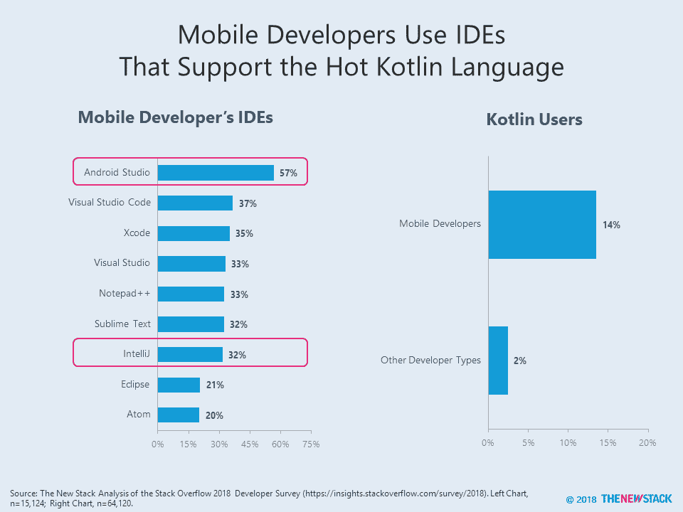

# JetBrains 的 IntelliJ 是真正的 Android 垄断吗？

> 原文：<https://thenewstack.io/is-the-jetbrains-intellij-the-real-android-monopoly/>

本周，欧盟对谷歌€处以 43 亿欧元(50 亿美元)的罚款，原因是谷歌滥用安卓在移动设备市场的主导地位。这一论点与 20 年前针对微软的论点如出一辙——即“迫使”OEM 厂商捆绑销售其浏览器，使其在搜索广告市场获得了不正当的优势。

我们不是反垄断专家，但我们注意到，独立开发环境(ide)是谷歌拥有优势的另一个领域，而微软曾经独领风骚。根据 2018 年 StackOverflow 调查，40%的开发人员使用 Visual Studio 代码或 Visual Studio。19%的人使用谷歌的 Android Studio，但如果看看五分之一的受访者使用移动应用程序，这个数字会发生巨大变化。在这个群体中，57%的人使用 Android Studio 作为开发环境。

局外人可能不知道这一点，但 [Android Studio 是基于 JetBrains 的 IntelliJ](https://blog.jetbrains.com/idea/2013/05/intellij-idea-and-android-studio-faq/) 。因此，尽管它们是不同的产品，但实际上用户体验和功能是相似的，这使得 JetBrains 在试图销售其软件的付费版本时具有优势。在移动开发者中，32%的人使用 IntelliJ。这两个 ide 之间的联系显示在采用数据中。使用 IntelliJ 用户的五分之四的移动开发者也使用 Android Studio。44%使用 Android Studio 的移动开发者也使用 IntelliJ。

除了共同的传统，Kotlin 还是将 Android Studio 和 IntelliJ 结合在一起的另一个因素。对于一种相对较新的语言来说，14%的手机开发者使用这种语言意义重大。对于那些使用 Kotlin 的人来说，多达 93%的人正在使用上述 ide 之一。

Pusher 的 [Zan Markan](https://twitter.com/zmarkan) 最近[写了](https://thenewstack.io/what-we-learned-about-kotlins-growth-this-year/)关于调查数据，表明 Kotlin 是未来移动开发不可或缺的一部分。事实上，79%的用户说没有他们不喜欢的功能。难怪 StackOverflow 调查中有整整 37%的移动开发者预计到 2018 年底会使用 Kotlin。除了 Android 品牌的内容，JetBrains 是人们了解 Kotlin 的下一个主要途径。凭借其强大的地位，预计它将吸引寻求专业级功能和支持的新客户。

IntelliJ 是否在移动开发者中占据主导市场份额并不重要。这并没有转化为监管者所关心的那种垄断，因为它没有利用自己的地位伤害竞争对手。事实上，IDE 市场传统上一直由免费和廉价的软件主导，产品之间竞争激烈。也就是说，在一个市场中成为第一有它的优势。

通过 [Flickr 的特色图片。](https://www.flickr.com/photos/wwarby/11513503393)

<svg xmlns:xlink="http://www.w3.org/1999/xlink" viewBox="0 0 68 31" version="1.1"><title>Group</title> <desc>Created with Sketch.</desc></svg>