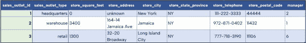
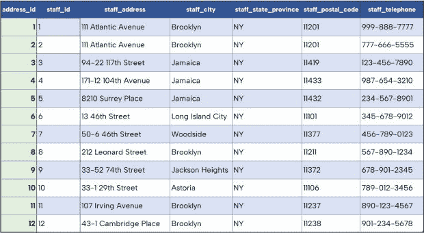

# 这是数据重构的终结吗？

> 原文：<https://thenewstack.io/is-this-the-end-of-data-refactoring/>

在我早期的一个编码项目中，我记得我参加了需求会议，制定了一个数据模型，起草了一个数据库设计，并提交给 DBA 团队进行审查和批准。在命名、数据类型和结构约定上有许多来回的沟通。几周后，在开发环境中创建了这些表，这样我就可以接收测试数据，并根据这些数据构建和测试代码。

当需求发生变化，或者当涉众对数据模型的理解发生变化，或者测试数据迭代产生不同的结果，或者范围蔓延进入项目，我们将重新开始数据模型—>数据库设计—> DBA 评审/批准—>开发创建过程。

像这样的项目不是一次性的。通常，在开发、生产、维护和增强的每个迭代过程中，都会耗费大量的项目时间。通过减少或消除数据模型和数据库设计之间的转换步骤，您可以极大地缩短上市时间和维护成本。我希望我以前就能做到。

## 什么是数据重构？

数据重构的根源可能要追溯到应用于计算机程序的代码重构。正如[马丁·福勒在他的同名书中对重构](https://refactoring.com)的定义，它是“一种重组现有代码体的训练有素的技术，改变其内部结构而不改变其外部行为。”

但是重构如何应用于数据和数据库呢？

代码重构通常在最初的草稿之后，或者当需要对代码进行改进或添加特性时进行。这些变化中的任何一个都可能在项目最初实现之前或之后影响到项目，无论是哪种情况，都会使代码更干净、更高效、更易维护。由于支持代码的数据结构的变化，也可能发生一些重构。由于对数据模型的更深入理解，以及对收集的数据的增加和减少，经常会发生这样的变化。

重构同时发生在数据和数据模型中。虽然代码重构可以在没有数据模型重构的情况下发生，但代码几乎总是会受到底层数据模型变化的影响。数据重构成为模型、存储系统和代码重构的来源。每一块都需要精心的规划和透彻的理解，这就增加了可观的项目资源。

我们看到了通过更好的数据和代码进行重构的积极好处。所以花的时间不值得吗？这里有什么麻烦？

看看项目的数据重构组件，有几个任务伴随着它，包括:

*   对数据模型进行更改，以适应新的情况、功能等。
*   使数据模型与存储技术的格式保持一致，如关系、图形或其他格式。每种类型的数据存储格式都有自己的一套规则，因此我们通常会对数据做进一步的修改，以适应所需的结构。

数据模型和数据存储步骤之间的“转换”步骤可能会很麻烦，尤其是当项目经理批准更改时，以便在现实世界的数据配置和数据库的结构化格式之间正确地调整数据结构。图形数据库可以缩短或减少翻译阶段，因为它们更自然地模拟现实世界中存在的数据。

## 数据库的数据重构

[在之前的文章](https://thenewstack.io/do-we-need-data-normalization-anymore/)中，我们使用了一家咖啡店的数据集，包括销售收据、产品和顾客。我们可以使用相同的数据集来研究数据重构，但是在这个例子中，我们关注数据的不同部分:商店及其人员分配。这些例子中的所有数据、变更脚本等等都可以从[这个 GitHub 库](https://github.com/JMHReif/data-refactoring)下载。

我们的示例数据集在下面的表 1 和表 2 中。商店位置包括关于位置类型、大小、地址细节、电话号码和指定经理的数据。员工表包含每个员工的姓名、职位、开始日期和指定的工作地点。

表 1:商店位置表

表 2:人员表

该数据的图形表示类似于下面的图 1。

图 1:商店位置和员工的图表表示

在这个图模型中，我们有两个主要实体(节点):**商店**和**员工**。这些节点之间的关系告诉我们它们是如何连接的。要么指派一名工作人员在一个地点工作，要么由一名特定的工作人员管理一家商店。

接下来，让我们看看一些特定的重构会如何影响这些模型。

### 重构 1:添加新列

存储附加信息是数据库项目中常见的变化。在我们的咖啡店案例中，我们可能还想跟踪一个商店位置的开业日期(一个位置已经经营了多长时间)。对于关系格式，更改过程将涉及向表中添加一个新列。这可能还需要:

*   向利益相关者解释变更。
*   编写并执行一个[数据定义语言(DDL)](https://www.techopedia.com/definition/1175/data-definition-language-ddl) 语句来改变表结构，或者删除整个表并用 DDL 中的新列重新构建它。
*   将新数据添加到群体集合中。
*   最后，将实际数据导入表中。

在这些任务之间，可能需要额外的变更批准步骤。这一更改不会影响 staff 表，因此不需要对其进行任何更改。这一重构的结果如表 3 所示。

表 3:商店位置表的第一个重构

同时，对于图形格式，我们需要向 **Shop** 节点添加一个新属性。与上面的关系过程类似，我们需要向利益相关者解释变更，并获得任何必要的变更批准。然而，删除数据结构、添加数据结构和设置新的数据结构都被图形方法所消除，因为没有严格的 DDL。有了 graph，结构就不会强加在数据上。更确切地说，数据本身决定了结构，并且可以在数据所代表的信息发生变化时进行调整，如图 2 所示。

图 2:图的第一次重构

我们在 GitHub 上的[代码库中包含了关系和图形流程的示例脚本。](https://github.com/JMHReif/data-refactoring)

### 重构 2:添加新表和关系

接下来，假设我们的员工覆盖范围存在问题。我们希望保留员工地址，以帮助我们确定谁能够在另一个地点轮班。

虽然我们可以将员工地址直接存储在 **Staff** 表中，但是地址比其他数据更容易改变，我们可能希望将员工的个人信息与其业务信息分开。我们可以创建一个单独的表来存储地址，这意味着在 staff 行和具有新列的相关地址之间创建一个外键关系，以及用于新表结构和数据插入的语句。

表 4:将外键列 **address_id** 添加到 **Staff** 表

表 5:新增**人员 _ 地址**表

对于 graph，我们需要添加新的 **StaffAddress** 节点的数据以及与 Staff 节点的关系，如图**图 3** 所示。现有数据不会受到影响，因此我们不需要改变数据库中的人员实体。

图 3。重构图 2

### 重构 3:向现有表中添加数据

对于我们的第三次也是最后一次重构，业务正在蓬勃发展，我们可能希望在新的商店位置增加新雇用的员工。

在关系结构中，在表中创建一个新的职员意味着添加一个商店位置分配以使行完整。我们可能需要某种[依赖规则(约束)](https://www.w3schools.com/sql/sql_foreignkey.asp)来确保我们不能在 **Staff** 表的 location 列中插入一个值，如果它不存在于 **Shop_Location** 表中的话。如果我们想将新员工的地址添加到 **Staff_Address** 表中，我们也需要在该表中设置相同的护栏。这意味着分配到新地点的任何新员工都需要我们首先创建[地点，然后是员工，然后是他们的地址](https://github.com/JMHReif/data-refactoring/blob/main/refactoring3/relational/refactor3-ddl.sql)。以错误的顺序执行这些步骤会导致错误。

表 6: **带有新行的商店位置**表

表 7: **人员表**新增 2 名人员

表 8: **Staff_Address** 有两个新地址的表

对于图 4 中的图表版本，我们只需添加新数据。结构保持不变，现有数据不受影响。

图 4。重构图 3

## 图表减少了数据重构

您已经看到了数据重构如何影响关系数据库和图形数据库。由于表结构和实际数据的分离，关系数据库需要更密集的过程来进行更改。相比之下，图消除了现实世界数据和数据库结构之间的额外转换步骤，因为它们更自然地模拟现实世界中存在的数据。

这个例子可能看起来很小，与真实世界相比显得微不足道。然而，当你拥有数十家商店、数千名员工和数十万个送货地址时，会发生什么呢？业务关键型系统阻碍团队做出改变，因为涉及到劳动力和对他们组织的工作流程的潜在影响。图表保留我们已经拥有的数据和模型，只改变已经改变的。

图形重构允许企业具有适应性和灵活性，使他们能够随着行业或周围数据的变化而变化。将现有项目转移到图中可以减少上市时间，同时提高未来的可维护性、风险缓解和附加功能开发。

## 从哪里开始

<svg xmlns:xlink="http://www.w3.org/1999/xlink" viewBox="0 0 68 31" version="1.1"><title>Group</title> <desc>Created with Sketch.</desc></svg>