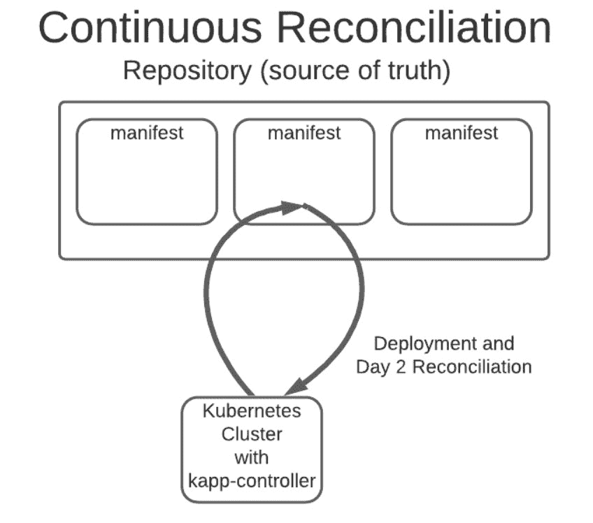

# VMware 的 Carvel 捐赠只是另一个 CNCF 沙盒吗？

> 原文：<https://thenewstack.io/is-vmwares-carvel-just-another-cncf-sandbox/>

VMware 的 Carvel 项目已经正式加入了一长串[云本地计算基金会(CNCF)](https://thenewstack.io/future-cloud-native-computing-foundation/) 沙盒项目以及其他几十个项目。但在将 Carvel 视为另一种据称有助于在 Kubernetes 环境下开发应用程序的方式之前，Carvel 已经看到了一些至少值得再看一眼的用例，其创作者表示，自今年年初以来，下载量已超过 30 万次。

对于 [Carvel](https://carvel.dev/) 来说，一个更突出的案例是它如何被用于 [Tanzu](https://thenewstack.io/vmwares-tanzu-extends-across-all-security-layers-on-kubernetes/) 和其他 VMware 平台和工具的开发和部署。换句话说，如果您将 VMware 的 Tanzu 用于云原生环境，您可能已经间接甚至直接受益于开源平台。也有充分的证据表明，VMware 仍然大力致力于开发和支持 Carvel，尤其是考虑到其旗舰产品 Kubernetes 和平台的成功取决于它在许多方面的运行情况。

## 进一步整合

Carvel 应用程序包可以部署到 VMware 的“red hot”kube apps 应用程序平台以及 Tanzu 框架，在 Tanzu 框架中，Carvel 为 Kubernetes 集群管理提供了一系列以应用程序为中心的工具，[企业管理协会(EMA)](https://www.linkedin.com/in/torstenvolk) 的分析师 Torsten Volk 告诉新的堆栈。“我期待这些工具与 Tanzu 和 Kubeapps 的进一步集成，并且不太担心 VMware 对 Carvel 失去热情，”Volk 说。“在过去的 12 个月中，60 名开发人员提交了 257 个代码，这一非常可靠的指标支持了我的预测。”

同样，Carvel 加入了其他平台的行列，包括[大使实验室](https://www.getambassador.io/?utm_content=inline-mention)、 [Acorn 实验室](https://acorn.io/)和其他平台，尽管它也不一定与这些提供商竞争。它还提供了 GitOps 功能，可以用来取代领先的 GitOps 工具，如 [Argo CD](https://argo-cd.readthedocs.io/) 和 [Flux](https://runonflux.io/) ，尽管用户仍然可以使用 Carvel 工具，并继续为 GitOps 使用 Argo CD 或 Flux，如果他们愿意的话。

它的创造者说，一个关键的区别是，Carvel 与其说是一个平台，不如说是一套工具，用于自动化和解决组织在 Kubernetes 上开发和部署应用程序时遇到的问题。在这方面，Carvel 提供了一个特定工具的列表，而不是一个包罗万象的平台。

该项目的早期采用者包括: [Twilio、](https://www.twilio.com/) [TeraSky、](https://www.terasky.com/)[美国陆军](https://www.army.mil/)等，以及如上所述，VMware 将 Carvel 用于 [Tanzu Mission Control (TMC)](https://tanzu.vmware.com/mission-control) 和 [Tanzu Kubernetes Grid (TKG)。](https://docs.vmware.com/en/VMware-Tanzu-Kubernetes-Grid/index.html)

无论是 DevOps 团队还是用户想要使用 Carvel，它肯定可以帮助那些在生产流水线自动化方面苦苦挣扎的组织，VMware 的 [Valentina Alaria](https://www.linkedin.com/in/valentinaalaria) 上周在底特律的 KubeCon + CloudNativeCon 上告诉新堆栈，在此期间，Carvel 正在成为一个沙盒项目的 [CNCF](https://cncf.io/?utm_content=inline-mention) 。

“这种想法是，你可能有不同的剧本，你必须手动运行，但有了 Carvel 的模块化，你可以使用 Carvel 和其他工具来帮助自动化界面，”Alaria 说。

## 回购清单

在 [GitHub](https://github.com/vmware-tanzu/carvel) 上传达的 [Carvel](https://carvel.dev/) 项目回购清单如下:

*   [ytt](https://github.com/vmware-tanzu/carvel-ytt)–通过 YAML 结构，而不是文本文档，模板和覆盖 Kubernetes 配置。
*   kapp–安装、升级和删除多个 Kubernetes 资源作为一个“应用程序”
*   [kbld](https://github.com/vmware-tanzu/carvel-kbld)–以不可变的方式在 Kubernetes 配置中构建或引用容器映像。
*   [img pkg](https://github.com/vmware-tanzu/carvel-imgpkg)–通过 Docker 注册表捆绑和重定位应用程序配置(带映像)。
*   [kapp-controller](https://github.com/vmware-tanzu/carvel-kapp-controller)–在 App CRD 中捕获应用部署工作流。由 kapp 提供可靠的 GitOps 体验。
*   [vendir](https://github.com/vmware-tanzu/carvel-vendir)–声明目录中应该有哪些文件。
*   [secret gen-controller](https://github.com/vmware-tanzu/carvel-secretgen-controller)–提供 CRD 来指定集群上需要哪些秘密(生成或不生成)。

实验性:

美国陆军使用 Carvel 为士兵提供在受限环境中部署的自由。

美国陆军最近描述了如何使用 Carvel 来帮助其用户在高度受限的环境中使用和部署软件。用户包括正在开发软件的军队士兵。美国陆军代表表示，Carvel 在允许陆军用户克服 kubectl 访问和使用的挑战方面发挥了重要作用，这些挑战在环境中受到防火墙限制或连接问题的阻碍。美国陆军最终使用 Carvel [kapp-controller](https://carvel.dev/kapp-controller/) 来帮助自动化允许用户从 Kubernetes 环境的高度分布式本质中受益的过程，而不给予他们完全访问权，同时保留受限访问权。

阿拉里亚说，换句话说，卡沃尔赋予了那些在军队服役的人为分布式环境开发和部署代码和应用程序的能力，而他们以前由于安全限制而无法这样做。

<svg xmlns:xlink="http://www.w3.org/1999/xlink" viewBox="0 0 68 31" version="1.1"><title>Group</title> <desc>Created with Sketch.</desc></svg>