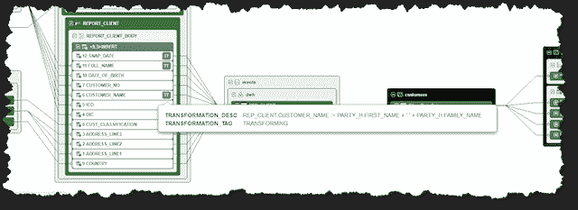

# 您的数据血统是否有助于您做出明智的决策和设置优先级？

> 原文：<https://thenewstack.io/is-your-data-lineage-helping-you-make-smart-decisions-and-set-priorities/>

今天，每个人都在谈论数据血统，以及它的每一个可能的方面:你的代码、你的值、你的运行时进程的血统，甚至你的衣服的血统(开玩笑)。然后是法规遵从性、信任以及问题解决或影响分析的沿袭。这种情况会持续下去，需要跨越所有数据管道的沿袭，需要内部解决方案的沿袭，需要遗留工具的沿袭，需要全新的云解决方案的沿袭，需要内部构建的东西的沿袭。

有方法和最佳实践，以及自动化和描述性的混合方法来完成这一切。但是我想谈谈你是如何很好地利用你正在获得的血统的。

血统展示有多种风格。漂亮的图形很常见(尽管情人眼里出西施)，有各种各样的形状和颜色。谱系图会变得非常复杂。就像一盘意大利面条，完美准备的血统仍然很难理解和追溯。在这里的 [Manta](https://getmanta.com/) ，我们专注于让 lineage 更容易使用，有颜色、过滤、lineage 渲染级别的选项，还有实用的警告和高亮显示。

想象一个记录良好的世系场景，如果画在白板上，或者放大到一个较高的级别，将覆盖整个墙壁或走廊！当你回顾它的时候，从哪里开始？也许您是从源表、视图或存储过程开始这一历程的，以便执行下游分析。有无数的流、数百个列映射和无数交错的路径。您在找什么？有什么指导方针吗？有路标吗？Manta 提供了一种动态突出显示的方法，我们称之为“ActiveTags”

这些就像在你的墙上或走廊上贴上鲜红的“便利贴”(或者选择你的颜色)，指出需要你注意的具体特征，或者让你专注于血统的一个方面——帮助你识别那盘意大利面条中的一根。

Manta 中的 ActiveTags 是现成的，也可以根据内部或第三方解决方案的实时发现动态添加。其中之一是 Manta 标记真实或重大转变的能力。对于典型的 ETL 流来说，这是非常宝贵的，它们是活动标签，突出显示了重要的业务规则应用于何处，而不仅仅是简单地将列信息从一个地方移动到另一个地方。

这里我们看到一个 active tag(lineage 上下文中的蓝色高亮部分),它引起了人们对 SQL 中一个详细函数的注意:

当寻找“大海捞针”时，突出这些逻辑宝石的确切位置可以节省大量时间。将数据质量信息动态应用于其沿袭管道的站点可以决定现在需要解决哪些问题，以及以后可以审查哪些问题。

看到一个新发现的数据质量问题(在 ETL 过程中作为一个活动标签)导致潜在客户的每日列表，可能比看到一个导致季度收入汇总的相同管道中的问题需要更多的关注。这与当你的 GPS 应用程序显示前方道路发生重大事故时决定绕道行驶没有什么不同。客户还利用有源标签来查明隐私数据隐藏在他们的数据流环境中的什么地方。

在被第三方分析工具发现后，可以将 ActiveTag 的详细信息引入 Manta，这些分析工具通过数据爬行来识别敏感数据所在的位置。然后曼塔会带你去它要去的地方。

您和您的团队努力实现端到端的传承。确保你能尽可能快、尽可能容易地找到你所需要的，来回答你从整个组织收到的关于血统的苛刻问题。你记录血统细节的努力是值得的！

<svg xmlns:xlink="http://www.w3.org/1999/xlink" viewBox="0 0 68 31" version="1.1"><title>Group</title> <desc>Created with Sketch.</desc></svg>