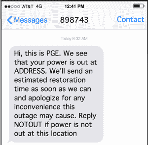
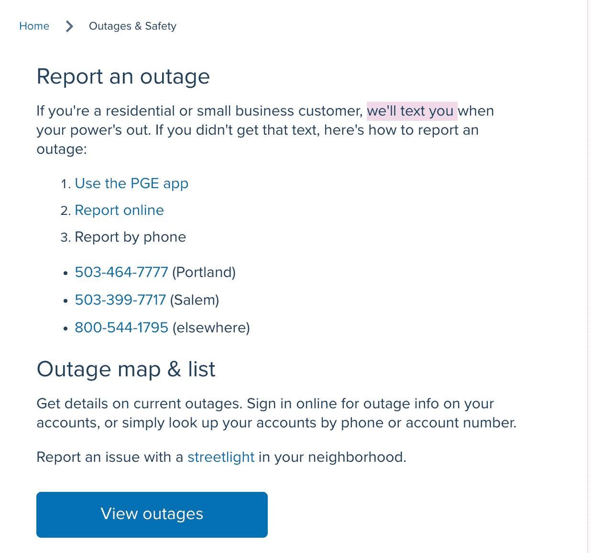
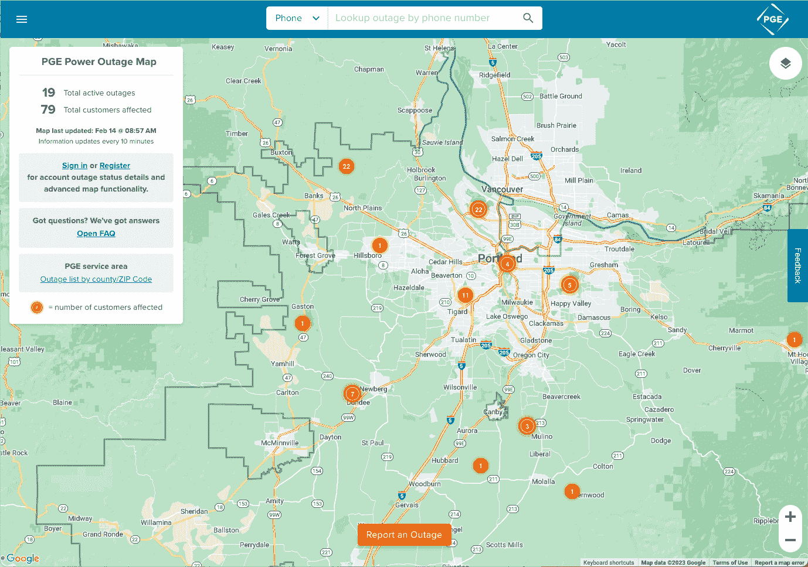
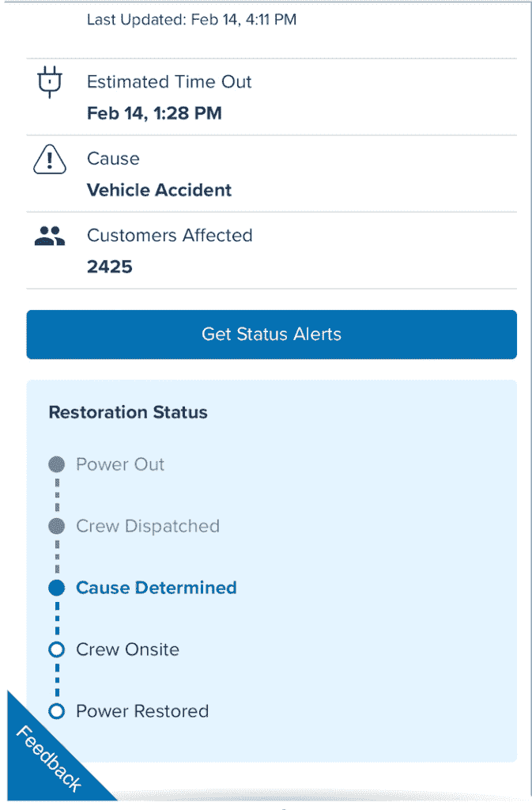
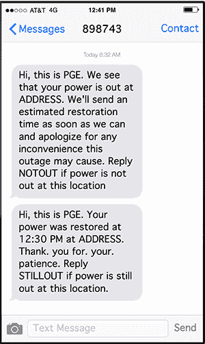
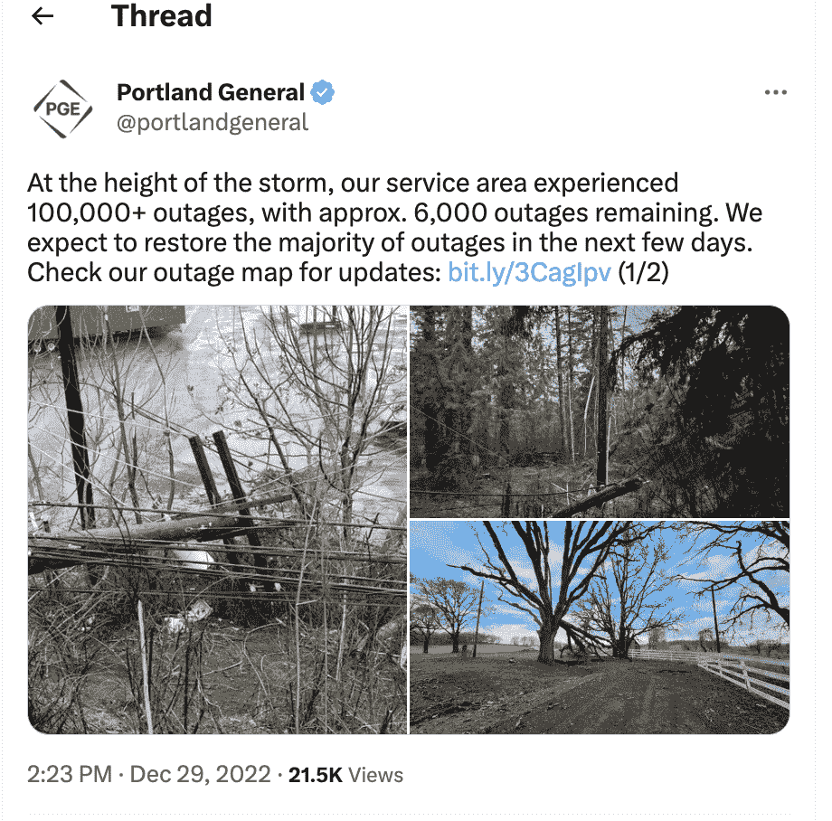

# 你的事件响应比能源公司更好吗？

> 原文：<https://thenewstack.io/is-your-incident-response-better-than-an-energy-companys/>

俄勒冈州的波特兰市在过去几年中经受了多次风暴，这些风暴刮倒了百年老树，切断了电线，使成千上万的人和宠物处于黑暗之中。

作为一名居民，这意味着我已经非常熟悉波特兰通用电气(PGE)的事故响应通信，老实说，我印象深刻。他们的客户沟通远远超过我从许多科技公司看到的。这怎么可能呢？更少的组件？训练有素的应急人员？我怀疑这是由于他们能够得到的信息和信号。

众所周知，软件工程师在诊断系统问题时会面临信息过载的问题。事实上，至少这些工程师对真正的问题有所警觉，因为 59%的人说他们从当前的可观察性解决方案中收到的一半警报实际上是没有帮助或没有用的，这并不能让人感到安慰。根据 Chronosphere 的 2023 年[云本地可观测性报告](https://go.chronosphere.io/2023-observability-report.html)，不仅有大量信号，而且许多信号质量很低，40%的人经常从他们的可观测性解决方案中收到警报，而没有足够的上下文来进行分类。

从一位 PGE 客户的角度了解停电情况，并在最后参加测验，看看您的事故沟通情况如何。

## **准备…设定…断电！**

从客户的角度来看，第一个可观察到的事件是所有的灯突然熄灭，风扇/HVAC 关闭，出现了一种诡异的寂静。

在短信到达后不久(几分钟内):

PGE 文本

这是五星级的客户拓展服务，因为它主动通知我，PGE 承认我所关心的权力，特别是我的地址受到了影响。积极主动可能会让 PGE 支持人员免于被短信和电话淹没，同时让客户有时间去找手电筒和蜡烛。

另一个亮点是，PGE 的下一步计划已经明确。当有新闻报道时，他们会带着估计的恢复时间回来。可爱！作为客户，这是我唯一关心的其他信息。

上面的樱桃是他们报告数据不准确的方法。使用相同的沟通环境，而不是让客户(因为停电而感到紧张)必须登录到单独的网站或应用程序进行报告。

假设客户没有注册短信提醒。他们可能会在手机浏览器上浏览 PGE 网站，希望他们的电池能经受住断电。[断电&安全](https://portlandgeneral.com/outages-safety)部分作为主菜单栏的一个永久部分很容易被发现，只需一次点击就能获得信息。

注意到报告选项的顺序了吗？我注意到它们是按照对客户的方便程度/对 PGE 的效率来排列的。通过应用程序进行报告很简单，然后在他们的网站上提交文件，这两种方式都可以让 PGE 快速获得大规模的报告。最后一个选择是通过电话报告，这可能会占用人类的响应，因此最后才显示。

## **听，一张地图！**

假设文本通知没有满足您对断电信息的渴望。PGE 的停电图为您提供，按需提供，显示了该公司当前对客户影响的理解。

我为什么喜欢这个？了解停电是在成千上万的客户和地区中普遍发生，还是只发生在我所在的社区，有助于调整客户对电力恢复的预期。

显然，如果整个波特兰市都在经历停电，期待快速解决是荒谬的。

## **嘉奖**

1.  位置感知可视化:这是一个显示整体系统影响的视图。数字的表格视图不能有效地传达这一点
2.  关于数据新鲜度的关键信息:上次更新的时间和刷新率。
3.  受影响的客户的实际数量:对我来说没什么用，但是增加了我的信心，PGE 已经洞察了他们的系统，因为他们有一个真实的数字。
4.  根据电话号码搜索和定位你所在地区的能力:而不是像账户 ID 那样没人记住的神秘事物

基本上，有了这个地图，人们就可以随时了解解决问题的进展或进展的缺失，而不必去打扰和束缚 PGE 的员工；紧张的女同性恋者可以尽情地检查和刷新。

## **值得安装的 App**

这些天我不愿意在手机上安装应用程序，但 PGE 的应用程序已经在我的必备品中赢得了一席之地。

设计很简单，传达信息非常清楚。让我们看看他们应用程序的断电状态页面:

PGE 应用程序页面

看看事故解决时间表！不需要成为一个巡边员就能找到它。

1.  停电的简单阶段，向客户突出显示关键时刻，尤其是“派遣工作人员”，这意味着帮助即将到来！
2.  更新停机原因有助于更好地了解预计缓解需要多长时间。它并不完美，但也算不错了。

## **要有光**

耶！灯光嗡嗡作响，所有的机器开始发出噪音，热量再次流动，PGE 发送了一条简短的总结信息。

PGE 文本

想象一下，如果你收到了那条短信，还在黑暗中瑟瑟发抖。在你读到最后一句话之前，你可能会感到困惑，并且可以很容易地通过回复 STILLOUT 来告知 PGE 他们的严重错误。

真是客户沟通的大师级！

## 小测验:你对事故的反应比 PGE 好吗？

1.  您是否主动通知客户影响，而不是客户通知您？
2.  客户报告影响是否容易，客户支持人员进行分类是否高效？
3.  您是否以客户友好的方式定期提供状态更新和信息？(例如:除非您的客户是开发人员，否则没有必要详细讨论数据库锁定。)
4.  当事故发生时，您能确定有多少客户受到影响吗？
5.  Can customers subscribe to a feed of outage notifications? Are they tailored to the features/products they use or is it all outages?

    图 6

<svg xmlns:xlink="http://www.w3.org/1999/xlink" viewBox="0 0 68 31" version="1.1"><title>Group</title> <desc>Created with Sketch.</desc></svg>