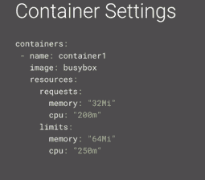
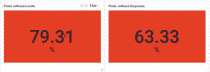
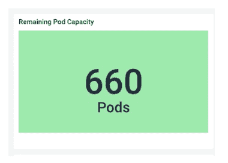
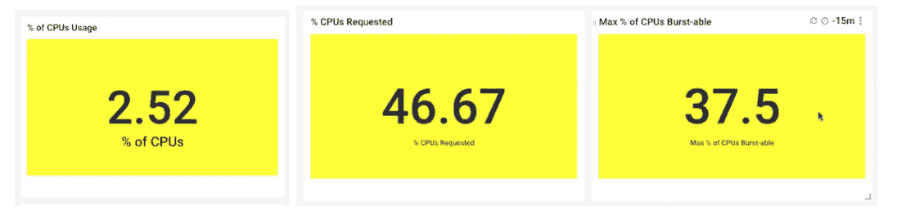
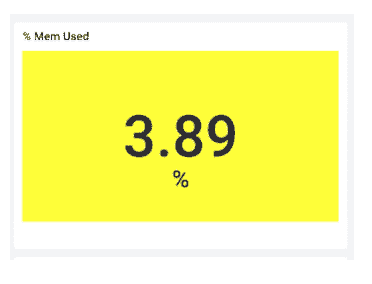
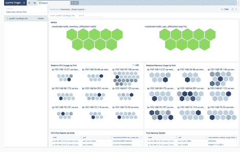
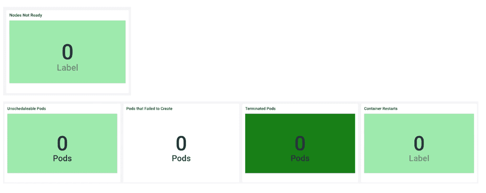

# 你的 Kubernetes 集群健康吗？这里有 5 种方法可以找到答案

> 原文：<https://thenewstack.io/is-your-kubernetes-cluster-healthy-here-are-5-ways-to-find-out/>

 [凯蒂·莱恩

凯蒂·莱恩是 Sumo Logic 的产品宣传员，她专注于运营分析和 Kubernetes。她有超过 10 年的经验，从数据中心网络到数据科学和应用程序监控和稳定性。Katie 一直在寻找更好、更简单的方法来解释概念，并利用她丰富的背景知识，将技术从充满术语的盒子中拿出来展示给世界。](https://www.sumologic.com/) 

Kubernetes 是一项极其智能的技术，但如果没有正确的方向，它可能会以不想要或意想不到的方式做出反应。正如大多数“智能”技术一样，它只和操作者一样智能。为了让团队在 Kubernetes 上取得巅峰成功，他们对 Kubernetes 集群有所了解是至关重要的。这里有五种方法，工程师可以在设置 Kubernetes 集群时最好地确定任何遗留问题，并确保尽可能最健康的工作负载(*要了解更多 Kubernetes observability 深度内容，请查看我们的电子书，[Kubernetes Observability](https://www.sumologic.com/brief/kubernetes-observability/))*。

幸运的是，有一些技术可以收集 Kubernetes 环境中的日志、指标、事件和安全威胁，以帮助监控各种集群的健康状况。这些收集器从 Kubernetes 集群的所有部分收集数据，可以汇总这些数据以获得集群健康状况的高级视图，并实时获得诸如资源利用率、配置错误和其他问题的见解。

## 1.在所有 pod 上设置 CPU 请求和限制

请求和限制是 Kubernetes 在给定可用资源(如 CPU 和内存使用量)的情况下用来智能地调度 pods 的机制。对于 CPU，这是以毫核心定义的，所以 1000m 等于一个核心。请求是您预计给定容器将需要多少，而限制则是允许容器使用多少的实际上限。

确保为所有 pod 设置了 CPU 请求。最佳实践是将其设置为一个内核或更低，如果您需要更多的计算能力，则添加额外的副本。同样需要注意的是，如果您将此时间安排得太高，比如 2000 米，但您只有单核可用，那么此 pod 将永远不会被安排。在第五步中，我将向您展示如何复查未计划的 pod。

确保您为所有 pod 设置了 CPU 限制。如上所述，限制是上限，因此 Kubernetes 不会允许您的 pod 使用超过您在限制中定义的 CPU。也就是说，CPU 有点宽容，因为它被认为是一种可压缩的资源。如果您的 pod 达到 CPU 限制，它将不会被终止，而是被节流。您的 CPU 将受到限制，因此您可能会遇到性能问题。

## 2.在所有 pod 上设置内存请求和限制*

*内存以字节定义(配置时为 MiB 或 Mi)

**确保您为所有 pod 设置了内存请求:**内存请求是您认为 pod 将消耗的数据量。像 CPU 一样，如果内存请求大于您的最大节点，Kubernetes 不会调度 pod。

**确保你为所有的 pod 设置了内存限制:**内存限制是你的 pod 可以使用的内存上限。与 CPU 不同，内存是不可压缩的，也是不可调节的。如果一个容器超过了它的内存限制，那么它将被终止。

## 3.审核提供的资源

检查 Kubernetes 最佳健康状况的另一件事是，您的资源是否不足或过度配置。如果你有剩余的可用 CPU 和内存，那么你是消费不足，可能付出太多。另一方面，如果您接近 100%的利用率，那么当您需要扩展或有意外负载时，您可能会遇到问题。

检查剩余的 pod 容量。一个有用的 Kubernetes 指标是“[kube _ node _ status _ allocatable](https://github.com/kubernetes/kube-state-metrics/blob/master/docs/node-metrics.md)”，这是 Kubernetes 估计在给定平均 pod 资源利用率的情况下，一个节点上还能容纳多少个 pod。我们可以将剩余的 pod 容量加起来，粗略估计一下在不出现问题的情况下我们可以向外扩展多少。

**检查总的 CPU 使用百分比与请求的 CPU 百分比和 CPU 限制的百分比**:总的 CPU 使用将告诉您现在使用了多少，请求的告诉我们我们猜测我们可能需要多少，限制是我们设置为上限的硬限制。

在下面的示例中，我们仅使用了可用计算能力的 2.5%。我们的供应过剩，可能会缩减。相比之下，我们请求的 CPU 是 46%，所以我们认为我们需要的比我们实际使用的多得多。要么是我们猜错了，要么是我们有没有计划到的高度突发的需求。

最后，我们的 CPU Burstable 告诉我们所有 CPU 限制的总和。由于这低于我们的 CPU 要求，我们可能要回去检查我们的限制设置。要么我们没有对所有事情设定限制，要么我们误解了我们的限制。

检查总的内存使用百分比、请求的内存百分比和内存限制百分比。就像 CPU 一样，我们可以检查我们的内存是否被过度配置。只有 3.8%的利用率告诉我们，我们确实过度配置了，但我们可以轻松地扩展数年。

## 4.查看跨节点的 Pod 分布

当我们查看 pod 如何分布在集群中的可用节点上时，我们想要大致均匀的分布。如果某些节点完全过载或负载不足，这可能是一个值得调查的更大问题的迹象。

可能导致不均匀分布的一些检查内容包括:

**结缘。** Affinity 是一个 pod 设置，使它们更喜欢具有某些属性的节点。例如，pod 可能需要在连接了 GPU 或 SSD 的机器上运行，或者 pod 可能需要具有特定安全隔离或策略的节点。仔细检查您的相似性设置可以帮助缩小不均匀分布的原因，并减少缩放问题的可能性。

**污点和宽容。**污点是亲和力的反义词。这些是节点上的设置，它们会“污染”节点，因此 pod 不太可能被分配到那里。如果要为特定的 pod 保留节点，或者要确保该节点上的 pod 对可用资源具有完全访问权限，则可以使用此选项。

**限额和要求:**回头看看你的限额和要求设置。这是经常引起问题的原因，在这篇文章的三个部分中值得一提。如果您的调度程序没有关于 pod 需要什么的正确信息，它将会在调度方面做得很差。

## 5.检查处于不良状态的 pod

在 Kubernetes 环境中，当前状态时刻都在变化，所以过度担心每一个被终止的 pod 会慢慢消耗你的时间和理智。但是，下面的列表值得关注，以确保它与您基于集群中当前事件的预期相符。

*   **节点未就绪:**节点可能会因为多种原因而进入这种状态，但通常是因为它们耗尽了内存或磁盘空间。
*   **未计划的 pod:**pod 通常以未计划状态结束，因为调度程序无法满足 CPU 或内存请求。仔细检查您的集群是否拥有您的 pod 所请求的可用资源。
*   P **创建失败的 ODS:**pod 创建失败通常是因为镜像有问题，比如启动脚本中缺少依赖关系。在这种情况下，回到起点。
*   **容器重启:**一些容器重启并不值得关注，但是看到很多这样的重启可能意味着 pods 处于 OOMKill(内存不足终止)状态。内存不足是 Kubernetes 中最常见的错误之一，这可能是由映像问题、下游依赖性问题或者意外、限制和请求问题引起的。

这些集群健康最佳实践可以限制 Kubernetes 环境中的意外行为，并确保您不会遇到问题。这些也为您提供了一个起点，帮助您回答那些模糊的问题，如“我的 Kubernetes 集群是否健康？”如果所有这些项目都是绿色的，那么您的集群可能处于良好状态，您可以高枕无忧了。

*要了解更多的 Kubernetes 可观测性深度潜水，请查看完整的电子书 [Kubernetes 可观测性](https://www.sumologic.com/brief/kubernetes-observability/)。*

<svg xmlns:xlink="http://www.w3.org/1999/xlink" viewBox="0 0 68 31" version="1.1"><title>Group</title> <desc>Created with Sketch.</desc></svg>