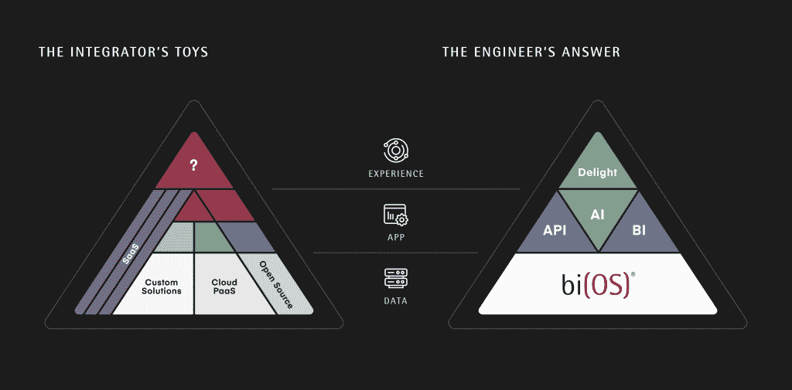

# Isima 承担数据管理摄取到洞察力

> 原文：<https://thenewstack.io/isima-takes-on-data-management-ingest-to-insight/>

在过去的几十年里，数据管理变得越来越复杂，但可用的“解决方案”却没有跟上，根据刚刚推出 bi(OS)的 [Isima](https://www.isima.io/) 的说法，bi(OS)是一个端到端平台，旨在帮助组织快速接收和处理数据以获得实时见解。

有效利用实时数据的公司是像谷歌和脸书这样财力雄厚、员工充足的供应商。Isima 首席执行官兼联合创始人 [Darshan Rawal](https://www.linkedin.com/in/darshanbr/) 表示，对于大多数组织来说，这只是一个梦想，他坚持认为，将一系列技术(RabbitMQ、Kafka、Spark、Cloudera、Hadoop、SAS、Informatica)拼凑在一起的做法并不能让公司更接近于实现这个梦想。

在[的一篇博文](https://www.isima.io/is-complexity-inevitable/)中，联合创始人[莫尼什·苏瓦那](https://www.linkedin.com/in/monish/)解释了他们在市场上看到的情况:

*有些复杂性来自于整合许多不同的好产品，而不是端到端的思考。我们看到了一层又一层的点解决方案，它们很好地解决了一个问题，但使完整的解决方案变得更加复杂。每个单点解决方案都易于尝试和使用，但是大规模部署整个系统需要一支军队。这种复杂性的最终结果是，企业在大数据方面进行了多年的巨额投资后，却没有真正的投资回报。*

相比之下，印度的一家制药公司 pharm easy(T11)让一名分析师采用 bi(OS)来改善供应链运作。它的实验包括使用人工智能/机器学习来[确定哪些客户的订单应该优先提升](https://www.isima.io/customerawaresupplychain/)。据报道，这方面的可观测性从 6 小时减少到 15 分钟。

另一个问题是确定订单的[状态，这是一个产生用于改进的 KPI 的过程，但是在四到六个小时内—对于有意义的补救来说太晚了。使用 bi(OS)使团队能够组合多个数据源，按城市、州、SKU 等进行深入研究。，实时查找特定订单的异常延迟。](https://isima.docsend.com/view/kz5zkyeiqsz64abm)

其仓库最初仅根据预期交付时间发出订单，而 bi(OS)则实现了进一步的客户细分，这一功能在一周内为 3000 万客户推出。然后用天，它用天写逻辑，每 30 分钟重新排序一次订单。

## 反思一切

Isima 团队在大数据领域拥有丰富的经验，早在这个词被创造出来之前，也早于 Hadoop 时代。其核心团队一直在为微软、AWS、Cloudera、Tibco、BlueArc、Drobo、DataStax 和 D. E. Shaw 等公司构建横向扩展关系数据库、高性能存储和应用人工智能。

工程副总裁帕拉德普·马达瓦拉普是微软 SQL Server 引擎的首席开发人员，也是亚马逊 Aurora 数据库的创建者之一。拉瓦尔在 21 世纪初制造了一个卡珊德拉克隆体，比卡珊德拉开放源代码(2008 年)早几年。他和[战略销售副总裁 Alfredo Tamura](https://www.linkedin.com/in/kensaburo-alfredo-tamura-79972335/) 与日本的电信公司合作，确保在海啸发生时信息传递仍然可靠。在他的经历中，Suvarna 在私募股权公司 Intellectual Ventures 工作了十年，为软件、医疗 IT 和材料领域的早期技术筹集了 6.5 亿美元的资金。

位于加利福尼亚州帕洛阿尔托的团队构建了一个一体化平台，涵盖数据的接收、存储、处理、可视化和利用。他们在内部为 bi(OS)构建了 SQL 关系数据库。它与系统的数据接收和分析功能紧密集成。他们添加了一个数据目录来帮助用户识别感兴趣的数据集，并帮助进行数据治理。

Rawal 将其描述为一个数据平面，而不是一个管道，结合了人工智能和商业智能(BI)功能。添加 API 和 SDK 是为了让开发人员更容易将数据功能纳入他们的应用程序，也让数据科学家更容易修改数据。它也被描述为从数据仓库和数据湖模型中吸取精华。

“我们查阅了 70 年代和 80 年代的操作系统书籍，问‘为什么人们要进行缓存？让我们去掉缓存。为什么我们有这些数据库的主从架构？为什么我们不能删除来自副本的变更数据捕获？为什么我们要排队？…三十年前，我们有了 MQ 系列。然后我们有了 RabbitMQ，现在我们有了 Kafka。但还是排队。

“除此之外，我们开始获得这些缓存技术…而你只是在创建越来越多的相同层。…企业需要的是一个构建产品，它允许他们在几周内工作并构建应用程序。对吗？那是，那是我们做的。”

Isima 与一系列专注于改善数据管理并从数据中获得实时洞察力的初创公司竞争，包括 [Dremio](https://thenewstack.io/dremio-wants-put-data-scientists-drivers-seat/) 、 [Kasten](https://thenewstack.io/kasten-data-management-for-kubernetes/) 、 [Incorta](https://www.incorta.com/) 和 [Quantexa](https://www.quantexa.com/) 。

[Qubole 的 Prateek Shrivastava](https://thenewstack.io/getting-cloud-data-lakes-right/) 写了关于正确处理数据湖的文章，而 [Splice Machine 首席执行官 Monte Zweben](https://thenewstack.io/getting-cloud-data-lakes-right/) 写了关于运营云数据湖的文章。

AvidThink 的创始人兼负责人、分析师 Roy Chua 认为 Isima 的概念很有趣。

*企业数据分析并不总是兑现承诺。从 Hadoop 到 Apache Spark，更不用说 Hive、Cassandra、Tensorflow、Kafka 等一波又一波的方法，从构建数据湖到数据管道，许多企业都从大数据投资中寻求 ROI，结果却大失所望。这其中的一部分是知道哪些方法用于什么目的:批量 ETL、流式 ETL、机器学习、深度学习以及如何支持像即席查询这样的用例。*

Chua 说，激发 Chau 对 Isima 兴趣的有两件事:其创始人曾在 Datastax、Cloudera 和 AWS 任职的血统，以及他们对大数据问题的整体方法。“我从许多组织(从企业到电信公司)那里听说，构建大型数据湖使他们处于存储越来越多的数据，但却不一定能从这些数据中获得洞察力的境地。从分析大量长期数据中识别一些深刻见解的理想用例很少实现。Isima 的团队观察到，数据处理和行动的速度越快，分析的价值就越大，这与我从市场上听到的观点是一致的。”

他说，他们融合多种数据分析用例的方法:用户的特别查询，数据科学家的更深入的分析和 ML，以及开发者的编程 API 访问，这是雄心勃勃的，也是有趣的。

“Isima 的工作流程侧重于加载时的快速接收、数据清理和丰富功能，以及快速定义商业智能的有趣功能。Isima 的论点是，通过短时间的反馈循环来实时或接近实时地观察结果，数据分析的价值实现速度要快得多。他们在包括电信、金融和医药零售在内的一系列垂直行业进行了早期试验，这是一个充满希望的开端，我认为他们的融合方法值得关注。”

PharmEasy 将于 8 月 25 日加入 Isima 团队参加网络研讨会。

图片由来自 Pixabay 的 Anja 提供。

<svg xmlns:xlink="http://www.w3.org/1999/xlink" viewBox="0 0 68 31" version="1.1"><title>Group</title> <desc>Created with Sketch.</desc></svg>