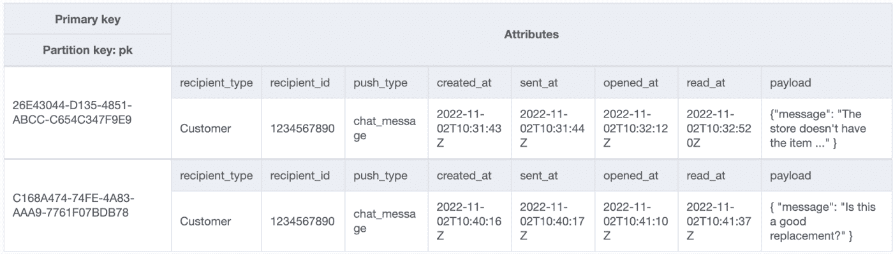
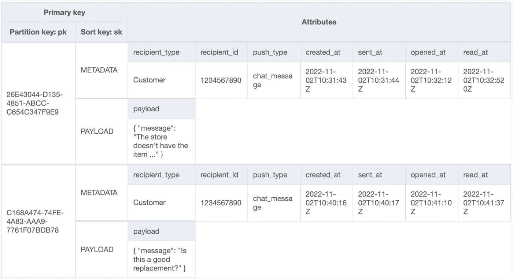
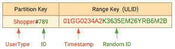
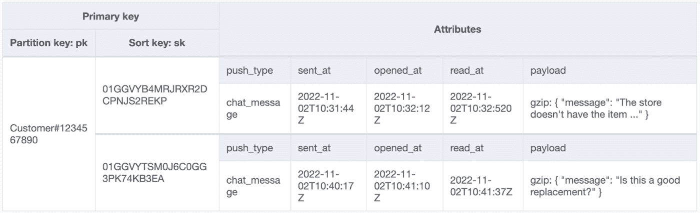

# ISO 更好的缩放，Instacart 为 Amazon DynamoDB 放弃 Postgres

> 原文：<https://thenewstack.io/iso-better-scaling-instacart-drops-postgres-for-amazon-dynamodb/>

杂货递送初创公司 [Instacart](https://thenewstack.io/instacart-speeds-ml-deployments-with-hybrid-mlops-platform/) 最近从[开源 Postgres 数据库系统](https://thenewstack.io/the-competitive-advantage-of-postgres/)切换了[亚马逊网络服务](https://aws.amazon.com/?utm_content=inline-mention)’[dynamo db](https://thenewstack.io/place-ccache-front-database-like-amazon-dynamodb-accelerator-dax/)，工程团队现在正在分享模式设计，该设计将每笔交易的可计费写操作数量减少了一半以上。

Instacart 正在将其主要数据存储迁移到亚马逊的 DynamoDB。目前运行在 Amazon EC2 上的 Postgres 系统已经达到了极限。在一篇博客文章中，InstaCart 软件工程师 Manas Paldhe 告诉我们，迁移的决定因素归结为一件看似无关紧要但对需要它们的人同样重要的事情:推送消息通知。

Instacart 工程师最近决定，Postgres 和 Amazon EC2 实例不再以当前的形式使用推送消息通知。公司工程师没有重构他们现有的系统，而是决定继续开发 DynamoDB。他们不得不彻底重新设计模式设计和数据建模，以降低使用成本，并使其对他们的写入次数更具成本效益。

## **零号患者—推送消息通知…**

推送消息通知是 Instacart 与其用户之间的主要沟通方式…

Postgres 存储发送给用户的消息周围的状态机。消息根据订购和购买他们的货物的人数线性扩展。Instacart 还计划发布一些新功能，将在每日基线的基础上增加约 8 倍的通知。一个单一的 Postgres 集群将不再削减它。

白天/晚上的繁忙程度相当于夜晚/清晨的安静程度。Postgres 不能根据需求进行扩展，拥有一个可以扩展的数据库对 Instacart 来说是非常有利的。经过一些测试，这是 DynamoDB 的胜利。

## **DynamoDB 如何定价**

Instacart 对 DynamoDB 的主要担忧是成本，而不是延迟或扩展要求。这个版本的比较是将不同的 DynamoDB 选项与一个分片的 Postgres 集群进行比较。

“DynamoDB 的成本基于 DynamoDB 表中存储的数据量，以及对它的读写次数，”Paldhe 解释道。第一部分是“只要你知道你有多少数据，估计起来就很简单。”

读取和写入更加棘手。使用成本有两个选项，即与读写相关的费用，“按请求付费”和“调配容量”Instacart 使用“调配容量”选项，因为他们说如果有很多请求，“按请求付费”选项会“非常快地变得非常昂贵”。Instacart 表示，“调配容量模式和自动扩展容量[使他们]能够保持舒适的扩展空间。”

写操作的开销大约是读操作的 10 倍，因此必须进行大量的数据建模，以使 Postgres 表成为 DynamoDB 可接受的开销。

## **dynamo db 的新数据模型**

第一步是看看当前 Postgres 表在 DynamoDB 上的价格，这样团队就可以知道从哪里开始优化。

第一个需要改进的地方是写操作，obv。

**写操作优化**问题是:根据历史用户偏好，存储的消息会在数据库中保留七天。这意味着表存储的数据写入量很大，大部分负载来自插入和更新。

AWS 对读取容量单位(RCU)上的数据进行收费。“对于小于 4KB 的最终一致的行读取，消耗了一半的 RCU，”Paldhe 说。

写容量单元(rcu)采用类似的设计。每条消息超过 1KB，其生命周期包括三次更新，这意味着一条消息每次写入至少消耗 2 个 wcu。

写更新发生在 UUID 的主键上，但是读更新流经通知接收者的 Postgres 中的索引。为了匹配 Postgres 的功能，DynamoDB 需要接收者的全局二级索引(GSI)。再加一个 WCU。

使用 Postgres 模式，每条记录总共需要 9 个 wcu。

用于说明的 Postgres 数据表

由于上面列出的所有原因，并且因为每次更新意味着对象上的单个字段被更新，所以该表是低效的。以节省部分 wcu 的名义，将原表格设计更新为[单表格设计模式](https://aws.amazon.com/blogs/compute/creating-a-single-table-design-with-amazon-dynamodb/)。

下表显示了新的模式。

这个新表显示它们共享相同的分区键(UUID ),但是排序键现在不同了。第一个将 JSON 对象存储为属性，而第二个保存所有的时间戳和元数据。

每个记录生命周期的预期容量需求减少了 2 个 wcu。修正后的公式如下:

3 个 WCU 来创建记录(1 个 WCU 用于元数据项+ 2 个 WCU 用于包含 1KB 以上 JSON 对象的项)

GSI 的+1 WCU
+3 WCU 用于三次更新(仅元数据项)
=每个记录生命周期 7 个 WCU。

## **基于读取减少 WCUs】**

这项工作减少了两个 wcu，但是团队可以进一步减少吗？那些被写入但从未被读取的数据，比如索引，会怎么样呢？索引总是被写入，但很少被阅读。这种优化读取的迂回是重要的因素，因为表被分成多行。

Instacart 能否通过改变数据读取方式来减少数据量并消除 GSI？

**下面是他们如何优化大小:**消息元数据被存储为一个大型 JSON 对象，其中 75%的行超过 1KB。到目前为止，消息的最大部分是 JSON 字段。为了减小大小，Instacart 使用了 GZip，它以 JSON 的高压缩比而闻名。现在，99%以上的时间邮件都被压缩到 1KB 以下。

接下来，他们的目标是让主键变得足够有用，以至于不再需要 GSI。GSI 是必要的，因为 Postgres 使用了索引，但索引本身并不明确需要。GSI 被替换为 userType 和 userID 的串联。

上图的后半部分是范围键。这是因为单个用户会收到许多消息，使得原始键不唯一，但分区和范围键的组合是唯一的。添加时间戳是因为它们是按时间排序和提取的。添加随机 id 是为了在收件人同时收到多封邮件时识别邮件。

现在，系统可以查询分区并过滤范围键以进行批量读取操作，而不是构建和利用 GSI。由于大量的变更，这确实需要逻辑重构，但是，套用帕尔德的话，“这是值得的。”

新方程如下:

1 个 WCU * (1 个插入)
+ 1 个 WCU * (3 个更新)
=每个记录生命周期 4 个 WCU！

## **卷展栏**

该模式已经过优化，随时可以推出。从事这个项目的团队不希望集成的容易性成为一个障碍，所以首次展示很好而且很慢。为了有助于友好的推广精神，并帮助开发人员顺利地从 Postgres 过渡到 DynamoDB，工程师们选择对开源库( [Dynamoid](https://github.com/Dynamoid/dynamoid) )进行精简包装，该库为他们已经习惯的 ActiveRecord 提供了类似的接口。

作为一个巨大的附带好处，Dynamoid 允许从事 DynamoDB 项目的工程师在一个简单的 API 中包含有助于推进项目的工具(字段压缩、时间排序标识符和复合分区键)。

展示的第一部分包括隐藏在特征标志后面的双重书写和阅读。由于只需要七天的保持，  一周后读数开关开始上升。推出是如此顺利，以至于在推出后一周 Postgres 代码路径就被取消了，数据库也缩小了。

## **结论**

在过去的六个月里，Instacart 对 DynamoDB 的使用从一个表增加到 20 多个表，支持不同内部组织的 5 到 10 个不同功能。工程团队了解了更多关于大型敏感部署的信息。他们还学习了很多关于 DynamoDB 及其许多支持工具的知识。

帕尔德解释说，这项事业的目标是成为一个“先锋项目”，在这方面，它看起来已经取得了巨大的成功。

<svg xmlns:xlink="http://www.w3.org/1999/xlink" viewBox="0 0 68 31" version="1.1"><title>Group</title> <desc>Created with Sketch.</desc></svg>