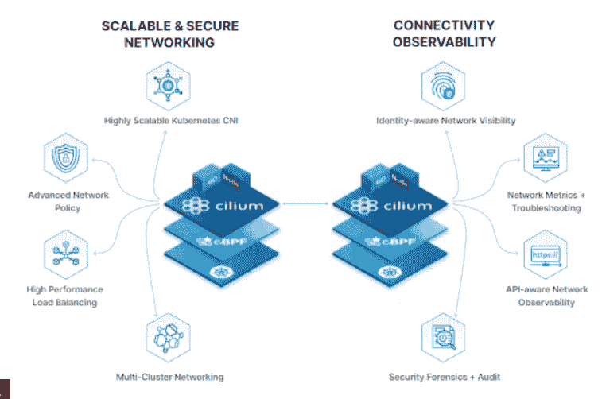
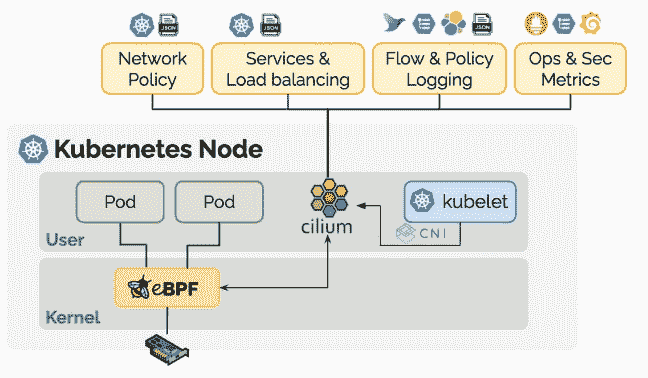

# 等效利用 eBPF 实现云本地安全性和可见性

> 原文：<https://thenewstack.io/isovalent-harnesses-ebpf-for-cloud-native-security-visibility/>

在 [Isovalent](https://www.isovalent.com/) 的资深网络专家正在建立[扩展的 Berkeley 包过滤](https://ebpf.io/) (eBPF)技术的承诺，该技术使 Linux 内核可编程，以解决 Kubernetes 和微服务的短暂挑战。

“如果你考虑一下 Linux 内核，传统上，它是一些 Linux 内核开发人员在过去 20 或 30 年中决定构建的一组静态功能，他们将其编译到 Linux 内核中。它的工作方式是内核开发人员所想的，但可能不适用于我们今天需要做的用例，”Isovalent 首席执行官[丹·温德兰特](https://www.linkedin.com/in/danwendlandt/)说。

向内核添加新东西是一个耗时数年的艰苦过程。

“这就是为什么我们在 Linux 内核中拥有的网络和防火墙技术基本上仍然是过去 20 年来我们拥有的相同技术，比如 IP 表，用于制定安全政策，”他说。

“这些技术实际上是为一个世界而设计的，在这个世界中，我们认为 Linux 路由器部署在一个由人配置的物理机器上，并且很少改变。这与我们的客户(如 Adobe 和 Capital One)以及 Google Kubernetes 产品的用户的需求截然不同，这些产品拥有高度动态的云原生环境，其中 IP 地址甚至没有任何意义。

“那么，你如何让 Linux 能够理解 Kubernetes 的身份，理解你的微服务能够实现，例如，防火墙和其他安全用例？eBPF 让我们将这种智能注入到 Linux 内核中。”

 

Wendlandt 在 Nicira 开始了他的职业生涯，该公司开发了 Open vSwitch，这是一种用于虚拟化数据中心的软件网络层。它于 2012 年被 VMware 收购，该技术演变为 VMware NSX。

首席技术官托马斯·格拉夫(Thomas Graf)是开源项目 [Cilium](https://cilium.io/) 的联合创始人，他在 Red Hat 和思科的 Linux 内核网络社区有着深厚的根基。他和[丹尼尔·博克曼](https://www.linkedin.com/in/daniel-borkmann-24311bb9/)，也处于同等地位，都是 Linux 内核方面的世界顶级权威。

“我们已经看到了软件定义的网络的第一波浪潮。然而，在像 Kubernetes 这样的环境中，就能够为这个新的云原生世界做些什么而言，它非常有限，”Wendlandt 说。

他称 Kubernetes 和 eBPF 是“技术方面的完美风暴，让我们让 Linux 以一种让你更好地做各种网络相关事情的方式来理解 Kubernetes。”

这家总部位于加州山景城的公司最近脱颖而出，宣布了由安德森·霍洛维茨和谷歌牵头的 2900 万美元的 A 轮融资，以及企业版的 Cilium。

## 可编程序计算机

Nicira 的创始人、现任 Andreessen Horowitz 的普通合伙人、同等地位的董事会成员 Martin Casado 在[博客文章](https://a16z.com/2020/11/10/investing-in-isovalent/)中解释说，传统的网络包括物理硬件上的点对点连接。虽然早期的软件定义的网络从物理硬件中获得线索，但现在它完全是关于连接微服务、云服务、API 以及用于连接它们的更高级别的协议和系统。

“过去是 IP 地址、端口、虚拟网卡和虚拟局域网。现在，是服务身份、gRPC、Kafka、分布式数据存储、远程 API 等。，”他写道。

他提到需要一个新的网络和安全层来提供云原生可见性、安全性和对这些高级抽象的控制，并将 Cilium 称为这个新层。

SAP 实验室的开发者 Gaurav Gupta 两年前在哥本哈根的 KubeCon 大会上称 eBPF 为“Linux 的最新超级力量”。

由于 Linux 是许多 Kubernetes 节点的操作系统，eBPF 提供了在[内核空间](https://thenewstack.io/ebpf-put-the-kubernetes-data-plane-in-the-kernel/)内运行任何沙盒程序的能力，而无需更改内核源代码或加载模块。

Casado 注意到 eBPF 给 Linux 内核带来的类似于 JavaScript 给浏览器带来的。

我们之前[是这样解释技术](https://thenewstack.io/how-ebpf-turns-linux-into-a-programmable-kernel/)的:

“使用 [eBPF](https://man7.org/linux/man-pages/man2/bpf.2.html) ，开发人员用 C 的子集编写代码，这些代码被编译成 BPF 字节码，以便在 BPF 虚拟机上运行。在对代码进行安全检查之后，即时编译器将字节码转换成特定于架构的机器代码。…

然后，成功编译的机器码被附加到内核的代码路径上，当被遍历时，执行任何附加的 eBPF 程序。所有用户都可以通过共享内存映射来访问状态。"

[https://www.youtube.com/embed/_Iq1xxNZOAo?feature=oembed](https://www.youtube.com/embed/_Iq1xxNZOAo?feature=oembed)

视频

“有一套网络和安全的逻辑被硬编码并嵌入到 Linux 内核中，”Wendlandt 说。“eBPF 让我们编写自己的逻辑，但是在 Linux 内核中以一种非常高的性能和安全的方式运行它。它不能让你的内核崩溃；它不会对你的内核做坏事。…既快又安全。我们能够扩展内核的功能，而不会破坏内核的核心属性。”

## 在作战

使用 eBPF 和 Cilium 作为其 GKE 数据平面的基础，Google [称](https://cloud.google.com/blog/products/containers-kubernetes/bringing-ebpf-and-cilium-to-google-kubernetes-engine)Cilium 是“Kubernetes 最成熟的 eBPF 实现”

为了跟踪微服务中短暂发生的事情，应用性能管理供应商 [Instana](https://www.instana.com/) 使用 eBPF 来检测[异常进程崩溃](https://thenewstack.io/instana-uses-ebpf-for-detecting-abnormal-process-termination/)，甚至是那些你可能永远不知道的崩溃，因为 Kubernetes 会立即启动一个替代品。

其他客户包括阿里云、Adobe、Datadog、GitLab 和 SAP SE。

Wendlandt 指出，Kubernetes 根本不关心 IP 地址，因为容器来来去去非常动态。

“因此，如果您的安全团队找到您说，‘嘿，这个 IP 地址两周前做了一些可疑的事情，那里运行的是什么应用程序？’没有办法回答这个问题，”他说。

因此，您需要能够动态理解 Kubernetes 工作负载身份的东西，以便能够实现这些安全用例。Cilium 使用 eBPF 将 Kubernetes 身份注入 Linux 内核网络层。

“高级外卖是为了实现您的合规目标。例如，Capital One 最近公开谈论他们如何需要能够在 Kubernetes 中进行审计和取证以及工作负载隔离。他们无法用传统的防火墙机制做到这一点，”他说。“谷歌需要能够让安全团队了解哪些工作负载在相互交流。所以你不能使用传统的基于 IP 的机制来做到这一点。这是采用纤毛的婴儿驱动力之一。随着企业转向 Kubernetes 和原生云，这确实有助于他们满足安全要求。”

作为一家公司，Isovalen 致力于上游 eBPF 项目和开源 Cilium 项目，他将该项目描述为使 eBPF 成为“人类消费品”，以解决这些 Kubernetes 网络和安全用例，然后还提供企业功能。

“真正让我们与众不同的是，我们将 eBPF 作为一项从根本上改变游戏规则的技术，让我们能够提供更深的安全性、更深的可见性和更好的可扩展性。他说:“我们不再试图采用旧的技术和附加的 Kubernetes 意识，而是能够在 Linux 内核中实现这一点。

他说，Sec ops 团队现在可以非常详细地了解其环境中工作负载的详细情况，他们对这项技术非常感兴趣。

“人们正在构建 API 驱动的服务，突然之间，网络就在每个应用的中间，对吗？因为每个 API 调用都是通过网络进行的，”他说。“可观察性方面是 eBPF 非常适合的，因为我们基本上可以以极低的开销实现 100%的深度可观察性。”

他说，这是公司计划拓展的一个领域。然而，这项技术并不特定于 Kubernetes，该公司最近宣布支持 VM，因为公司需要灵活性，无论他们是否已经将工作负载转移到 Kubernetes。

<svg xmlns:xlink="http://www.w3.org/1999/xlink" viewBox="0 0 68 31" version="1.1"><title>Group</title> <desc>Created with Sketch.</desc></svg>