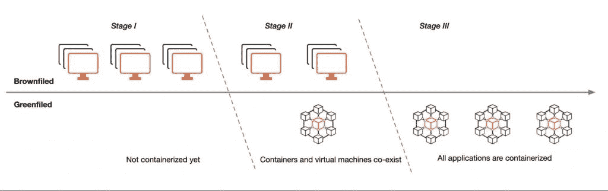
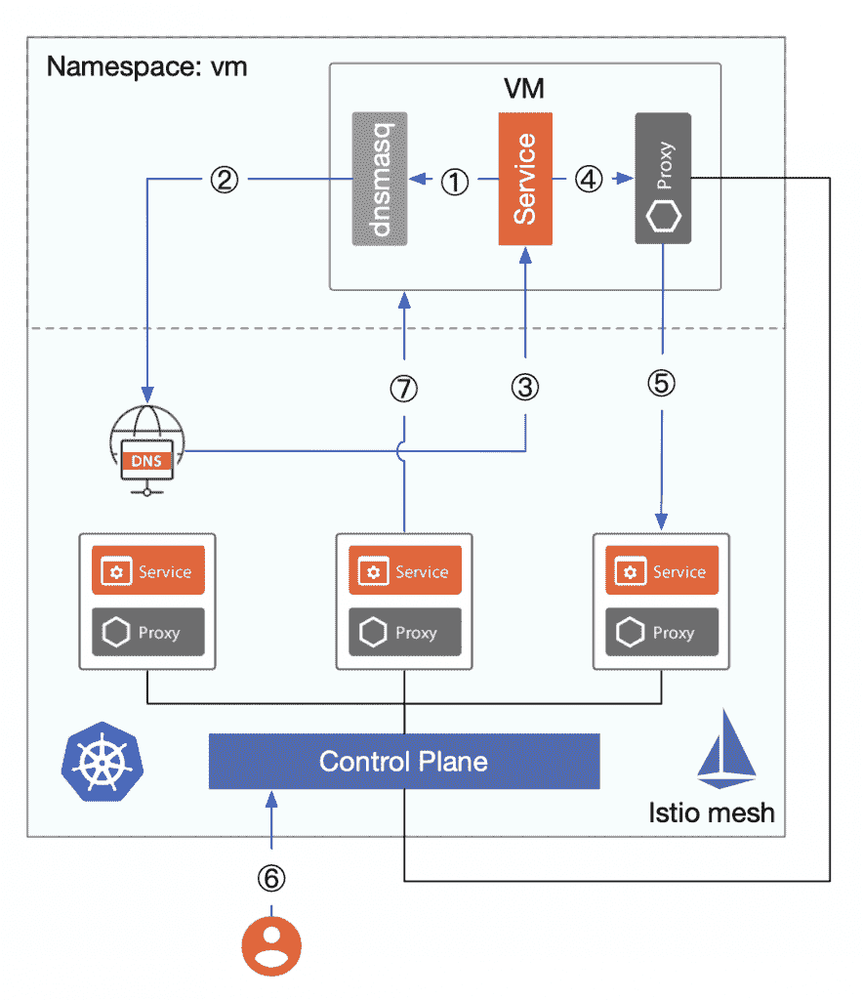
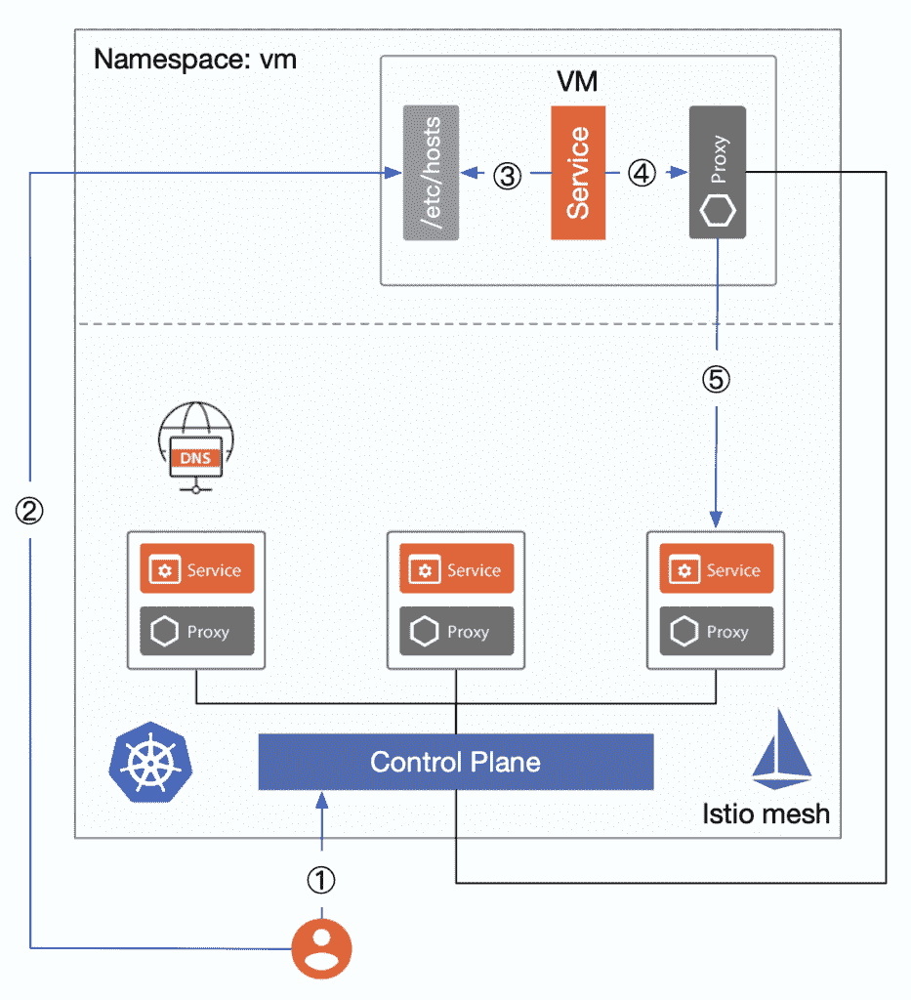
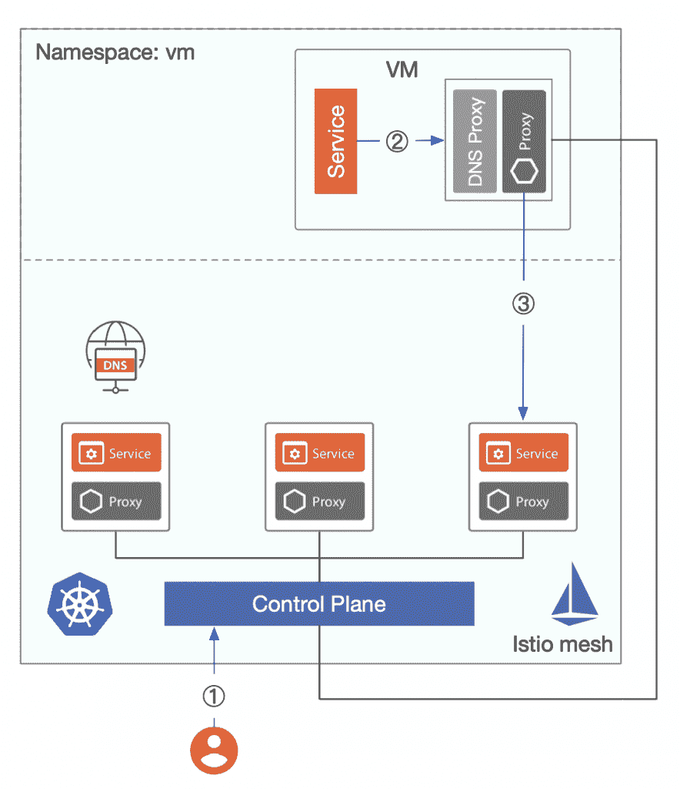

# Istio 1.8:虚拟机集成之旅

> 原文：<https://thenewstack.io/istio-1-8-a-virtual-machine-integration-odyssey/>

[Tetrate](https://www.tetrate.io/) 赞助本帖。

 [吉米·宋

Jimmy 是 Tetrate 的开发者倡导者，CNCF 大使，ServiceMesher 和 Cloud Native Community(中国)的联合创始人。他主要关注 Kubernetes、Istio 和云原生架构。](https://www.linkedin.com/in/jimmysongio/) 

在本文中，我将向您概述 [Istio](https://istio.io/) 的虚拟机集成支持历史。特别是在 Istio 1.8 中引入了智能 DNS 代理和工作负载组，这使得虚拟机和容器在资源抽象级别上是等价的。

我将向您展示 Istio 虚拟机集成的混乱历程。Tetrate 是一家企业服务网格公司，它将推动 Istio 在任何地方运行作为其创始使命的一部分，在客户部署中广泛使用了虚拟机功能，并在推动虚拟机向 Istio 上游发展方面发挥了重要作用。

## 前言

在我的[上一篇文章](https://thenewstack.io/how-to-integrate-virtual-machines-into-istio-service-mesh/)中，我谈到了 Istio 1.7 如何支持虚拟机。但在那个时候，10 月下旬，虚拟机仍然没有无缝集成到 Istio 中——仍然需要大量的手动工作。现在，Istio 1.8 增加了 WorkloadGroup 和智能 DNS 代理，允许虚拟机等非 Kubernetes 工作负载成为 Istio 中的一等公民——就像 pods 一样。

无论是否为虚拟机安装了 sidecar，在 1.7 之前，除非配置了 kube-external DNS，否则无法解析 Kubernetes 服务的 DNS 名称，这是 Istio 中虚拟机集成的最后一部分。这个缺点终于在 Istio 1.8 中得到修复。

## 为什么虚拟机支持很重要？

在将我们的应用迁移到云原生架构并不断容器化它们的过程中，我们将经历三个阶段，如下图所示。

*   阶段 1:所有应用程序都部署在虚拟机上
*   阶段 2:应用程序部署在虚拟机和容器上，从虚拟机迁移到容器，并使用 Kubernetes 管理容器。
*   阶段 3:首先将所有应用程序部署在容器中，使用 Kubernetes 管理容器，使用 Istio 管理服务到服务的通信。

上图是人为简化的:实际上，可能有多个混合云、多个区域、多个集群等。另外，在第三阶段，容器和虚拟机可能会长期共存，但容器化的趋势保持不变。

在第 2 阶段，人们通常首先将新服务和一些应用程序容器化，并将其部署到 Kubernetes 但是在应用程序完全容器化之前，过度容器化会带来很多问题。虚拟机如何访问容器中的服务？在服务迁移期间，如何确保稳定性和无缝性？Istio 从开源项目的早期就一直致力于这个问题。

## Istio 的虚拟机支持历史

Istio 对虚拟机的支持是一个漫长的过程，算是一次冒险。

### 0.2: Istio 网格扩展

从版本 0.2 开始，Istio 通过 [Istio Mesh Expansion](https://istio.io/v0.2/docs/setup/kubernetes/mesh-expansion.html) 将虚拟机添加到网格中，前提是满足以下先决条件。

*   虚拟机必须通过 IP 地址直接访问应用程序的 pods，这需要通过 VPC 或 VPN 在容器和虚拟机之间建立一个平面网络；虚拟机不需要访问集群 IP，而是直接访问服务的端点。
*   虚拟机必须能够访问 Istio 的控制平面服务(Pilot、Mixer、CA，现在集成为 Istiod)，这可以通过在 Istio 网格中部署负载平衡器向虚拟机公开控制平面端点。
*   (可选)虚拟机可以访问网格内部的 DNS 服务器(部署在 Kubernetes 中)。

集成虚拟机的步骤如下。

1.  为 Istio 控制平面服务和 Kubernetes 集群的 DNS 服务创建一个内部负载平衡器。
2.  为 Istio 服务 CIDR、服务帐户令牌、安全证书和 Istio 控制平面服务的 IP(通过内部负载平衡器公开的 IP)生成配置文件，并将其发送给虚拟机。
3.  在虚拟机中设置 Istio 组件 dnsmaq(用于 DNS 发现)。以便虚拟机可以使用 FQDN 访问网格中的服务，从而确保虚拟机可以正确解析网格中服务的集群 IP。
4.  要在虚拟机中运行服务，您需要配置 sidecar，添加要拦截的入站端口，然后重启 Istio 并运行 istioctl 来注册服务。

下图显示了从集成虚拟机到在网格中访问虚拟机中的服务的详细流程。

图 1

1.  DNS 被部署在虚拟机中的 dnsmasq 劫持，这使得它可以正确地获取 Istio 服务的集群 IP(Kubernetes 的内置 DNS)。
2.  访问 Kubernetes 的内置 DNS 服务(该服务通过内部负载平衡器暴露在集群外部，可以直接访问)。
3.  返回由`productpage.bookinfo.svc.cluster.local`解析的集群 IP，注意 IP 地址不可直接访问，但 DNS 解析失败将导致服务的 VM 请求失败。
4.  虚拟机对网格中服务的调用被 sidecar 代理劫持。
5.  由于代理连接到 Istio 控制平面，因此可以通过 xDS 查询服务的端点，因此流量将被转发到其中一个端点。
6.  要访问 mesh 中的 VM 服务，您需要使用 istioctl register 命令将 VM 服务手动添加到 mesh 中，这实际上是将 VM 服务注册到 Kubernetes 中的服务和端点。
7.  可以使用 VM 注册的服务名(FQDN，例如`mysql.vm.svc.cluster.local`)来访问网格中的服务。

上述 Istio 对虚拟机的支持在 Istio 1.0 中得以延续，它在 Istio 1.1 中引入了一个新的 API [ServiceEntry](https://istio.io/latest/docs/reference/config/networking/service-entry/) ，允许将额外的条目添加到 Istio 的内部服务注册表中，以便网格中的服务可以访问/路由到这些手动指定的服务。istioctl register 命令不再需要，在 Istio 1.9 中将被弃用。

istioctl experimental add-to-mesh 命令已添加到 Istio 1.5 中，用于将服务从虚拟机添加到网格，其工作方式与 istioctl 寄存器类似。

### 1.6 到 1.7:新的资源抽象

Istio 在[版本 1.6](https://istio.io/latest/news/releases/1.6.x/announcing-1.6/) 的流量管理中引入了一种新的资源类型 [WorkloadEntry](https://istio.io/latest/docs/reference/config/networking/workload-entry/) ，对虚拟机进行抽象，以便它们可以作为与 Kubernetes 中的 pod 等效的负载添加到网格中；具有流量管理、安全管理、可观察性等。WorkloadEntry 简化了虚拟机的网格配置过程，它根据服务条目中指定的标签选择器选择多个工作负载条目和 Kubernetes pods。

Istio 1.8 为[工作负载组](http://istio.io/latest/docs/reference/config/networking/workload-group/)添加了一个资源对象，该对象提供了一个可以包括虚拟机和 Kubernetes 工作负载的规范，旨在模仿现有的用于 Kubernetes 工作负载的 sidecar 注入和部署规范模型，以在虚拟机上引导 Istio 代理。

下面是 Kubernetes 中虚拟机与工作负载的资源抽象级别的比较。

从上图中，我们可以看到虚拟机工作负载与 Kubernetes 中的工作负载是一一对应的。

在这一点上，一切似乎都很完美。然而，直接在 Kubernetes 集群中公开 DNS 服务器是一个很大的[安全风险](https://blog.aquasec.com/dns-spoofing-kubernetes-clusters)，所以我们通常手动编写虚拟机需要访问本地/etc/hosts 的服务的域名和集群 IP 对——但是这对于具有大量节点的分布式集群来说是不实际的。

通过配置虚拟机的 local /etc/hosts 来访问 mesh 内部服务的过程如下图所示。

图 2

1.  将虚拟机中的服务注册到网格中。
2.  将要访问的服务的域名和集群 IP 对手动写入虚拟机中的本地/etc/hosts 文件。
3.  虚拟机可以访问服务的群集 IP。
4.  sidecar 代理拦截流量，特使解析要访问的服务的端点地址。
5.  对服务的指定端点的访问。

在 Kubernetes 中，我们一般使用服务对象进行服务注册和发现；每个服务都有一个单独的 DNS 名称，允许应用程序使用服务名称相互调用。我们可以使用 ServiceEntry 将虚拟机中的服务注册到 Istio 的服务注册表中，但是如果 DNS 服务器没有向网格外部公开，虚拟机就无法访问 Kubernetes 集群中的 DNS 服务器来获取集群 IP，这会导致虚拟机无法访问网格中的服务。如果我们可以向虚拟机添加一个 sidecar，它将透明地拦截 DNS 请求，并获取网格中所有服务的集群 IP，类似于图 1 中的 dnsmasq 的角色，问题难道不会得到解决吗？

### 从 Istio 1.8 开始—智能 DNS 代理

随着 Istio 1.8 中智能 [DNS 代理](https://cloudnative.to/blog/istio-dns-proxy/)的引入，虚拟机无需配置/etc/hosts 就可以访问网格内的服务，如下图所示。

图 3

边车上的 Istio 代理将带有一个由 Istiod 动态编程的缓存 DNS 代理。来自应用程序的 DNS 查询被 pod 或 VM 中的 Istio 代理透明地拦截和服务，并对 DNS 查询请求做出响应，从而实现从虚拟机到服务网格的无缝访问。

Istio 1.8 中引入的 WorkloadGroup 和智能 DNS 代理为虚拟机工作负载提供了强大的支持，使部署在虚拟机中的遗留应用程序完全等同于 Kubernetes 中的 pods。

## 摘要

在这个 Istio 的虚拟机支持的奥德赛中，我们可以看到虚拟机和 pod 统一管理的逐步实现——从在 mesh 中暴露 DNS 服务器并在虚拟机中设置 dnsmasq 开始，到使用智能 DNS 代理并抽象出`WorkloadEntry`、`WorkloadGroup`、`ServiceEntry`等资源结束。本文只关注单个集群的情况，不足以用于实际生产。我们还需要处理安全性、多集群、多租户等问题。

## 参考资源

通过 Pixabay 的特征图像。

<svg xmlns:xlink="http://www.w3.org/1999/xlink" viewBox="0 0 68 31" version="1.1"><title>Group</title> <desc>Created with Sketch.</desc></svg>