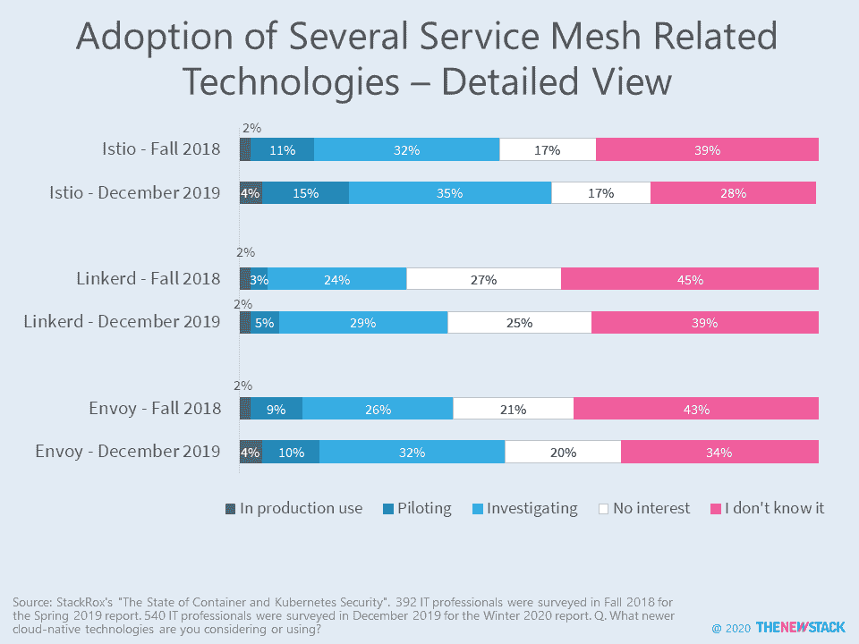

# Istio 和服务网状优势的竞争

> 原文：<https://thenewstack.io/istio-and-the-service-mesh-horse-race/>

对服务网格的行业研究的回顾表明 [Istio](https://istio.io/) 作为首选控制平面具有早期领先优势。然而，服务网格通常还具有数据平面组件以及其他增值功能。将这些开源组件混搭成捆绑解决方案是一个持续的过程，可能会影响这一领域的最终赢家和输家。

StackRox 最近在[发表的一份报告](https://www.stackrox.com/kubernetes-adoption-and-security-trends-and-market-share-for-containers/)显示，Istio 在生产中的采用比去年翻了一番，但使用率仍然很低；只有 4%的受访者表示他们的组织在生产环境中使用了 it。尽管 Linkerd 在生产中的使用停滞不前，但随着公司更加关注服务网格，它正在受益。随着去年[的推出，Linkerd 2.0](/linkerd-2-0-the-service-mesh-for-service-owners-platform-architects-sres/) 也可能导致用户数量增加。

值得注意的是，在 2018 年末和 2019 年 12 月的调查中，86%的受访者表示，他们的组织正在使用 Kubernetes 作为编排容器和微服务的一种方式。可能有必要查看其他指标，例如使用微服务的生产工作负载数量，以便更好地理解您何时真正需要服务网格。

[Envoy](https://www.envoyproxy.io) 用于许多服务网格的数据平面，与去年相比，采用率略有上升。我们不知道 Envoy 和 Istio 在捆绑解决方案中的使用频率。

到目前为止，新的堆栈将服务网格技术定义为一个专用的基础设施层，为服务到服务的通信增加功能。随着市场的成熟，我们预计关于服务网格之间以及 API 网关和入口控制器等相关技术之间的互操作性的辩论将会持续下去。与此同时，我们注意到人们愿意重新审视其他开源项目，构建本土系统，引入以供应商为中心的解决方案。

新的堆栈将继续采访前沿用户，以确定不同的使用案例和挑战如何影响[服务网格](https://thenewstack.io/category/service-mesh/)技术的发展。另外，请查看我们最近[完成的](https://thenewstack.io/survey-results-service-mesh-useful-for-security-observability-and-traffic-control/)调查。

## 奖金研究

下表列出了去年开展的五项调查中与服务网格相关的结果。New Stack 的调查是关于服务网格的，所以它显然对正在使用或积极考虑该技术的人进行了过度采样。报告的采用水平的其他差异可能是由于问题的措辞以及受访者对服务网格实际上是什么缺乏理解。

来自 Pixabay 的 Ann Margaret Clemente 的特写图片。

<svg xmlns:xlink="http://www.w3.org/1999/xlink" viewBox="0 0 68 31" version="1.1"><title>Group</title> <desc>Created with Sketch.</desc></svg>