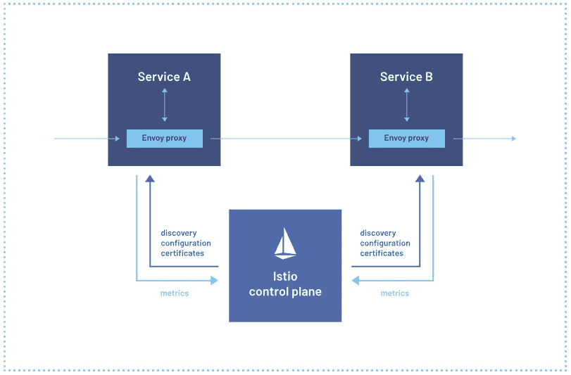
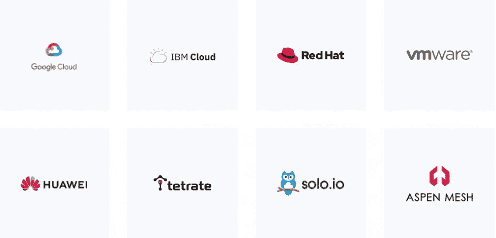

# Istio 申请加入 CNCF:为什么是现在？

> 原文：<https://thenewstack.io/istio-applies-to-join-cncf-why-now/>

Istio 指导委员会决定 [将](https://github.com/cncf/toc/pulls?q=is%3Apr+is%3Aopen+Istio) 服务网格项目作为与[云原生计算基金会(CNCF)](https://cncf.io/?utm_content=inline-mention) 的孵化项目提出了 一个问题:为什么需要这么长时间？

此举是因为 IBM——谷歌和汽车共享提供商 Lyft 的原始创建者之一——和其他社区成员对该项目的治理表示担忧，特别是谷歌倡导在 2020 年为该项目创建开放使用共享区(OUC)。然而，今天的背景已经发生了变化，Istio 指导委员会的一名成员在 GitHub 上指出。

### 正确的时机

Istio 指导委员会本周暗示时机已经成熟。根据 Istio 指导委员会成员[Craig Box](https://www.linkedin.com/in/crbnz/?originalSubdomain=uk)领导 Google Cloud 云原生倡导团队的 Istio 在[GitHub](https://github.com/cncf/toc/pull/827)上发布的声明，此举旨在帮助“深化”Istio 通过 Gateway API 和 gRPC 与 Kubernetes 的集成，“更不用说在 Istio 身边成长起来的 Envoy 了”“我们认为是时候将卓越的云原生堆栈统一在一个单一的保护伞下了，”声明写道。

然而，在 2020 年谷歌为 Istio 创建开放使用共享(OUC)许可以及谷歌对相关商标的所有权遭到批评后，Istio 申请加入 CNCF。IBM 认为 OUC 许可计划“令人失望，因为它没有达到社区对开放治理的期望，”IBM 云平台的总经理兼首席技术官 Jason McGee 在 2020 年的一篇 [博客中写道。](https://developer.ibm.com/blogs/istio-google-open-usage-commons/)

“开放的治理过程是许多成功项目的基础。如果没有这种供应商中立的项目治理方法，Kubernetes 相关项目的社区内部就会产生摩擦。在项目开始时，有一个协议，该项目将在成熟时贡献给 CNCF，”McGee 写道。“IBM 仍然认为，管理关键开源项目(如 Istio)的最佳方式是在一个声誉良好的组织的支持下进行真正的开放治理，该组织为所有贡献者提供公平的竞争环境，对用户透明，并对许可证和商标进行供应商中立的管理。谷歌应该重新考虑他们最初的承诺，将 Istio 带到 CNCF。”

IBM 开放技术副总裁[托德·摩尔](https://www.linkedin.com/in/todd-moore-7985402b/)在一封电子邮件回复中告诉新堆栈，谷歌放弃商标是为了让 Istio 项目实现其长期目标。

“很久以前，IBM 意识到了公开治理的社区的力量，在中立家庭中得到保护的项目是获得动力和催生市场的项目。虽然 Istio 项目治理取得了长足的进步，但该项目注定不会被长期中立的家庭广泛采用，”摩尔说。“单一供应商对商标和许可的控制是广泛采用的一个障碍，因为最终用户和行业参与者都知道其中的陷阱。”

与此同时，谷歌不愿交出商标的当事人“已经不在了”，摩尔指出。“这解放了理智的头脑。开始时，谁来注册商标是一个掷硬币的问题，IBM 真诚地接受了谷歌，我们将该项目带到 CNCF 的协议将得到尊重，”摩尔说。"事实证明并非如此，但这种情况已经得到纠正。"

谷歌发言人在电子邮件回复中反驳道:“我们一直在等待 Istio 生命周期中的合适时机进行捐赠，就其成熟程度而言，现在正是合适的时机。谷歌找到 OUC，要求他们将商标捐赠给 T4 Linux 基金会。OUC 同意这样做，因此作为出资的一部分，商标将被转让。”

### 初始磁阻

昨天，Istio 的指导委员会表示，OUC 的执照将继续有效。然而，这些商标将转移到 Linux 基金会，但继续在 OUC 的商标准则下管理。

据业内人士透露，谷歌的某些方面不愿意放弃 Istio 商标的所有权。这是因为，[企业管理协会(EMA)](https://www.enterprisemanagement.com/) 的分析师 [Torsten Volk](https://www.linkedin.com/in/torstenvolk) 告诉 New Stack，谷歌“在 Istio 上投入了大量的员工时间，并将服务网格视为进入企业市场的关键切入点。”

“控制将分布式应用程序连接在一起的‘字符串’对任何供应商来说都是一个很好的位置，但谷歌肯定知道 Docker 发生了什么，因为他们高估了自己的实力，为 Kubernetes 铺平了道路，”Volk 说。“要点是，谷歌需要采取这一步，以便 VMware、思科、IBM、Red Hat 和朋友们继续致力于 Istio，而不是最终开始货比三家。”

虽然 Istio 保留了 OUC 许可证，但将相关商标转移到 Linux 基金会的行为，尤其是申请成为 CNCF 项目的决定，似乎安抚了 IBM——至少在某种程度上。

### IBM 反应

IBM 昨天在一篇文章中写道:“IBM 完全相信开放治理和社区的力量。因此，我们热烈鼓掌欢迎今天将 Istio 提交给云原生计算基金会(CNCF)。”

然而，IBM 并没有说得更具体。根据 Volk 的说法，这种转变可以解释为“过去围绕这个话题有很多摩擦，谷歌仍然坚持 OUC 许可证模式，而不是简单地采用没有商标保护的传统开源许可证。”

沃尔克说:“对于所有相关方来说，这都是一个棘手的话题，因为 Istio 整合需要每个供应商做出重大投资，没有人愿意向他们的董事会解释为什么他们的公司正在为谷歌的股东价值做出贡献。”。

### 更多支持和治理

与此同时，据谷歌工程副总裁[【CNCF】](https://github.com/cncf/devstats)[陈戈德堡](https://www.linkedin.com/in/goldbergchen/) 在一篇博客文章中指出，谷歌已经为 Istio 做出了一半以上的贡献和三分之二的提交。在为 Istio 采用 Envoy 之后，谷歌也成为了 Envoy 的最大贡献者。

“Istio 是组织的 Kubernetes 生态系统中位于 CNCF 之外的最后一个主要组件，其 API 与 Kubernetes 完全一致。“在我们最近向 CNCF 捐赠 Knative 之后，接受 Istio 将在基金会的支持下完成我们的云原生堆栈，并使 Istio 更接近 Kubernetes 项目，”戈德堡写道加入 CNCF 还使贡献者和客户能够更容易地展示支持和治理，符合其他关键云原生项目的标准，因此我们很高兴能够帮助支持项目的发展和采用。”

对于 Istio 领先的工具提供商,[olo . io](https://www.solo.io/)来说，Istio 加入 CNCF 只是一个好消息。当然，CNCF 的支持只会让 Istio 更加强大，这应该会转化为 Solo.io 的[Gloo Mesh](https://www.solo.io/products/gloo-mesh/)和其他基于 Istio 的产品的用户的性能优势。

“五年前，我们在 Istio 上下了赌注……但我们确实相信 Istio 是最好的服务网络，即使它不在 CNCF。但在人们对 Istio 为什么不在 CNCF 感到有点困惑甚至有点担心之前，Solo.io 的创始人兼首席执行官“[Idit Levine](https://www.linkedin.com/in/iditlevine)”告诉新栈。“现在我认为，Istio 加入 CNCF 将使 Istio 完全像 Kubernetes 一样，成为事实上的服务网络。”

Solo.io 全球现场首席技术官副总裁 Christian E. Posta 和 solo . io 现场工程师 Rinor Maloku 在本书[【Istio in Action】](https://www.manning.com/books/istio-in-action)中对服务网格进行了定义，这是一个相对较新的术语，用来描述一个分散的应用程序网络基础设施，使应用程序安全、灵活、可观察这样，服务网格描述了一种由数据平面和控制平面组成的架构，数据平面使用应用层代理代表应用管理网络流量，控制平面管理代理。Posta 和 Maloku 写道，这种架构“让我们能够在应用程序之外构建重要的应用程序网络功能，而不依赖于特定的编程语言或框架”。

“Istio 是一个服务网格的开源实现。它最初是由 Lyft、谷歌和 IBM 的人创建的，但现在它有一个充满活力、开放、多元化的社区，包括来自 Lyft、Red Hat、VMware、Solo.io、Aspen Mesh、Salesforce 和许多其他公司的个人，”波斯塔和马洛克写道。“Istio 允许我们构建可靠、安全的云原生系统，并在大多数情况下无需更改应用程序代码即可解决安全性、策略管理和可观察性等难题。”

<svg xmlns:xlink="http://www.w3.org/1999/xlink" viewBox="0 0 68 31" version="1.1"><title>Group</title> <desc>Created with Sketch.</desc></svg>