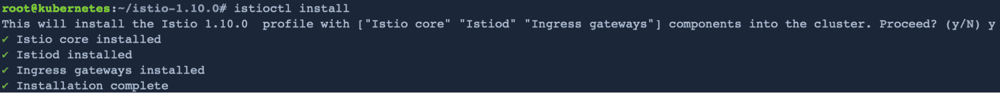
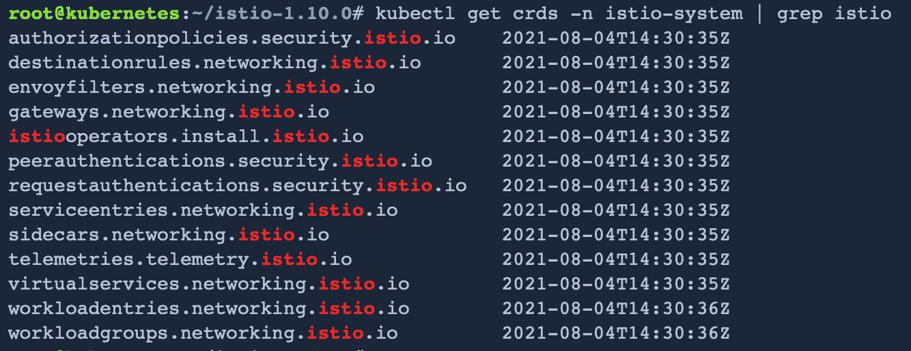
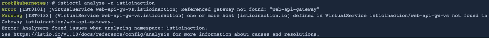
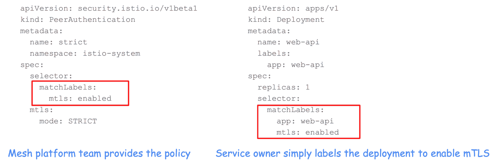

# Istio 的复杂性去神秘化

> 原文：<https://thenewstack.io/istios-complexity-demystified/>

很长一段时间以来，Istio 一直被批评为出了名的复杂和难以使用。作为一个在这个项目上工作了四年多的人，我在 Istio 的头两年同意了这个说法。然而，自从 [Istio 1.3](https://istio.io/latest/news/releases/1.3.x/announcing-1.3/) 以来，Istio 社区专注于简化，Istio 现在更加精简和易于使用，特别是有了 [Istio 1.6](https://istio.io/latest/news/releases/1.6.x/announcing-1.6/) 或更新版本。我个人观察到改进的简单性和易用性，我们的许多用户都报告了类似的体验。

本质上，今天的 Istio 要简单得多。任何因为早期版本更难使用而避开 Istio 的人都应该考虑再看一眼。

## Istio 让简单的事情变得简单

随着 Istio 社区对简单性的极大关注，我很自豪地说，简单的事情现在通过 Istio 变得很容易。让我先举三个具体的例子:

### 1.安装一个命令

在 Istio 的早期，我记得我总是必须在 istio.io 中查找安装说明。这不是一个要记住的简单命令。如今，用户可以使用`istioctl install`命令轻松安装 Istio，该命令为他们设置了默认配置文件。此外，用户可以指定`--profile`来指示不同的配置文件。很好记，对吧？

Istio 安装大约需要一分钟，只安装了十几个自定义资源定义(CRD ):

### 2.分析你的 Istio 资源

早在使用 Istio 的时候，我记得当从 Kubernetes 到 [Istio service mesh](https://thenewstack.io/why-do-you-need-istio-when-you-already-have-kubernetes/) 使用一个简单的留言簿应用程序时，我花了几个小时调试我的 Istio 资源出了什么问题。不再是了！`istioctl analyze`考虑到群集中的其他 Istio 资源，可以立即告诉我我的 Istio 资源有什么问题。

### 3.简单的安全策略

我们的大多数用户都在采用服务网格，因为他们的安全或架构团队要求他们保护微服务通信。Istio 让这变得非常简单:网格平台团队只需应用认证策略，并在任何带有匹配标签的服务上启用相互 TLS。我喜欢这一点，因为这意味着服务所有者不需要做任何事情，只需要标记他们的部署，就可以要求他们的服务与 mTLS 进行所有通信。您可能会想，如果没有 service mesh，您可以自己管理所有这些，但是修改您的应用程序代码并创建一个自己开发的框架来管理证书分发和循环会困难得多。

## **服务网格的复杂性**

 [孙林

林是 Solo.io 的开源总监。她自 2017 年以来一直致力于 Istio 服务网格，并在 Istio 技术监督委员会任职。此前，她在 Istio 指导委员会服务了三年，并在 IBM 担任了超过 15 年的高级技术人员和主发明人。她是《Istio Explained*一书的作者，拥有 200 多项专利。*](https://www.linkedin.com/in/lin-sun-a9b7a81/)  *服务网格数据平面是您的基础架构的关键组件，当您需要处理云原生工作负载以及虚拟机或裸机上的传统工作负载时，它自然会很复杂。此外，您可以跨不同的区域、地区和云运行您的工作负载。像 Istio 这样的服务网格对于纯粹的 Kubernetes 工作负载来说很简单，但我们用户的现实是他们都有不同的需求，他们中的许多人仍然在非 Kubernetes 环境中拥有大部分工作负载。对于他们来说，在云原生之旅中，让这些传统工作负载参与服务网格至关重要。我们的用户甚至告诉我们，其中一些工作负载可能会一直留在 Kubernetes 之外。

这就是保持服务网格简单的许多挑战开始发挥作用的地方。使用 Istio，我们需要简化场景，但也要支持复杂的场景。

以安装过程为例，Istio 项目因提供太多选择而受到批评。虽然使用 istioctl 安装 Istio 非常简单，但我们有一些用户不想在生产中运行 istioctl，因为它需要更新他们的交付渠道，他们必须为此寻求额外的批准。一些常见的工具，如[赫尔姆](https://helm.sh/)已经在他们的组织中得到支持，他们将更容易利用这些预先批准的工具。此外，我们的一些用户希望控制面板在他们的群集之外运行，以便可以由不同的团队单独管理，因此外部控制面板是我们提供的另一种安装方法。因为每个公司或团队有如此多不同的用例及需求，我相信根据用户的各种需求提供选择和灵活性比仅仅提供一种使用`istioctl install`的简单安装方法要好。

Istio 也因其网络 API 的复杂性而受到批评。复杂性部分是由丰富的可用功能造成的，同时为南北流量和东西流量提供一致的 API。有趣的是，在过去的几年里，我发现所有这些特性都是致力于解决各种挑战的用户所要求的。应用层网络非常复杂，从边缘到东西向流量，必须考虑许多场景，例如:

1.  你的主机名是什么？您是在边缘终止流量还是使用直通？
2.  您使用的是什么协议和端口？
3.  你如何保持你的优势？
4.  您希望如何将流量路由到您的服务？
5.  如何提高服务的弹性？
6.  您是否需要基于位置的故障转移策略？

## 【Istio 的下一步是什么？

由于生产中有大量用户，Istio 项目致力于关注 Istio 的第 2 天运营，因为我们希望确保我们的用户成功地在全球范围内大规模运行服务网格。我很高兴能在 [Solo.io](https://www.solo.io/) 与我们的 Istio 和 [Gloo Mesh](https://www.solo.io/products/gloo-mesh/) 用户合作，帮助他们大规模采用 Istio，同时也将他们的要求带给上游的 Istio。

作为专注于第 2 天运营的工作的一部分，我们也在标准化我们的 API，因为它们变得更加成熟，并提供了基于角色的 API 的明确分离。例如，在试验该功能时，MeshConfig 一直是许多 API 的家园，但随着该功能的成熟，社区正在将这些 API 标准化为自己的定制资源，以便用户可以轻松配置遥测或扩展或代理配置，而无需要求平台团队修改全局 mesh 配置。

我们将继续把我们的功能从不太成熟的阶段(实验或 alpha)升级到成熟阶段(beta 或稳定)。和其他成功的项目一样，我们希望保持整洁，删除用户不感兴趣的功能。对于长时间停留在实验阶段或 alpha 阶段的特性来说尤其如此。我们将继续让简单的场景变得简单，但为我们的用户提供复杂的场景。

## **亲身体验 Istio 的简单！**

如果您想了解更多关于 Istio 的信息，或者仍然需要确信它易于使用，请从[我们的 Istio 工作室](https://play.instruqt.com/soloio/invite/xxuodq1yhvcr)开始，亲自体验 Istio。(注:该链接有效期至 11 月底，可供 500 人使用)。在本次研讨会中，您可以了解如何从 Istio 的入口网关逐步采用 Istio 来安全地公开您的服务，以及如何观察您的服务与各种流量控制场景之间的交互。如果你喜欢参加现场研讨会，只需[报名](https://www.solo.io/events-webinars/)参加我们即将举办的“Istio 入门”研讨会。

<svg xmlns:xlink="http://www.w3.org/1999/xlink" viewBox="0 0 68 31" version="1.1"><title>Group</title> <desc>Created with Sketch.</desc></svg>*