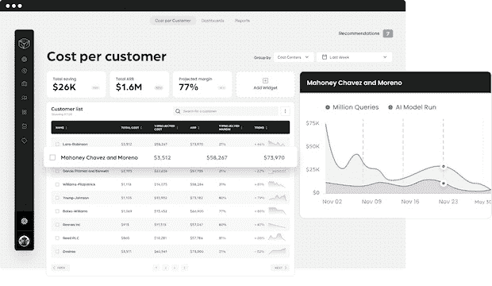
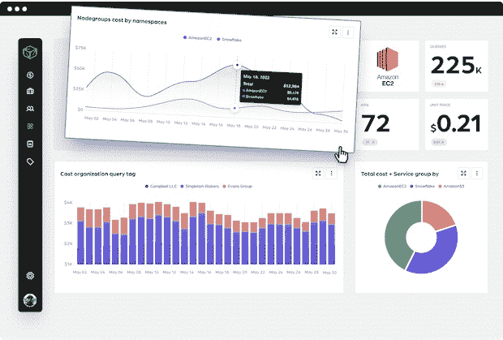
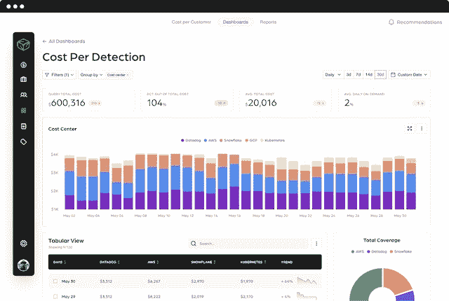

# 你在 AWS 上花多少钱并不重要

> 原文：<https://thenewstack.io/it-doesnt-matter-how-much-you-spend-on-aws/>

仅仅专注于减少您的云支出不会让您有任何进展。归根结底，最重要的是盈利能力。

谈到云成本管理，对话通常围绕降低成本展开。毕竟，云账单通常是 SaaS 公司和托管服务提供商(MSP)的第二大支出，因此可以理解这些企业希望保持低成本。

但是简单地削减你的云成本可能不是一个好的长期策略。它会导致质量下降，限制你的扩展能力，扼杀创新，所有这些都会损害盈利能力。你真正应该问的问题是，你的基础设施的成本效益和利润如何。这是 FinOps 旨在解决的首要问题。

## 关注成本效率和盈利能力

长期以来，初创企业一直过度关注增长。但增长不一定转化为盈利。只关注增长的企业有可能成为自身成功的受害者，原因很简单，没有额外的帮助，云支出变得过于复杂，难以有效管理。

如果你正在考虑为你的企业融资，你需要开始优先考虑你的商业模式的盈利能力，而不是简单地增加你的年收入。未能在运营成本和盈利能力之间建立良好的平衡是大多数初创企业失败的最常见原因之一——根据一些消息来源，大约 90%。

谈到[云成本](https://thenewstack.io/improving-price-performance-lowers-infrastructure-costs/)，随着你搭载的客户越来越多，你的账单自然会增加。在许多情况下，这是你的公司变得更加有利可图的标志。或者，情况可能正好相反，即使你的账单在增加，你的利润却停滞不前——或者更糟——缩水了。为了确定您的业务目前所处的位置，以及在可预见的未来可能处于的位置，您需要在评估和优化您的云支出时考虑业务环境。

一个健康的业务环境应该会看到盈利能力随着云支出的增加而增加。如果它们偏离太多，那么业务连续性可能会面临风险，而如果它们越来越接近，你的盈利能力将会下降。

## 将工程团队纳入业务层面的对话

大多数 SaaS 公司都有一个成熟的工程模型，在这个模型中，开发和运营不再是孤立的，而是在整个应用交付管道中协同工作。一个有效的工程团队基于连续的反馈循环迭代地构建、测试和发布 SaaS 产品。因此，在任何一家 SaaS 公司中，整个客户体验以及每个客户的盈利能力都回到了工程团队的活动中。

问题是，在许多组织中，工程本身已经成为一个孤立的部门——一个倾向于严格专注于开发和维护现代 SaaS 产品的技术专业知识的部门。大多数工程团队很少关注云支出之类的事情，而是依赖财务团队来制定预算。

为了构建一个更可持续、更具成本效益的业务模式，工程设计需要被纳入围绕云支出和盈利能力的高层对话中。工程团队需要了解他们的云支出，以及他们的单位经济效益。例如，他们需要知道部署特定服务和功能的成本，以便知道他们是否有利可图。他们需要云支出的详细视图来回答以下问题:

*   我们当前云设置的相关成本是多少？
*   维护一个特定的产品、服务、功能或客户需要多少成本？
*   这些产品、服务、功能和客户是否盈利？
*   我们的 Azure 账单更高是因为我们在增长还是因为我们超支了？
*   我们如何处理资源供应和云成本预测？

一旦工程团队能够理解它们对盈利能力的影响，他们就可以参与围绕业务增长的高层讨论。换句话说，他们不仅仅开发 SaaS 产品，他们还开发高效的 SaaS 产品，这就是 FinOps 模式的全部。

## 最后的话

在当今的经济环境下，成功的公司是那些作为在共同目标下运营的统一团队做出数据驱动的业务决策的公司。企业再也无法承受各自为政的经营，不计后果的支出和过度专注于增长的日子已经一去不复返了。投资者不再只对公司规模感兴趣，他们希望看到一种在可持续性和收入之间取得平衡的盈利商业模式。

总之，SaaS 初创企业必须注意避免单纯关注降低成本，无论在令人不安的经济环境下这有多么诱人。相反，决策者必须对其商业模式的盈利能力有更细致入微的了解。这使得 FinOps 框架成为当今基于服务的云商业模式的重要资源。

<svg xmlns:xlink="http://www.w3.org/1999/xlink" viewBox="0 0 68 31" version="1.1"><title>Group</title> <desc>Created with Sketch.</desc></svg>