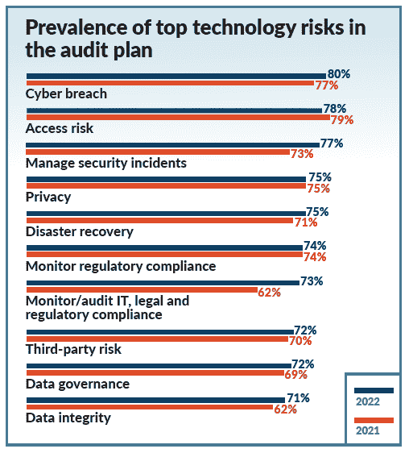

# IT 专业人士信任开放框架和第三方云

> 原文：<https://thenewstack.io/it-pros-trust-open-frameworks-and-clouds-over-third-parties/>

根据云安全联盟进行的调查，尽管竞争对手声称，[云服务提供商](https://thenewstack.io/category/cloud-services/)和开源框架被认为是有效的。

在针对[“云中的敏感数据”](https://cloudsecurityalliance.org/artifacts/sensitive-data-in-the-cloud/)的 452 名 IT 和安全专业人员调查中，38%的人表示他们的组织拥有有效或高度有效的方法来处理云计算的风险管理。这份报告于 4 月发布，是由 Anjuna 委托的，Anjuna 也是[机密计算联盟](https://confidentialcomputing.io/members/)的成员。

根据另一份联盟报告[“衡量风险和风险治理”，](https://cloudsecurityalliance.org/artifacts/measuring-risk-and-risk-governance/)在 2021 年 7 月和 8 月的调查中，63%的 IT 和安全专业人员认为开源风险管理实践是有效的，相比之下，30%的人认为第三方供应商解决方案是有效的。这份报告是受谷歌委托于 6 月发布的。

根据 6 月发布的云安全联盟调查，云原生、第三方和开源风险管理实践对云的有效性。来源:“衡量风险和风险治理”，云安全联盟

美国国家标准与技术研究所的[网络安全框架的](https://www.nist.gov/cyberframework)被六月份研究的 72%的参与者用于管理公共云风险。41%的受访者表示他们遵循联盟自己的框架 [CCM 和 CAIQ](https://cloudsecurityalliance.org/research/cloud-controls-matrix/) 。

只有 49%的受访者使用第三方供应商来实际量化他们面临的风险水平，其中[安全记分卡](https://securityscorecard.com/blog)的使用率是领先竞争对手的两倍以上。

风险管理是一个经常与[安全](https://thenewstack.io/category/security/)责任联系在一起的话题，但它也包含更广泛的金融不确定性。近四分之三(73%)的六月调查参与者认为衡量云风险的方法与传统 IT 有显著不同。

为了更好地了解这个话题，我们查看了由 Protiviti 和 ISACA 进行的第 10 届年度[“IT 审计和技术风险调查](https://www.protiviti.com/US-en/insights/protiviti-top-risks-survey)”的结果。

与前一年相比，网络违规、安全事件以及 IT、法律和法规合规性都跃升为 2022 年审计计划中要解决的风险。

来源:“IT 审计对当今顶级技术风险的观点”，Protiviti 和 ISACA

八月初由[亚马逊网络服务](https://aws.amazon.com/?utm_content=inline-mention)和 Splunk 宣布的新的[安全数据框架](https://thenewstack.io/its-time-to-normalize-cyberattack-data/)在一定程度上是合理的，因为开源合作被认为符合围绕数据治理的市场需求。

观察市场如何发展将会很有趣。像数据保护公司 Normalize 这样的供应商会有一席之地吗？还是大公司会主导？TBD。

<svg xmlns:xlink="http://www.w3.org/1999/xlink" viewBox="0 0 68 31" version="1.1"><title>Group</title> <desc>Created with Sketch.</desc></svg>