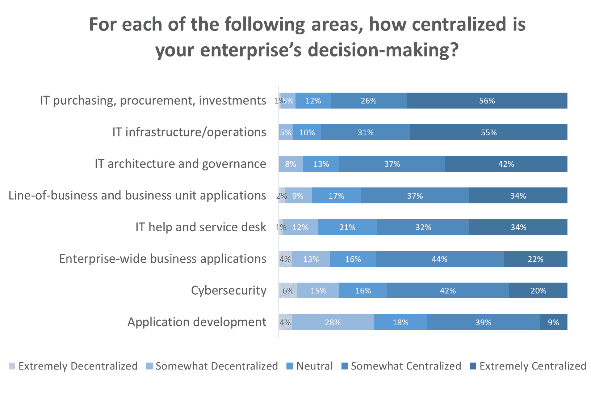
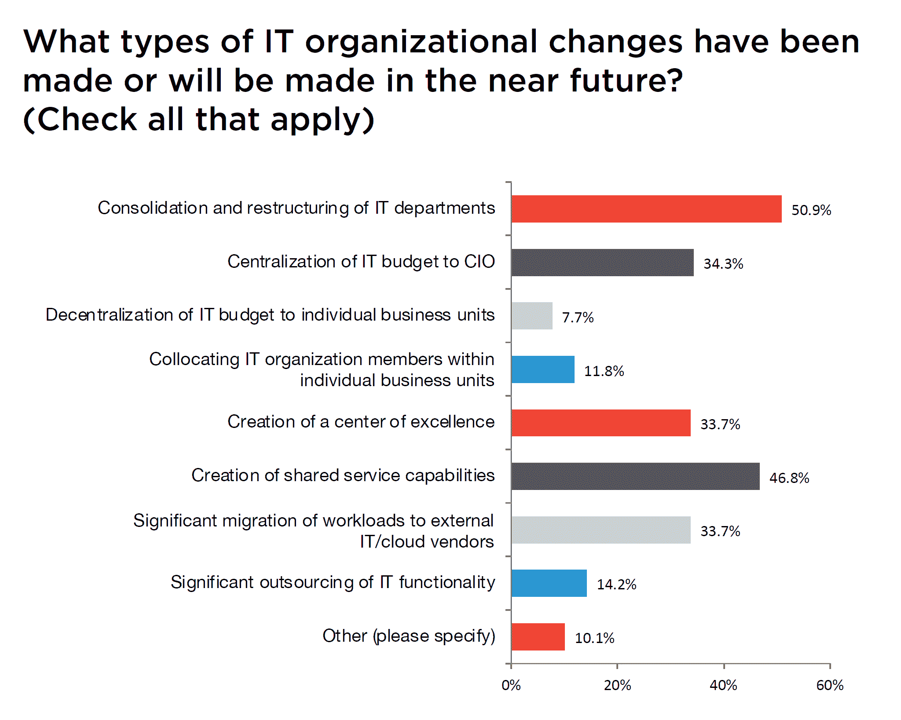

# IT 支出:自上而下与分散决策

> 原文：<https://thenewstack.io/it-spending-top-down-vs-decentralized-decision-making/>

IT 部门继续他们对控制企业技术决策的无止境的追求。56%的组织的 IT 支出决策高度集中，尤其是在基础架构和运营方面。相比之下，根据我与 Argyle 高管论坛对 202 名 IT 领导者进行的调查，只有 9%的受访者认为应用程序开发是极度集中的。尽管技术决策似乎正在向业务部门转移，但 IT 主管的计划实际上是在他们的组织中引入更多的功能。

来源:Argyle 执行论坛

[数字化转型](https://thenewstack.io/digital-transformation-it-and-the-rest-of-the-company/)意味着增加技术支出，但不一定是 IT 部门的支出。为了应对分散的技术支出可能会分散到非 IT 业务部门，IT 组织实际上正在试图集中自己。根据上述调查，53%的 IT 领导者在过去两年中对其 IT 运营模式或组织进行了重大变革，另有 37%的领导者正在进行变革。

这些计划中有一半涉及部门重组，如创建云运营、站点可靠性工程团队或正式确定 DevOps 角色。尽管声势浩大，但这些努力往往是为了重新安排躺椅，因为在一天结束时，组织的角色正在现代化。

纵观当前和未来的组织变革，分权显然不是 IT 领导者的优先事项。只有 8%的人计划将 IT 预算转移到各个业务部门，而 34%的人希望将预算转移给首席信息官。此外，只有 12%的公司计划将 IT 员工分配到业务部门。

来源:Argyle 执行论坛

一个常见的变化是建立卓越中心，这通常是培育创新的[双模式](https://thenewstack.io/parity-check-dont-afraid-shadow-yet/)方法的一部分。

IT 运营模式的改变通常是为了重新关注核心能力。因此，47%的当前和未来变化将是创建共享服务功能，其中中央 IT 组织跨多个业务部门提供一致的服务，如服务台。这种方法已经在许多组织中流行起来，因为 35%的受访者表示，目前超过一半的 IT 基础架构和应用程序工作负载是通过以客户为中心的模式交付的，在这种模式下，IT 充当内部最终用户、外部 IT/云供应商和/或内部提供的共享服务之间的服务代理。

下一次当你听说将决策权推给实际实施技术变革的人是多么重要时，请记住反对这种授权的对抗力量。

通过 Pixabay 的特征图像。

<svg xmlns:xlink="http://www.w3.org/1999/xlink" viewBox="0 0 68 31" version="1.1"><title>Group</title> <desc>Created with Sketch.</desc></svg>