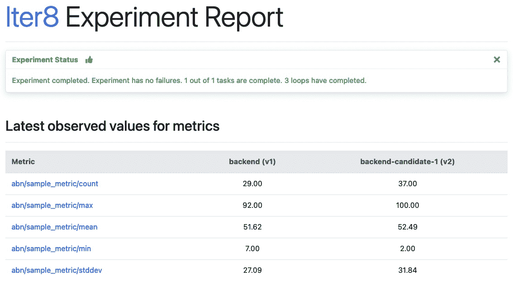

# ITER 8:Kubernetes 应用程序、ML 模型的简单 A/B/n 测试

> 原文：<https://thenewstack.io/iter8-simple-a-b-n-testing-of-kubernetes-apps-ml-models/>

分布式应用程序的常见架构是拥有一个向用户公开的前端组件，该组件与一个或多个后端组件进行交互。在本文中，我们关注这样一个分布式架构，并描述如何测试后端组件的多个版本。

在下图中，前端组件可能是一个在线商店。它依靠后端模型驱动的推荐组件来提出产品建议。我们对 A/B/n 测试后端推荐组件的多个版本感兴趣。在图中，我们有两个版本`v1`(*当前*，或*基线*，版本)和`v2`*(*候选*版本)。*

 *

A/B/n 测试是有价值的，因为它允许应用程序所有者在应用程序组件的多个候选版本之间进行智能选择，从而最大化收益。在 Kubernetes 中，A/B/n 测试在度量和流量工程方面提出了两个重要的挑战。

## **挑战:指标**

A/B/n 测试依赖于业务度量——衡量应用程序的好处或价值的度量。例如，对于在线商店，相关指标可能是销售收入或用户参与度。因为业务指标是特定于应用程序的，所以它们不能由基础设施来计算，而必须由应用程序本身来计算。

业务指标通常由面向用户的(前端)应用程序组件来计算。后端组件的贡献间接包括在指标计算中。然而，前端组件不能直接将度量值归因于后端组件的特定版本，因为它通常不知道后端的哪个版本被用于特定请求。

## **挑战:会话粘性**

来自同一个用户会话的请求应该被路由到相同版本的后端组件(会话粘性)。否则，用户体验可能会不一致。此外，如果来自同一个用户会话的用户请求被分发到后端的多个版本，那么就不可能确定一个业务指标。

### **Iter8 SDK**

[Iter8](https://iter8.tools) 是一个开源的 Kubernetes-release 优化器，可以帮助你轻松[测试 Kubernetes 应用](https://thenewstack.io/why-kubernetes-has-emerged-as-the-os-of-the-cloud/)。有了 Iter8，你可以进行各种各样的实验，比如 SLO 验证、金丝雀测试、混沌注入测试和 A/B/n 测试。Iter8 中的 A/B/n 测试由 Iter8 SDK 启用。

为了支持 A/B/n 测试，Iter8 SDK 引入了“磁道标识符”的概念。track 是 Kubernetes 应用程序的逻辑版本。有效轨道标识符的集合在应用程序的生命周期内是固定的。随着新版本的开发和部署，与给定轨道标识符相关联的应用程序的版本随着时间而改变。

对于给定的应用，轨道标识符的集合是固定的；这个数字决定了可以同时部署/测试多少个版本的应用程序。因为轨道标识符的集合是固定的，所以它们可以用于配置到应用程序的路由。

Iter8 SDK 为前端应用程序组件提供了两个 API:

*   `Lookup(component, user_session)`–给定一个应用程序和用户会话，返回一个轨迹标识符。只要没有配置改变，相同的输入将导致相同的轨道标识符。
*   `WriteMetric(metric_value, component, user_session)`–给定一个应用程序、一个用户会话、一个指标名称及其值，这会将指标值与应用程序的适当版本相关联。

下面的序列图说明了这种交互。作为对用户请求的响应，购物组件调用`Lookup()`来识别曲目标识符。`Lookup()`确保会话粘性——将为相同的用户会话推荐相同的曲目标识符。购物组件然后使用轨迹标识符作为路由的关键字将其请求发送给推荐组件。

稍后，当购物组件为用户会话计算业务指标时，它可以安全地与推荐组件的正确版本相关联。`WriteMetric()`有助于消除购物组件维护版本标签映射的需要。


## **运行 A/B 测试**

我们展示了如何为上述推荐组件运行 A/B 测试。在运行测试之前，已经部署了 Iter8 服务和应用程序。部署后端推荐组件的候选版本，并运行 A/B 实验。最后，如果需要，我们将展示如何提升候选版本。

### **部署 Iter8 服务**

我们可以用`helm`部署 Iter8 服务:

```
helm install  --repo https://iter8-tools.github.io/hub \

--version  0.2.2  iter8-abn abn  \

--set no"apps.default.backend.resources={service,deployment}"

```

这里，服务被配置为在`default`名称空间中监视`backend`应用程序的版本。Iter8 服务监视包含新版本的服务和部署对象。当观察到它们存在并准备好时，服务将包含新版本以响应`Lookup()`的请求。

### **部署应用**

以下手动步骤可用于部署应用程序。首先，部署前端在线商店组件:

```
kubectl create deployment frontend  --image=iter8/abn-sample-frontend-node:0.13

kubectl expose deployment frontend  --name=frontend  --port=8090

```

接下来，部署后端推荐组件的当前或基线版本( v1 ):

```
kubectl create deployment backend  --image=iter8/abn-sample-backend:0.13-v1

kubectl label deployment backend app.kubernetes.io/version=v1

kubectl expose deployment backend  --name=backend  --port=8091

```

### **运行 A/B 测试**

我们现在准备运行 A/B 测试，比较当前部署的后端推荐组件的基线版本和新的候选版本。概括地说，运行测试有两个步骤。第一步是部署组件的一个或多个候选版本。第二步是启动 Iter8 实验来评估收集的指标。这个实验将定期执行，直到它被删除。每次执行时，都会重新评估指标。

### 部署候选版本

以下手动步骤展示了候选版本的部署。但是，任何 CI/CD 流程都可以用于部署候选版本。

```
kubectl create deployment backend-candidate-1  --image=iter8/abn-sample-backend:0.13-v2

kubectl label deployment backend-candidate-1  app.kubernetes.io/version=v2

kubectl expose deployment backend-candidate-1  --name=backend-candidate-1  --port=8091

```

在这个例子中，候选版本是`v2`。这些对象共享相同的名称，如上所述，该名称对应于轨道标识符:`backend-candidate-1`。

实际上，测试取决于应用于前端组件的用户负载。在本教程中，我们使用一个简单的负载生成脚本来应用负载。要使用它，请将本地请求转发到群集:

```
kubectl port-forward svc/frontend  8090:8090

```

并调用负载生成器:

```
curl  -sL https://github.com/iter8-tools/docs/releases/download/v0.13.0/generate_load.sh \

|  sh  -s  --

```

## 启动 Iter8 实验

启动一个 Iter8 实验，该实验使用预定义的`abnmetrics`任务来定期读取业务指标:

```
iter8  k  launch  \

--set  "tasks={abnmetrics}"  \

--set abnmetrics.application=default/backend  \

--set runner=cronjob  \

--set cronjobSchedule="*/1 * * * *"

```

### 检查结果

检查实验结果(使用命令`iter8 k report [-o html]`)以决定是否提升候选版本。当实验运行时，报告将大约每分钟更新一次。一个示例报告是:



## **提升冠军**

一旦实验完成，候选版本可以被删除，基线版本可以被升级。同样，提供了提升推荐组件的候选版本的手动步骤。

删除候选版本:

```
kubectl delete deployment backend-candidate-1

kubectl delete service backend-candidate-1

```

然后升级基线版本:

```
kubectl set image deployment/backend abn-sample-backend=iter8/abn-sample-backend:0.13-v2

kubectl label  --overwrite deployment/backend app.kubernetes.io/version=v2
<b></b>

```

## **它是如何工作的？一些细节**

### **ITER 8 服务**

为了监视应用程序的新候选版本，Iter8 服务被配置为知道哪些对象构成了新版本。配置只需要预期资源对象的类型。给定这些简化的假设，Iter8 可以推导出对象名称:

*   所有版本的所有对象都部署在同一个名称空间中。
*   每个版本中只有一个给定类型的资源对象。
*   与基线轨道相关联的版本中的每个对象的名称是  `<application_name>.`
`*   The name of each object in the version associated with a candidate track is of the form `<application_name>-candidate-<index> where index is 1, 2, etc.``*   The baseline track identifier is `<application_name>`。*   与候选版本相关联的轨道标识符的形式为`<application_name>-candidate-<index>`。``

 ``最后，Iter8 假设只有一个候选版本(支持 A/B 测试)。如果有多个版本，应使用`maxNumCandidates`为应用程序指定最大数量:

```
--set apps.&lt;namespace&gt;.&lt;application&gt;.maxNumCandidates=&lt;number&gt;

```

### **部署候选版本**

随着后端组件版本的部署或删除，Iter8 服务维护曲目标识符到可用版本的映射。为了构建和维护这种映射，Iter8 服务监视其配置中指定的资源对象(见上文)。特别是，该配置要求构成后端组件的 Kubernetes 对象遵守指定的命名约定。此外，它们应该将标签`app.kubernetes.io/version`设置为版本标识符。

## **使用 SDK 实现前端**

我们通过一个 Node.js 示例展示了修改应用程序的前端组件以使用 Iter8 SDK 进行 A/B/n 测试是多么容易。

首先，需要从规范中生成 gRPC 库和源文件:

```
var grpc  =  require('@grpc/grpc-js');

var messages  =  require('./abn_pb.js');

var services  =  require('./abn_grpc_pb.js');

```

为 Iter8 服务创建一个客户端:

```
var client  =  new services.ABNClient(abnEndpoint,  gprc.credentials.createInsecure());

```

轨道标识符被映射到一组静态的端点。这里，路线存储在由轨迹标识符索引的地图中:

```
const trackToRoute  =  {

<span class="Apple-converted-space">   </span>"backend":  <span class="Apple-converted-space">   </span>"http://backend.default.svc.cluster.local:8091",

<span class="Apple-converted-space">   </span>"backend-candidate-1":  "http://backend-candidate-1.default.svc.cluster.local:8091",

}

```

确定出现故障时使用的默认路由:

```
route  =  trackToRoute['backend'];

```

调用 Lookup() ，传递后端组件和用户会话(在本例中， X-User 请求头的值):

```
var application  =  new messages.Application();

application.setName('default/backend');

application.setUser(req.header('X-User'));

client.lookup(application,  function(err,  session)  {

<span class="Apple-converted-space">    </span>if  (!err)  {

<span class="Apple-converted-space">          </span>// use route determined by recommended track

<span class="Apple-converted-space">          </span>route  =  trackToRoute[session.getTrack()];

<span class="Apple-converted-space">    </span>}

<span class="Apple-converted-space">    </span>// call backend service using session.getTrack() as index to list of endpoints

<span class="Apple-converted-space">    </span>http.get(route  +  '/recommend',  ...  )

}

```

或者，要编写指标，调用`WriteMetric()`、后端组件、用户会话以及指标名称和值(在本例中，是 0 到 100 之间的一个随机数):

```
var mv  =  new messages.MetricValue();

mv.setName('sample_metric');

mv.setValue(random({min:  0,  max:  100,  integer:  true}).toString());

mv.setApplication('default/backend');

mv.setUser(user);

client.writeMetric(mv,  function(err,  session)  {});

```

此代码的工作副本可以在 [这里](https://github.com/iter8-tools/docs/tree/v0.13.2/samples/abn-sample/frontend/node) 找到。

这些更改是一次性的——无论运行多少测试，都不需要进一步的更改。

## **结论和后续步骤**

我们已经探讨了进行 A/B/n 测试的一些挑战，尤其是应用程序的后端组件。这些挑战集中在前端组件将业务指标正确归因于被测试的后端组件版本的能力上。Iter8 SDK 提供了一个查找接口，允许前端组件知道每个用户使用的是后端组件的哪个版本，从而使前端组件能够正确地做出这种属性。

通过这种方式，it 可以可靠地将业务指标分配给正确的版本。我们展示了使用 Iter8 SDK 修改前端服务和运行 A/B/n 测试是多么容易——只需要几行额外的代码。启用候选版本进行测试只需要添加一些标签。

试用完教程后，用您自己的应用程序来试用一下。如果你需要帮助，有疑问或者想投稿，可以在 [GitHub](https://github.com/iter8-tools/iter8) 和 [S lack](https://join.slack.com/t/iter8-tools/shared_invite/zt-awl2se8i-L0pZCpuHntpPejxzLicbmw) 上加入 Iter8 社区。

<svg xmlns:xlink="http://www.w3.org/1999/xlink" viewBox="0 0 68 31" version="1.1"><title>Group</title> <desc>Created with Sketch.</desc></svg>``*