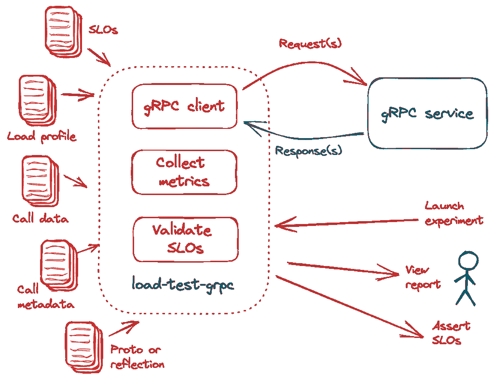
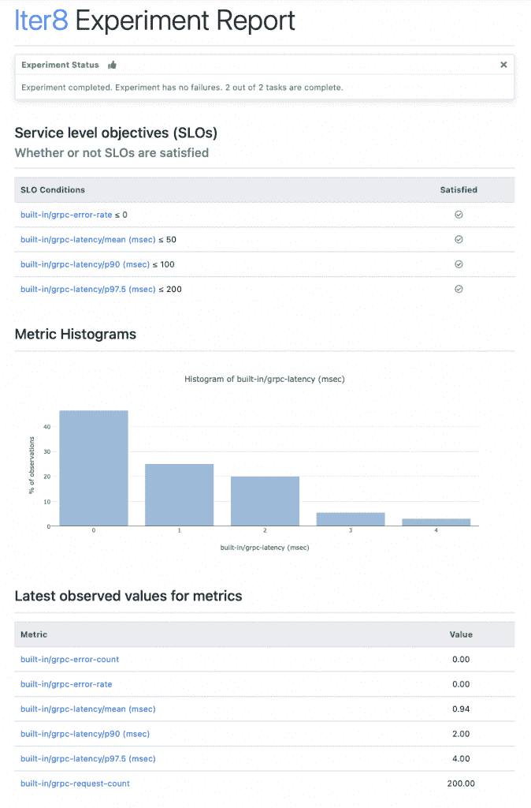
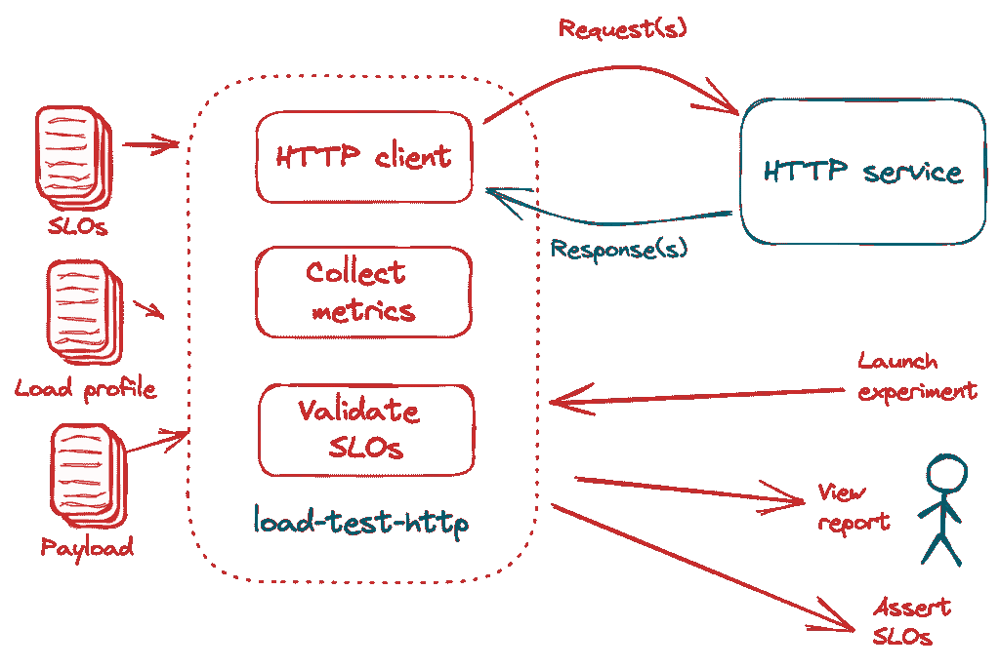

# Iter8 统一了 gRPC 和 HTTP 的性能验证

> 原文：<https://thenewstack.io/iter8-unifies-performance-validation-for-grpc-and-http/>

[](https://www.linkedin.com/in/sriumcp/)

[Srinivasan Parthasarathy](https://www.linkedin.com/in/sriumcp/)

[Sri 是一名应用机器学习研究员，拥有为混合云、网络安全和数据探索问题领域创建可扩展的 AI/ML/高级优化企业解决方案的记录。作为 Iter8 的联合创始人，他曾在 Kubecon 2020 和 2021 以及 Knative 和 KFServing 等社区会议上发表过演讲。](https://www.linkedin.com/in/sriumcp/)

[](https://www.linkedin.com/in/sriumcp/)[](https://www.linkedin.com/in/sriumcp/)

gRPC 是一个开源的远程过程调用(RPC)系统，它越来越流行于连接微服务和连接移动/web 客户端到后端服务。基准测试和性能验证是持续集成和交付(CI/CD)强大 gRPC 服务的重要组成部分。

在这篇实践文章中，我们展示了 [Iter8](https://iter8.tools) 如何使您能够快速启动 gRPC 基准测试和验证实验，并配置用于验证 gRPC 服务的服务级别目标(SLO)、用于基准测试的负载概况以及作为呼叫请求的一部分提供的数据和元数据，所有这些都在几秒钟内完成。我们还将讨论 Iter8 如何统一 HTTP 和 gRPC 服务的性能验证。

## **什么是 Iter8？**

[Iter8](https://iter8.tools) 是开源的 Kubernetes release optimizer，专为 DevOps、MLOps、站点可靠性工程师(SRE)和数据科学团队打造。Iter8 引入了一个名为“实验”的原语，可以轻松收集性能和业务指标，评估、比较和验证多个 app/机器学习模型版本，并安全地推广 app/ML 模型的获胜版本。为了便于重用，Iter8 实验以实验图表的形式打包和发布，实验图表是具有特定结构的舵图。例如，[负载测试 grpc 实验](https://iter8.tools/0.9/tutorials/load-test-grpc/usage/)支持 gRPC 服务的基准测试和性能验证。这个实验是本文的主要焦点，如下图所示。



## **为什么是 Iter8？**

Iter8 具有强大的功能，可同时增强和简化您的发布工程/CI/CD 工作流程。下面我们重点介绍其中的三种。

1.  Iter8 提供了一种统一的方法来测试和验证 HTTP 和 gRPC 服务。这使得组织能够发展一套通用的 CI/CD 最佳实践和设计模式，适用于这两种类型的服务。
2.  Iter8 的 CLI 生成描述实验结果的直观报告。报告是通过视觉洞察促进人类理解实验结果的理想工具。Iter8 CLI 还提供了一种简单的方法来断言条件，例如目标应用程序是否满足实验中指定的 SLO。从自动化的角度来看，断言是理想的，因为它们允许 CI/CD 管道和/或脚本根据断言是否为真而分支到不同的路径。
3.  Iter8 的实验图表通过提供一些相关的参数值，使得在几秒钟内启动实验成为可能，这在概念上和操作上简化了甚至是高级的基准测试和验证任务。

## **基准测试和验证 gRPC**

通过安装 Iter8 CLI 开始 gRPC 基准测试和验证。

```
brew tap iter8-tools/iter8

brew install iter8@0.9

```

或者，您也可以使用[预构建的二进制文件用于各种平台，或者 Go 1.17+](https://iter8.tools/0.9/getting-started/install/) 用于 Iter8 CLI 安装。

### **样本 App**

在单独的终端中运行示例 gRPC 服务。

`docker run -p 50051:50051 docker.io/grpc/java-example-hostname:latest`

### **Iter8 实验**

`iter8 launch`子命令从 Iter8 hub(一个包含 Iter8 实验图表的 Helm repo)下载一个[实验图表](https://iter8.tools/0.9/getting-started/concepts/#experiment-chart)，并通过将图表与用户提供的值相结合来生成一个完整的实验(experiment.yaml)，运行实验并输出实验运行的结果(result.yaml)。尝试使用 Iter8 的`load-test-grpc`实验图来测试示例 gRPC 服务，如下所示。在这个实验启动中，您将为 gRPC 服务提供`host`信息、完全限定的方法名(`call`)和协议缓冲文件的 URL(`protoURL`)。

```
iter8 launch  -c  load-test-grpc  \

--set host="127.0.0.1:50051"  \

--set call="helloworld.Greeter.SayHello"  \

--set protoURL="https://raw.githubusercontent.com/grpc/grpc-go/master/examples/helloworld/helloworld/helloworld.proto"

```

### **报告**

`iter8 report`子命令生成 HTML 或文本格式的实验报告。生成 HTML 报告并使用浏览器打开 report.html。

```
Iter8 report  -o  html  &gt;  report.html

```

实验报告看起来如下。



### **指标和 SLO**

收集内置延迟和错误相关指标以及自动验证 SLO 的能力是 Iter8 的强大功能之一。通过配置以下附加参数，修改上面使用的`iter8 launch`命令。

```
--set SLOs.grpc/error-rate=0  \

--set SLOs.grpc/latency/mean=50  \

--set SLOs.grpc/latency/p90=100  \

--set SLOs.grpc/latency/p'97\.5'=200

```

上述配置验证了应用程序满足以下 SLO。

*   错误率为 0。
*   平均延迟低于 50 毫秒。
*   第 90 百分位延迟低于 100 毫秒。
*   97.5%的延迟低于 200 毫秒。

生成并查看实验报告，该报告现在除了指标值之外，还包含 SLO 评估。

### **断言条件**

使用`iter8 assert`子命令检查实验是否无故障完成，以及是否满足所有 SLO。如果满足断言条件，该命令将以代码 0 退出，否则将以代码 1 退出。断言在 CI/CD/GitOps 管道中特别有用。

```
iter8 assert  -c  completed  -c  finished  -c  slos

```

### **负载曲线**

通过配置请求数(总数)、每秒请求数(rps)、要使用的连接数(连接数)和每个连接中要使用的并发请求工作线程数(并发数)，控制由 load-test-grpc 实验生成的负载的特征。为此，通过配置以下附加参数来修改上面使用的 iter8 启动命令。

```
--set total=500  \

--set rps=25  \

--set concurrency=50  \

--set connections=10

```

### **高级参数**

除了上述基本示例中说明的参数之外，`load-test-grpc`图表还支持许多高级参数。您可以使用这些参数以 JSON 或二进制文件的形式提供调用数据信息，这些文件可以是本地的，也可以驻留在远程 URL。在命令行提供调用元数据信息，或者作为 JSON 输入，作为本地文件或驻留在 URL 上的远程文件；提供原型文件或预编译的原型文件，或者让 Iter8 在没有它们的情况下尝试使用服务器反射，并使用客户端流、服务器流或双向流调用模式。

要了解以上所有扩展和其他 Iter8 功能的更多信息，请访问 [https://iter8.tools](https://iter8.tools) 。

## **基准测试和验证 HTTP**

对于 HTTP 服务的性能验证，Iter8 提供了[负载-测试-http 图表](https://iter8.tools/0.9/tutorials/load-test-http/usage/)，如下图所示。



尝试如下的`load-test-http`实验。

```
iter8 launch  -c  load-test-http  \

--set url="https://httpbin.org/post"  \

--set numQueries=200  \

--set payloadStr="abc123"

--set SLOs.latency-mean=50

```

`load-test-http`实验支持 GET 和 POST 端点的验证。与 gRPC 类似，这个实验也支持通过字符串值、本地文件或远程 URL 将有效负载配置为请求的一部分，配置内容类型，配置查询数量、每秒查询次数、使用的并行连接数，以及配置与错误和延迟相关的 SLO。与任何 Iter8 实验一样，您可以使用`iter8 report`命令查看文本或 HTML 报告，并使用`iter8 assert`命令断言实验结果。

## **结论**

对 SLO 进行基准测试和验证是一种敏捷的实践，使 DevOps 工程师能够以高频率交付应用程序，并确信他们不会在此过程中损害最终用户的体验。一个简单的无代码 CLI 驱动的基准测试和 SLO 验证解决方案，以统一的方式支持 gRPC 和 HTTP，具有灵活的 SLO、负载概况、数据和元数据规范，极大地简化了应用交付流程，并使开发运维工程师能够专注于其他关键业务任务。

Iter8 提供了这个解决方案。

<svg xmlns:xlink="http://www.w3.org/1999/xlink" viewBox="0 0 68 31" version="1.1"><title>Group</title> <desc>Created with Sketch.</desc></svg>