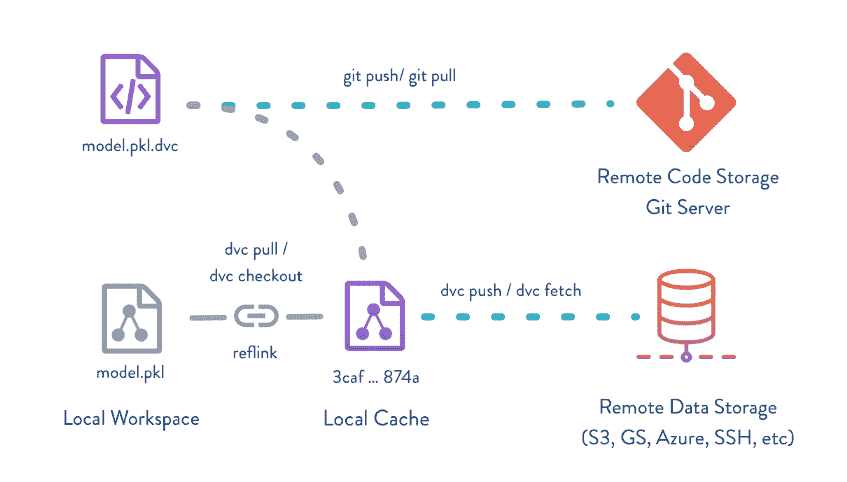

# Iterative.ai:面向 ML 工程师的基于 Git 的机器学习工具

> 原文：<https://thenewstack.io/iterative-ai-git-based-machine-learning-tools-for-data-engineers/>

在微软担任数据科学家期间， [Dmitry Petrov](https://github.com/dmpetrov) 认为大型、单一的数据平台不是出路。需要有建立在平台之上的工具，它们需要是开源的，并且机器学习工程师的特殊需求没有得到满足。

他的解决方案是创建 [Iterative.ai](https://iterative.ai/) ，这是一家总部位于旧金山的初创公司，专注于管理机器学习模型。它的两个产品 [DVC](https://dvc.org/) (数据版本控制)和 [CML](https://cml.dev/) (持续机器学习)旨在将工程实践引入数据科学和机器学习。

在不断增长的 [DataOps 企业软件供应商](https://medium.com/data-ops/the-dataops-enterprise-software-industry-2019-a862904857ef)的生态系统中，包括 DVC 加入了像 [TerminusDB](https://thenewstack.io/terminusdb-takes-on-data-collaboration-with-a-git-like-approach/) 、 [Dolt](https://thenewstack.io/dolt-a-relational-database-with-git-like-cloning-features/) 和 [Pachyderm](https://www.pachyderm.com/) 这样的公司，目的是为数据科学带来类似 Git 的体验，但彼得罗夫表示，DVC 的重点是狭隘的——版本化数据和 ML 模型。

彼得罗夫说，在管理他们的数据时，公司最初决定他们需要将数据转移到同事的笔记本电脑、云、生产系统。他们需要知道他们正在使用正确的版本，尤其是在训练一个模型的时候。

“我们的重点是 ML 建模，ML 过程，所以我们可以帮助人们建立模型，在团队之间共享模型，在模型上进行合作，”Petrov 说。

一份关于 2021 年趋势的 [O'Reilly 报告](https://www.oreilly.com/radar/where-programming-ops-ai-and-the-cloud-are-headed-in-2021/)提到缺乏足够的工具来对数据进行版本控制(尽管它称 DVC 为一个开端)，以及缺乏足够的工具来对模型进行版本控制(尽管它指出工具 [MLflow](https://mlflow.org/) 为一个开端)。

彼得罗夫说，数据分析师和数据科学家的需求与 ML 工程师的需求不同，软件工程栈的持续集成/持续交付工具不一定满足这些需求。然而，他决定在 GitHub、GitLab 和最近的 BitBucket 的基础上构建，而不是构建一个单独的平台。

他说，ML 工程师倾向于处理非结构化数据——图像、视频、文本——而数据科学家通常处理结构化数据，通常来自数据仓库。

“ML 工程师，他们确实写了一个代码。他们的模型通常很复杂。他们在团队中工作，”他说。“他们工作的数据科学家和数据分析师通常在一个相对较小的项目中工作，可能两天，最多一周。他们不需要任何先进的协作工具。

“ML 工程师，他们仍然需要协作。他们需要 GitHub 进行协作，他们需要这个 CI/CD 系统来解决彼此之间、团队和生产系统之间的[问题]，”他说。

这就是 DVC 和 CML 图书馆的用武之地。

[DVC](https://github.com/iterative/dvc) 提供了一种方法来一起跟踪数据、源代码和 ML 模型的变化，以提供一个项目的单一历史。它使用户能够跟踪实验的进展，无需模型再训练即可复制项目，并共享项目。

构建在 git 之上，用户创建轻量级的[元文件](https://dvc.org/doc/user-guide/project-structure)，描述要跟踪的 ML 工件。这使得系统能够使用这些元数据来处理大文件，而不是将它们存储在 Git 中。DVC 依靠远程存储在云中存储大文件——S3、Azure、谷歌云等。—或本地网络存储(例如，通过 SSH)。它们被视为键值存储，使用硬链接/符号链接而不是复制文件。

数据和模型的版本以 Git 提交的形式存储，使用户能够创建快照、恢复以前的版本、重现实验等等。他们可以使用 Git 标签/分支和[指标](https://dvc.org/doc/command-reference/metrics)跟踪来管理实验。

DVC 定义了团队协作和在生产中运行成品模型的规则和流程。通过 push/pull 命令，您可以一致地将 ML 模型、数据和代码移动到生产环境或其他地方。

轻量级管道连接版本化的数据集、模型和代码。管道被视为一等公民。它们与语言无关，并且将多个步骤连接成一个有向无环图(DAG)。

DVC 可以将某个阶段的输出标记为指标，可用于帮助用户跨版本比较模型和数据集。绘图功能以可视化形式显示指标。

就像 DVC 是 [Git-LFS](https://git-lfs.github.com/) 的扩展一样，CML 是 [GitLab CI/CD](https://docs.gitlab.com/ee/ci/) 的扩展。

虽然一些数据工程工具“更关注可靠性和分布式数据处理，但我们的场景要轻量得多。…这是一个场景和围绕模型的导航，当您构建 20 个版本的模型时，如何才能找到最好的一个？有一个最好的模型意味着什么？有时这不是失败，有时这并不意味着最好的成绩或其他什么，你需要对正在发生的事情以及如何在你的知识库中找到最好的模型有一个大致的了解。所以这是我们在 Git 上需要的另一个功能，”Petrov 说。

CML 是一个自动化机器学习工作流的库，包括模型训练和评估。使用 CML，您可以运行比较当前模型、生产模型的报告，找出与主模型或项目历史的任何阶段的差异，并监控不断变化的数据集。它将在每个 Git pull 请求中自动生成带有度量和图表的报告。

Petrov 说，除了开源项目，Iterative.ai 还建立了企业功能，如增强的安全性，并将在下个月左右推出一款在 DVC 和 CML 基础上结合协作和可视化的 SaaS 产品。

图片由来自 Pixabay 的 Gerd Altmann 提供。

[https://www.youtube.com/embed/UbL7VUpv1Bs?feature=oembed](https://www.youtube.com/embed/UbL7VUpv1Bs?feature=oembed)

视频

<svg xmlns:xlink="http://www.w3.org/1999/xlink" viewBox="0 0 68 31" version="1.1"><title>Group</title> <desc>Created with Sketch.</desc></svg>