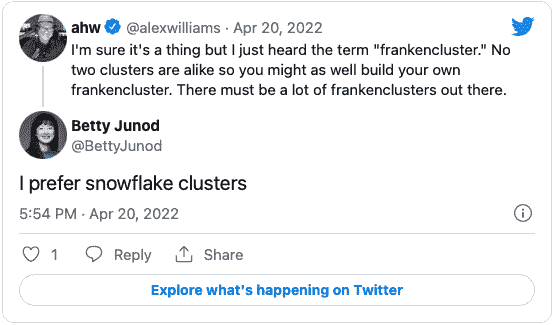

# 它还活着！法兰克福学派的崛起

> 原文：<https://thenewstack.io/its-alive-the-rise-of-the-frankencluster/>

 [丹尼尔·芬纳兰

丹尼尔是一名经验丰富的解决方案架构师，拥有在信息技术和服务行业的工作经历。精通数据中心、Linux、虚拟化、容器(Docker)、Kubernetes、安全性和 Bash 的强大工程/架构师专业人员。](https://www.linkedin.com/in/daniel-finneran-81a5b04) 

首先，什么是 FrankenCluster？就像任何以“Franken”为前缀的东西一样，这是一个由使其不自然(或怪诞)的组件构建或修改的集群。云原生空间为平台构建者提供了无数的组件选项；这既是福也是祸。

幸运的是，有各种形状和大小的集群可供选择，包括无数奇妙的技术。不幸的是，当选择正确的组件时，诅咒就来了,[云本地计算基础](https://cncf.io/?utm_content=inline-mention)景观是寻找按技术类别标记的项目的极好的第一站。但接下来就要由建筑商来做尽职调查了，从经验来看，这并不经常发生。有时，我会遇到一些集群，它们是使用一个尖端项目创建的，一个构建者在 Twitter 上听说过这个项目(这是 Twitter 驱动的基础设施吗🤔？)

这幅图像的存在是有原因的

## 我们是怎么到 FrankenClusters 的？

如果我们把思绪拉回黑暗时代，这是 It 行业中反复出现的主题。那是一个系统管理员手动维护大量服务器的简单时代。这些服务器非常独特，通常以《指环王》或《辛普森一家》中的角色命名。每台服务器只有一种用途。 *Marge* 是数据库，或者 *Gandalf* 是消息队列，它们的维护是只有特定系统管理员掌握的固有知识。

这很棒，直到服务器群的规模爆炸，然后随着虚拟机的进一步爆炸，突然 *Homer* 很可能被命名为类似 *lon-db-vm-small-01 的东西。*一个小型的管理员团队会因为试图管理成百上千个手工制作的服务器实例而疲于奔命，所以有些事情**不得不**去做。

在自动化工具和 IaC(作为代码的基础设施)之间，大多数运营团队达成了控制的灵丹妙药，允许创建、标准化、控制并最终退役机器群。对于 Kubernetes 来说，这仍然是一个持续的旅程，不幸的是，这使一些最终用户处于非常不稳定的境地。存在大量项目，最初创建这些项目是为了简化集群的部署。

不幸的是，这种工具的早期采用者现在留下了不受支持的集群或大量的技术债务，试图使这种被放弃的工具与 Kubernetes 版本和所需的附加项目保持同步。幸运的是，许多久经沙场的人意识到这个问题不会自己消失，我只能想象在集群生命周期特殊兴趣小组的许多个深夜之后，创建了 [Cluster-API](https://cluster-api.sigs.k8s.io/) 项目。

## 对法兰克福学派的需求

我们可以通过简化部署和确保管理集群的生命周期来缓解随机集群蔓延的情况。然而，通常情况下，一刀切的方法并不适用于所有用例。

随着新的企业和技术采用 [Kubernetes](https://thenewstack.io/category/kubernetes/) 作为他们选择的平台，他们经常会发现现成的 Kubernetes 发行版对于他们的需求来说不够灵活。5g 的采用和电信公司向 Kubernetes 的平台迁移迫使许多发行版采用和支持新的网络技术，然而，并不是每个人都有影响力来推动这些变化。

这使得构建者可以选择通过修改发行版来满足应用程序**或**构建 FrankenCluster 的需求，从而使发行版脱离支持。

这最终给企业留下了许多带有支持合同的标准化集群和出现问题时可以拨打的电话号码，以及一个早已去世的工程师在一个周末建立的、没有人理解或能够支持的 FrankenCluster。企业要么不得不接受这种技术债务(并希望雇佣或培训内部支持)，要么通过足够的讨价还价(和金钱的易手)来说服他们的分销选择采用他们的 FrankenCluster。

## 为最终用户标准化集群

在过去的生活中，我有机会与各种最终用户一起工作，帮助设计、实施和支持他们的集群。很多时候，一家公司会有多个集群，从架构上看，这些集群看起来大相径庭。通常情况下，我们被鼓励快速行动，当一个开发人员大声疾呼 Ops 提供一个平台来运行他们的应用程序时，他们通常会遇到障碍。

障碍有各种形状和大小，从没有可用的资源到无法提供开发人员需要的功能。大多数运营团队在遇到这些障碍时的结果是使用一些偷偷摸摸的" *Shadow IT。*“嗯，我们现在开始看到*的影子集群。*

有时候，应用程序团队(包括开发人员和运营人员)承担着创建下一版本应用程序的任务，而他们交付的不仅仅是应用程序，还有现在作为应用程序平台的整个集群。将此任务交给一个不知所措、力不从心的支持团队不会为您赢得任何支持，但是现在回头已经太晚了……我们现在就在这里，到处都出现了新的随机集群。

[Cluster-API](https://cluster-api.sigs.k8s.io/) 项目旨在通过为集群的生命周期(即创建/扩展/升级和删除)提供一个合理的接口来缓解这些问题。该接口可通过提供者模型进行扩展，这意味着无论在哪里创建集群，所有集群看起来都是一样的，例如在云中、边缘或本地。同一个应用程序团队现在将能够创建一个“受管理的”集群，可以在整个生命周期中对其进行控制。

这在理想情况下开始简化障碍，同时提供可以快速部署的标准化和托管集群。但是，我们可以更快地为开发人员提供他们开发和测试应用程序所需的环境！

来自 [Loft Labs](https://loft.sh) 的 [vcluster](https://www.vcluster.com/) 项目将快速集群部署提升到了一个新的水平，允许开发人员在现有的 Kubernetes 集群内创建全新的 Kubernetes 集群(不同版本)。有了这两个项目，我们可以在各种环境中快速建立一个物理集群，然后创建许多虚拟集群，开发人员可以尽情消费！

## 结论

最初我在想，也许 FrankenCluster 是一个错误的术语，也许 Kubernetes 的专家 Betty Junod 更喜欢称它为“雪花星团”是正确的。

但话说回来，大多数事物都是从美丽的“雪花”开始的。就连弗兰肯斯坦博士也没有打算创造一个怪物。虽然当他最终看到自己的作品时，他的第一个冲动是逃跑，但老实说，如果我被要求支持一个手工制作的 EOL Kubernetes 集群，该集群由长期废弃的项目制成，没有生命周期自动化，我可能也会选择生活在荒野中的动物中间。

像 Cluster-API 这样的项目(最近进入了 [v1.0+](https://www.cncf.io/blog/2021/10/06/kubernetes-cluster-api-reaches-production-readiness-with-version-1-0/) )有望阻止这种情况在未来发生。简化部署集群的过程应该有望停止人们创建自己的“雪花”的需求另外，像 vcluster 这样的项目允许开发人员和运营人员将现有集群划分为多个集群，这意味着开发人员可以获得他们需要的资源，而不必求助于“*影子集群。*

对于深奥的用例，总是需要定制集群，但如果我们能够保持低数量，我们将使每个人的生活更轻松。每个人都喜欢雪花(尤其是我，因为我热衷于滑雪，但不是很好)，但他们可能不想支持一个。

<svg xmlns:xlink="http://www.w3.org/1999/xlink" viewBox="0 0 68 31" version="1.1"><title>Group</title> <desc>Created with Sketch.</desc></svg>