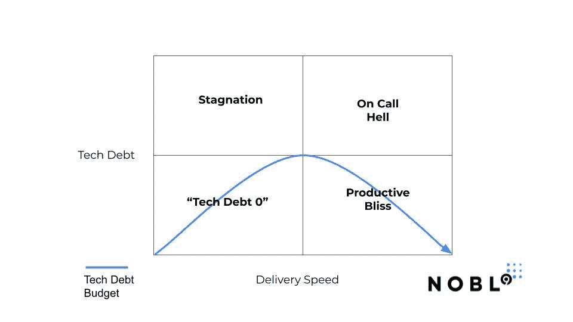

# 忽略一些科技债务是可以的——原因如下

> 原文：<https://thenewstack.io/its-ok-to-ignore-some-tech-debt-heres-why/>

[Kit Merker](https://www.linkedin.com/in/kitmerker/)

[Kit 是 Nobl9 的首席运营官，推动企业开发团队服务可靠性的社区和增长。在 Nobl9 之前，Merker 帮助 JFrog 成长为一家价值数十亿美元的公司，在此之前，他担任 Kubernetes 和 Google Cloud 相关容器计划的产品经理，同时也是 CNCF 的董事会成员。在加入谷歌之前，他在微软工作了 10 年。](https://www.linkedin.com/in/kitmerker/)

大家都知道要重视技术债。然而，由于一些无法解释的原因，我们都倾向于忽视它，直到为时已晚。这就是为什么可靠性工程很难的核心。

谷歌的软件可靠性[方法](https://thenewstack.io/google-sre-site-reliability-engineering-at-a-global-scale/)的一些魔力最近被揭示了。作为谷歌的前产品经理——负责容器引擎、容器注册、云启动器和 Kubernetes 项目——我仍然惊叹于该公司如何平衡速度与规模和可维护性。

如今，许多工程团队都试图理解谷歌的方法。如果世界上流量最大的云服务在不断引入新功能的过程中运行如此顺畅，我们可以从他们的方法中推断出什么？但对许多人来说，这种询问导致了“嗯，我们一点也不像谷歌”的无奈，并对从哪里开始的前景感到不知所措。

在你进入*如何*SRE 和更广泛的软件可靠性之前，我认为理解*为什么很重要。这使得整个运动更容易理解。*

## **为什么？堆积如山的技术债务**

虽然很少有公司像谷歌一样拥有数十亿用户和庞大的工程资源，但我们都有一个共同点，那就是技术债务。

完美软件和你出货的东西之间的差距就是技术债。你知道，随着工程周期不断有利于功能开发，吉拉积压的问题越来越多。技术债务不仅仅是 bug。它包括需要缓存策略的性能问题、升级到已经在使用的编程语言或框架的最新版本、需要更新的安全补丁、文档和 SSL 证书。你说吧。与软件可靠性有关的一切。

每个公司都必须在新功能的交付和积压的技术债务之间取得平衡。但是说实话:在大多数公司，这根本不是一种平衡。规模，直到有一场灾难，倾向于功能，技术债务只是那些被塞进一个里程碑的东西，目的是“有一天当事情慢下来时”重新访问。

不要误解我，工程团队经常向业务部门提出技术债务问题。我见过许多团队夸大或抱怨从未显现的技术债务风险。这些声明损害了商业利益相关者的信誉，他们强烈要求更快地交付特性。他们告诉你，他们可能被说服关注可靠性，但服务似乎运行得很好。很难就风险和优先级进行对话。可靠性风险只有在事后才显而易见。

因此，业务方面在功能创建上不断努力，同时也期望在正常运行时间和软件可靠性上尽善尽美。工程师们失去了宝贵的周末和晚上的家庭时间来执行随叫随到的周期。通常，当系统崩溃时，痛苦可以追溯到完全可以避免的问题，这些问题一直存在于技术债务积压中，但从未得到优先考虑！

技术债务是软件的钱坑，没有公司能够停止挖掘。

## 一个简单的类比:管理你的电子邮件收件箱

电子邮件收件箱为管理技术债务的现状方法提供了一个极好的类比。把未读邮件当成债务。有些很重要；有些只是垃圾。

### **“零收件箱”方法**

一方面，你有“零收件箱”的方法。你实时处理收到的每一封邮件。这个用户已经完全屈服于噪音，放弃了任何优先顺序感。如果你总是专注于收件箱，对每一封邮件都进行同等价值的评估，那么你很难成为一个高效的人。

就技术债务而言，这是一个对 APM 和日志工具的每一个信号都非常狂热的团队。这个团队对停机的防范如此之强，以至于他们构建了被开玩笑地称为“镀金可靠性”的东西——这是一场保卫 100%正常运行时间的宝贵战斗(一个不可能的目标)，以至于没有周期来创建功能。

### **《数千未读》逼近**

零收件箱的极端对立面是拥有数千封未读邮件的电子邮件用户。回到我们以前在办公室工作的时候，你正在访问他们的立方体，合作一些东西，当他们在他们的计算机上向你展示一些东西时，你注意到他们有 40，000 封未读邮件。哇哦。这些电子邮件用户已经超越了噪音，以至于他们也错过了所有的信号。

像这样管理技术债务的团队有一个巨大的特性积压，已经超过了他们的认知极限。它是如此之大，以至于他们最有可能在停机期间发现什么是重要的。

## **缺少什么:技术债务的背景**

区分“好的”技术债务(让我们发货)和“坏的”技术债务(需要注意)的上下文归结为理解对客户和团队的实际影响。

管理技术债务的团队很好地设定了“预算”，以建立触发器，将团队的注意力重新集中在提高可靠性和搁置特性上。由于技术债务是发布不完美代码的不可避免的副产品(注意:所有代码都有缺陷)，您需要一种应对机制来为技术债务提供更好的可见性、上下文和紧迫性。

基于客户和随叫随到的工程影响的技术债务预算清楚地说明了企业应该关注的原因。共享的环境将仅仅协商这些折衷的不相连的团队与使用数据和目标来驱动行为的一致的团队分开。

作为电子邮件用户，我们大多数人都处于零收件箱和数千封未读邮件之间。我们不会放弃我们所有的脑力来实时响应每一件小事，也不会完全忽视消防水管。我们使用过滤器，我们使用文件夹，我们使用优先级标签，我们设置规则，我们创造自动化。我们点击退订！因为我们的认知能力只允许我们进行这么多的推理，所以我们使用工具和一般策略的组合来关注重要的事情。我们尽量不在这一点上浪费我们的注意力。

忽略一些技术债务毕竟不是那么糟糕，只要你有共同的背景来指导你的决策。

<svg xmlns:xlink="http://www.w3.org/1999/xlink" viewBox="0 0 68 31" version="1.1"><title>Group</title> <desc>Created with Sketch.</desc></svg>