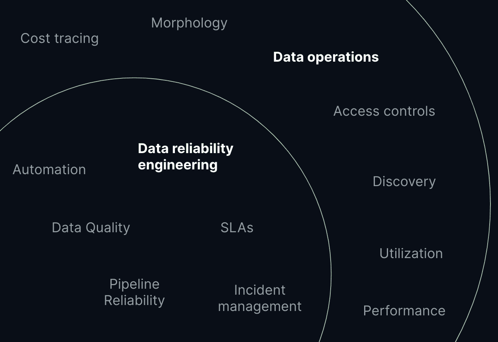

# 是时候进行数据可靠性工程了

> 原文：<https://thenewstack.io/its-time-for-data-reliability-engineering/>

 [凯尔·柯文

凯尔·柯文(Kyle Kirwan)是 Bigeye 的首席执行官兼联合创始人。在开始 Bigeye 之前，他是优步元数据团队的第一任产品经理，在那里他推出了他们的数据目录产品 Databook，并领导了他们内部谱系、新鲜度和数据质量工具的开发。](https://www.linkedin.com/in/kylejameskirwan/) 

曾经有一段时间，软件相当不可靠。在这篇 20 年前的 [MIT Technology Review](https://t.sidekickopen01.com/s3t/c/5/f18dQhb0S7kF8bNVj9W5jPD-x2zGCwVN8Jbw_8QsRtKVnxb187fK0G-W16gGC35STPT3101?te=W3R5hFj4cm2zwW4mKLS-4fGB3lW41WtBk3P8RkBW4kFl7_1JxwY5W1L6zDF1S0ZKrW1L5LN51W-tWmW1YYKtv4r51p_W3M8bVV49Kpj_W4cfMnV1GyxKM1V3&si=8000000006503149&pi=0c8d7ed4-7155-465b-9231-c85669dcc0d2) 文章中，一位软件工程师哀叹道，好的软件“是可用的、可靠的、无缺陷的、有成本效益的、可维护的”。而现在的软件不是这样的。”一晃二十年过去了，从支付软件到客户关系管理以及介于两者之间的一切，企业都是在软件上运行的。

随着数据从美好的必需品转变为企业创造客户体验和推动收入所依赖的东西，数据需要经历类似的演变——我们可以从之前的软件工程先驱已经完成的工作中吸取经验教训。

借用[站点可靠性工程](https://sre.google/)的原理，数据可靠性工程为提高数据质量、保持数据按时移动以及确保分析和机器学习产品得到一组健康输入的工作命名。

这项工作是由数据工程师、数据科学家和分析工程师完成的，他们在历史上没有成熟的工具和流程可供使用，而现代软件工程团队已经拥有了这些工具和流程。因此，与监控和事件管理等可扩展和可重复的流程相比，今天的数据可靠性工作通常涉及更多的抽查数据、开始深夜回填和手工将一些 SQL 转换为 Grafana 监控。

在数据可靠性工程(DRE)的名字下， [一些](https://medium.com/weave-lab/introduction-to-data-reliability-engineering-2ddacf7122b7) [数据](https://www.youtube.com/watch?v=kMy3SVWcMIQ&list=PLmVfmOZxH52wZr1CNC7QNRnl6SR46rSng&index=4) [团队](https://www.youtube.com/watch?v=tieJ2A00ww8&list=PLmVfmOZxH52wZr1CNC7QNRnl6SR46rSng&index=8) 正开始通过借用 SRE 和 DevOps 来改变这一点。

## **为什么现在会出现这种情况？**

更广泛地说，数据质量几十年来一直是一个话题，但在过去两年里得到了更多的关注。这是由同时出现的几个趋势推动的。

1.  **数据正被用于影响越来越大的应用:**支持聊天机器人、产品推荐、库存管理、财务规划等等。这些数据驱动的应用程序有望大幅提高效率，但如果出现数据中断，也会给企业带来成本。随着公司推动越来越高的 ROI 用例，对数据的依赖越来越多，这增加了对质量和可靠性的需求。
2.  **人类更少参与循环:**流式数据、定期重新训练的机器学习模型、自助仪表盘和其他应用程序减少了人类参与循环的数量。这意味着管道在默认情况下必须更加可靠，因为不再有分析师或数据科学家抽查数据——不应该有，他们有工作要做！
3.  **数据工程师人手不够:**雇佣数据工程师又难又贵。对人才的需求正在激增，而能够构建和扩展复杂数据平台的人才供应却没有跟上。这给这些团队带来了巨大的压力，要求他们有效利用资源，避免被动救火——任何自动检测和解决问题的方法，尤其是有助于在第一时间预防问题的工具或实践。

## DRE 在哪里结束，数据行动在哪里开始？

数据可靠性工程是数据操作(DataOps)的一部分，但只是一部分。数据运营指的是数据平台所有者将面临的一系列更广泛的运营挑战。这些挑战包括数据发现和治理、成本跟踪和管理、访问控制以及如何管理不断增长的查询、仪表板和 ML 功能和模型等问题。

与 DevOps 相比，可靠性和正常运行时间无疑是许多 DevOps 团队负责的挑战，但他们通常还负责其他方面，如开发速度和安全性考虑。

## **DRE 的工具和技术**

虽然关于数据可靠性工程的最佳工具和实践的墨迹尚未干透，但谷歌《SRE 手册》中的七个核心概念为数据团队的工作奠定了坚实的基础。

1.  **拥抱风险:**有些事情*最终会失败，这是不可避免的事实。团队需要计划检测、控制和减轻确实发生的失败，而不是希望他们有一天能达到完美。*
**   **监控一切:**如果无法检测到问题，就无法控制和缓解问题。监控和警报为团队提供了所需的可见性，以了解何时出现问题以及如何解决问题。对于基础设施和应用程序来说，可观察性工具是一个成熟的领域，但是对于数据来说，它仍然是一个新兴的领域。*   **设定标准:**数据质量好不好？这是一个主观问题，需要定义、量化并达成一致，以便团队在这方面取得进展。如果好或不好的定义模糊不清或缺乏一致性，那就很难有所作为。 [SLIs、SLOs 和 SLAs](https://www.bigeye.com/blog/defining-data-quality-SLA) 是标准制定工具，可以从 SRE 地区应用到 DRE 地区。*   **减少辛劳:**“辛劳”这个词描述了操作你的系统所需的人工工作——操作工作——与改进系统的工程工作相对。示例:启动 Airflow 作业或手动更新模式。对于有效的数据可靠性工程来说，尽可能地减少开销是值得的。例如，Fivetran 等工具可以减少获取数据的工作量，Looker 培训课程可以减少响应 BI 请求的工作量。*   **使用自动化:**数据平台的复杂性呈指数级增长，而手动管理数据平台的复杂性随着员工数量的增加呈线性增长。这既昂贵又站不住脚。自动化手动流程有助于数据团队扩展可靠性工作，释放脑力和时间来处理更高层次的问题。*   控制发布:做出改变最终是事情如何改善，但也是事情如何打破。这是数据团队可以直接从 SRE 和 DevOps、代码评审和 CI/CD 管道借鉴的经验。毕竟管道代码说到底还是代码。*   **保持简单:**可靠性的敌人是复杂性。复杂性不可能完全消除——毕竟管道正在对数据做一些事情——但是可以减少。最小化和隔离任何一个管道作业中的复杂性都有助于保持其可靠性*

 *## **DRE 的未来**

数据可靠性工程是一个非常年轻的概念，许多公司正在 [帮助定义](https://medium.com/weave-lab/introduction-to-data-reliability-engineering-2ddacf7122b7) 工具和实践，这将使 DRE 像 SRE 和 DevOps 一样有效。如果你对探索概念感兴趣， [数据可靠性工程会议](https://drecon.org) 是一个很好的起点。第一次活动在 12 月举行，有来自整个行业的一千多名与会者和演讲者，包括 [Looker、dbt、Figma、Datadog 和网飞](https://www.youtube.com/playlist?list=PLmVfmOZxH52wZr1CNC7QNRnl6SR46rSng) 。

<svg xmlns:xlink="http://www.w3.org/1999/xlink" viewBox="0 0 68 31" version="1.1"><title>Group</title> <desc>Created with Sketch.</desc></svg>*