# 是时候构建一个进步的 Web 应用程序了。以下是方法

> 原文：<https://thenewstack.io/its-time-to-build-a-progressive-web-app-heres-how/>

2022 年有资格做 app 的条件是什么？答案与 2002 年甚至 2012 年都不一样。例如，过去有“网站*”*和“网络应用*”之分*不再。

 [文森特·莫尔诺

Vincent 是 Oracle 技术团队的主要成员，负责领导使用 PWAs 的 Oracle APEX 移动体验。Morneau 对现代 JavaScript、PWAs、构建工具和前端架构感兴趣。他是 GitHub 上几个 APEX 开源项目的作者，也是一个定期的会议发言人和博客作者。在 Twitter 和 LinkedIn @ vincentmorneau 上与联系](https://www.linkedin.com/in/vincentmorneau/) 

如今，人们可以互换地提及网站和网络应用，可以肯定地说，这种区别已经无关紧要了。事实上，今天绝大多数的网站都可以称为网络应用。

相比之下，当我们把“web”这个词从等式中去掉，只听到“app”这个词时，我们往往会想到在 app stores 中找到的特定平台应用程序或从互联网下载的桌面软件。

在很大程度上，所有这些应用程序都制作得非常好，它们可以深度集成到适当的操作系统中。事实上，如果可以选择，用户会选择平台的应用版本，因为它被认为是可靠性的黄金标准。随着渐进式网络应用(PWAs)的出现，这种假设即将改变。

## 什么是 PWA？

可以将 pwa 想象为利用 HTML、JavaScript 和层叠样式表(CSS)等现代浏览器功能来提供漂亮、快速、丰富和可靠的应用程序的网站，这些应用程序可以直接放在网上，也可以通过应用程序商店下载。

PWA 中的单词“渐进式*”*表示用户将体验的功能范围。当然，不是每个人都有最新的设备，也不是每个人都运行最新的浏览器引擎。PWA 根据用户的当前配置提供自适应功能。

跨平台兼容性是 PWA 的另一个好处。构建一个 app，不管是哪一种，成本都很高。然而，为不同平台分发原生应用程序有一个特殊的价格，主要是因为程序员必须用多种语言编码，使用不同的库并支持许多技术。

事实上，互操作性是 web 一直处于优势的一个领域:网页可以在任何请求它的浏览器上运行，并且网页总是最新的。有了 PWA，我们越来越接近我们期望从特定平台应用程序中获得的丰富功能，同时保持网络提供的速度和分发优势。

## 思考设计

网站和 PWA 的区别是关键。

网站总是通过浏览器选项卡打开，而 PWAs 可以选择性地安装在设备上。这对开发人员考虑应用程序设计的方式有重大影响，因为即使应用程序的内容相同，其容器也完全不同。

在一个网站上，容器就是浏览器，它带有所有常规的导航模式，如地址栏、**上一页**和**下一页**按钮。在独立的 PWA 上，这些组件被全屏窗口取代，这提供了更加身临其境的体验，但不利于浏览器的本地用户界面。PWA 开发人员需要在应用程序中实现他们自己的导航模式。

下图显示了浏览器和 PWA 体验的两个示例。浏览器位于左侧，底部有一个标准的 URL 栏、发送到、书签和新窗口工具。左边的 PWA 没有这些，因此应用程序可以使用更多的屏幕空间。

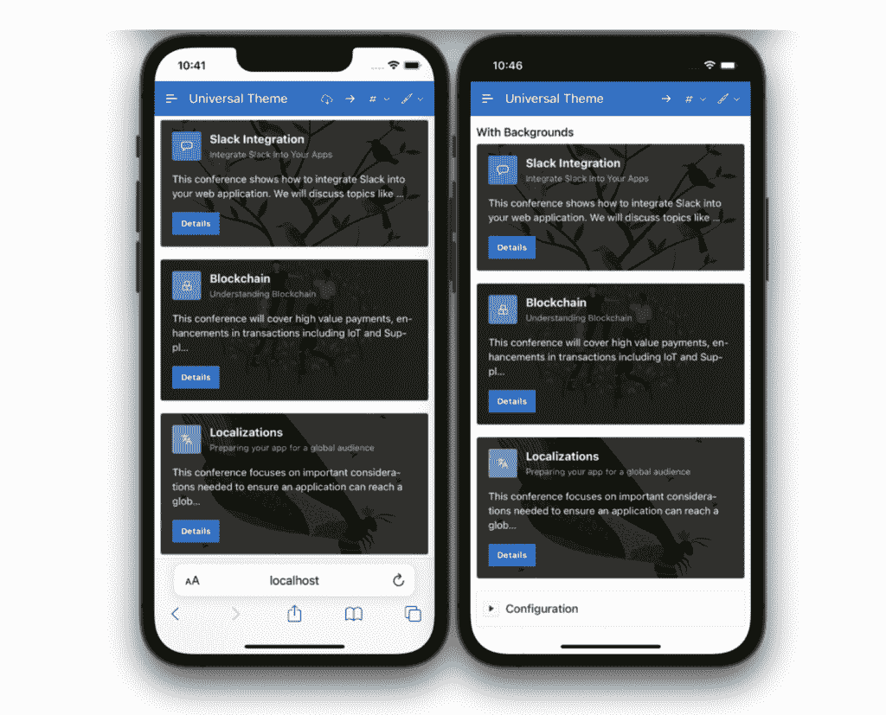

考虑图标。因为 PWA 可以从浏览器外部访问，所以开发人员必须更加关注图标设计。当一个图标只存在于一个应用程序中时，设计更直观，因为它位于其他应用程序组件旁边。然而，当一个图标在浏览器之外独立出现时，如果它想与操作系统设计理念的其余部分融合，它必须遵循更严格的规则。

例如，PWA 图标可以在 iOS 或 Android 设备的主屏幕中找到，或者在 macOS 的 Dock 中找到，或者在 Windows 的“开始”菜单中找到，或者在 ChromeOS 和 Linux 应用程序菜单中找到。如果图标是专门为这些位置设计的，那么这些位置是最好的选择。PWA 通过提供由每个图标的格式标识的专用图标阵列，可以适应所有图标格式。

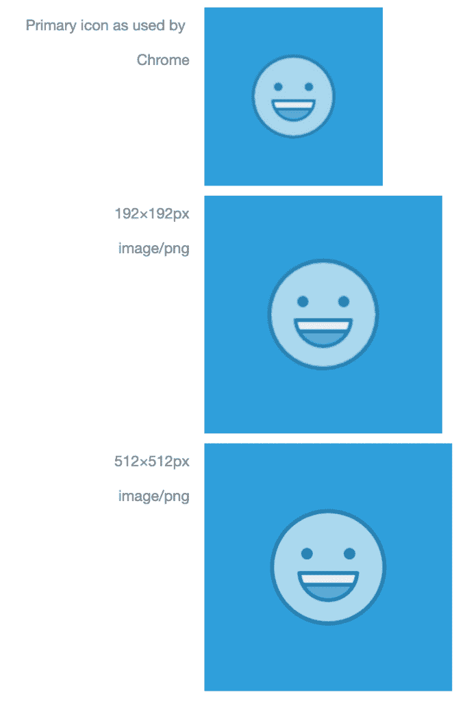

## 安装应用程序

PWAs 最吸引人的一个方面是允许你在设备上安装网络应用的技术。毫不奇怪，PWAs 面临的最大挑战之一是安装，因为没有统一的体验允许 iPhone 用户、Android 用户和 Windows 用户以相同的方式安装 web 应用程序。这些挑战也是机遇。愿意投资 PWA 用户体验设计流程的开发人员可以精心打造适合各种操作系统和浏览器组合的完全个性化的安装体验。

要提供合适的 PWA 流程，必须满足几个标准:

*   通过 HTTPS 提供应用程序。
*   应用程序有一个至少带有一个图标的 web 应用程序清单。(我们稍后将详细讨论清单。)
*   App 有一个带有获取事件处理程序的注册服务工作器。(稍后还会有更多相关内容。)

假设满足这些标准，应用程序应该有资格安装。将 web 应用程序放入设备的步骤因操作系统和浏览器而异。

在桌面设备上，谷歌 Chrome 和微软 Edge 目前提供了最好的 PWA 安装体验。安装徽章将显示在支持的浏览器的 URL 栏中。单击徽章将触发一个简单的弹出窗口，要求用户确认是否应该安装 web 应用程序。用户确认后，web 应用程序就会安装并出现在桌面开始菜单或 dock 中。(注意，我是在一个名为 [Oracle APEX](https://apex.oracle.com/en/?source=:ex:pw:::::TNS_PWA_A&SC=:ex:pw:::::TNS_PWA_A&pcode=) 的平台上开发 PWAs 的，所以在我的许多例子中，你会看到“APEX app*”*。更多关于 APEX 的 PWA 支持[在这里](https://docs.oracle.com/en/database/oracle/application-express/21.2/htmdb/crreating-a-progressive-web-application.html?source=:ex:pw:::::TNS_PWA_B&SC=:ex:pw:::::TNS_PWA_B&pcode=)。)

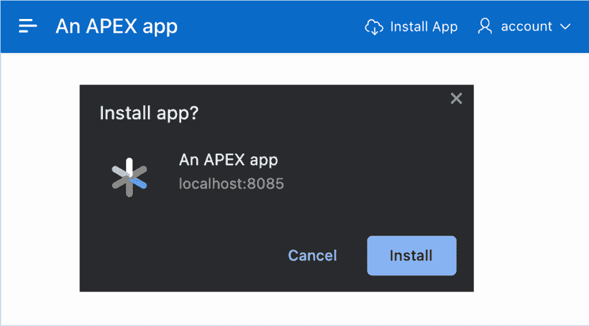

在 iOS 和 iPadOS 上，在撰写本文时，本机自动安装是不可能的。此外，只有 Safari 可以将 web 应用程序移动到主屏幕。App Store 中的其他浏览器，如 Google Chrome 和 Firefox，没有相同的操作系统权限，这使得 Safari 成为安装 PWA 的唯一选择。这种限制是不幸的，但可以通过正确的设备检测和清晰的应用程序内指令来规避。

说到说明，在 iOS 上安装 web 应用程序的步骤是:

*   轻触**共享**图标
*   点击**添加到主屏幕**
*   点击**添加**

然后图标出现在主屏幕上，应用程序可以在独立模式下打开。

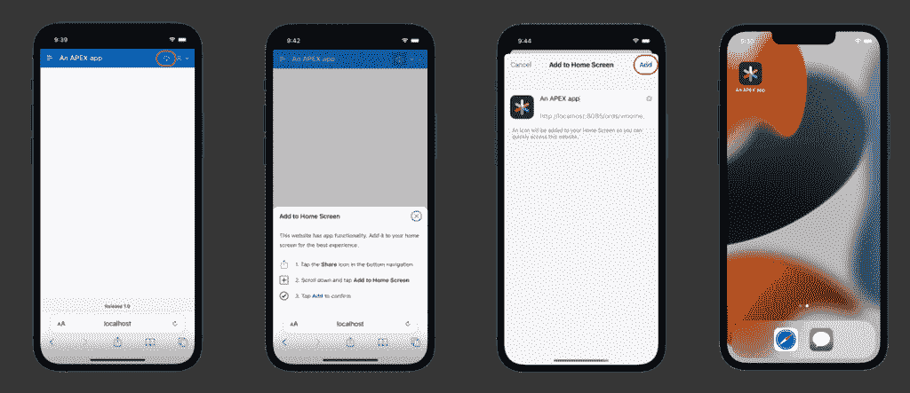

在 Android 设备上，安装过程类似于桌面体验，也就是说，用户可以在浏览器中找到一个实际的**安装应用**按钮，它会触发自动安装过程，将 web 应用带到主屏幕。Android 上不同浏览器之间关于安装或添加到主屏幕的术语是不同的；即便如此，Android 仍然是安装 PWA 最稳定的平台。

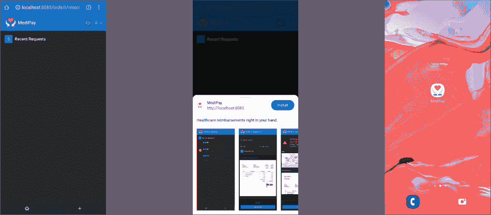

从设计的角度来看，有一个额外的应用内**安装应用**按钮会触发本机安装过程，这可能是一个好主意。

### Web 应用程序清单

如果 PWA 架构有一个大脑，那么 web 应用程序将是艺术的右半球。web 应用程序清单是一个 JavaScript 对象表示法(JSON)文件，它包含有关应用程序的元数据，以通知操作系统它应该如何显示以及它应该如何运行。以下是 web 应用程序清单中的一些信息。

*   **名称:**这是应用程序的完整名称，它将出现在设备的主屏幕、启动器和菜单中。
*   **描述:**这是安装过程中显示的描述性数据，解释了该应用程序的功能。
*   **start_url:** 这是用户运行 app 时打开的 url。在大多数情况下，这将是应用程序的主页。
*   **显示:**这将配置 PWA 在四种屏幕模式下运行:独立、全屏、最小、浏览器。
*   **方向:**应用的首选方向。例如，游戏可能更喜欢横向模式，但聊天程序可能在纵向模式下做得更好。
*   **theme_color:** 这是 app 周围容器的颜色，专门针对全屏模式下使用 PWA 时的任务栏。
*   **background_color:** 这是 app 打开时的背景颜色。
*   **dir:** 确定应用程序应该从左到右(默认)还是从右到左查看。
*   **lang:**web app 的语言体现价值观。
*   **图标:**一组不同格式的图标，代表应用程序。
*   **快捷方式:**长按应用图标时可以看到的一组 URL 快捷方式。
*   **截图:**安装时会以幻灯片形式显示的一组截图。

### 使用 Web 应用程序清单

向 web 应用程序添加 web 应用程序清单很简单。开发人员只需在页面的 head 元素中添加一个链接:

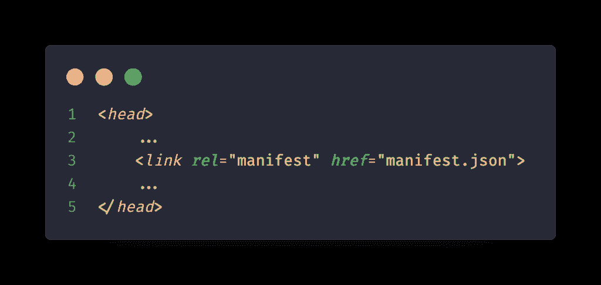

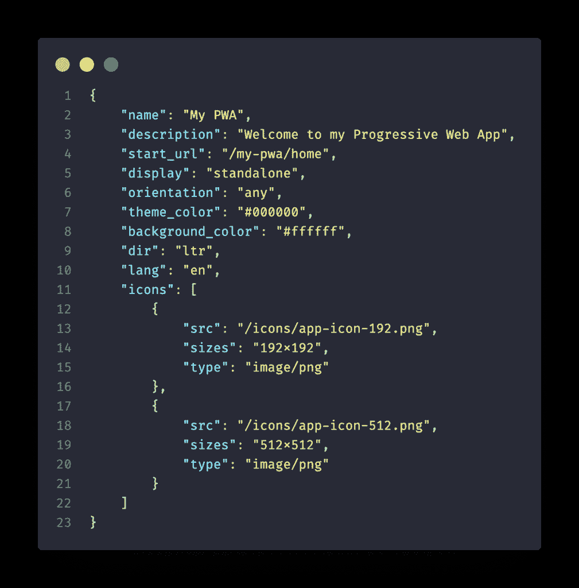

当浏览器获取 web 应用程序清单时，浏览器将识别属性并配置运行时用户界面。

## 与设备的深度集成

除了安装 web 应用程序的能力之外，PWAs 还有更多功能。为了完全集成到操作系统中，应用程序必须能够在后台静默运行，即使在设备空闲时也是如此，例如，接收通知、同步数据或管理支付请求。PWA 技术允许这样的事件处理，即使用户没有浏览网站或主动使用应用程序。

## 服务人员

如果我们再次使用大脑类比，PWA 架构的服务人员就是逻辑上的左半球。服务工作者是一个中间件 JavaScript 文件，位于 web 应用程序和服务器之间，拦截请求并决定如何处理响应。服务人员可以使用丰富的缓存机制来存储响应，稍后可以检索这些响应，而无需返回到服务器。本质上，服务工作者是服务器和客户机之间的代理。

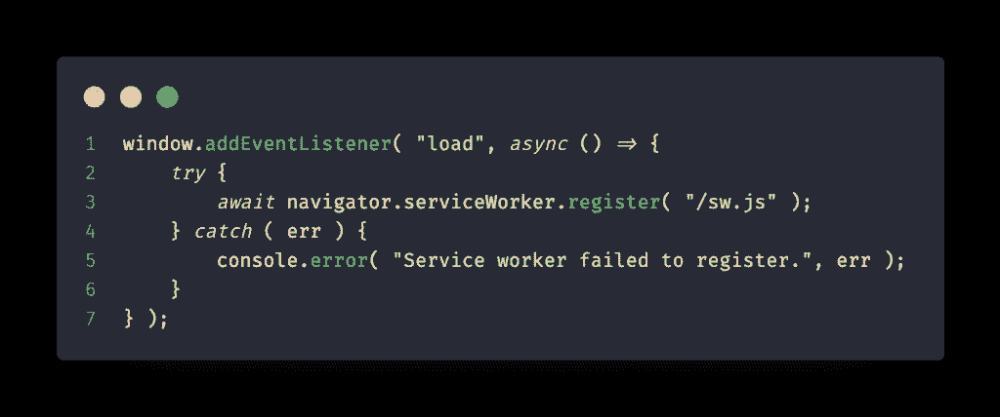

为了确保最大的安全性，特定的服务人员只处理单个应用程序和单个域。服务人员必须通过应用程序注册，并且可以随时删除。用户可以通过浏览器开发工具来监控服务人员。

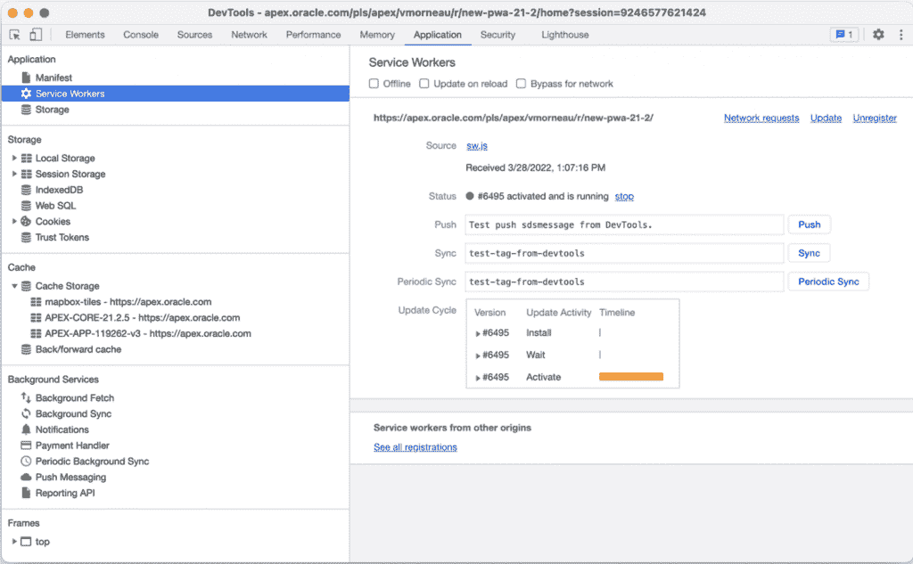

### 强大的网络缓存

当谈到离线设备的数据可访问性时，web 的名声并不好。然而，PWA 技术的一个卖点是它能够完全控制缓存资源，允许它们在本地存储文件和数据，并将 web 应用程序变成可以离线使用的东西。

考虑到服务工作人员的缓存能力，理解首先应该缓存什么非常重要:

*   页面 HTML
*   Java Script 语言
*   半铸钢ˌ钢性铸铁(Cast Semi-Steel)
*   形象
*   应用数据(JSON 或其他)
*   字体

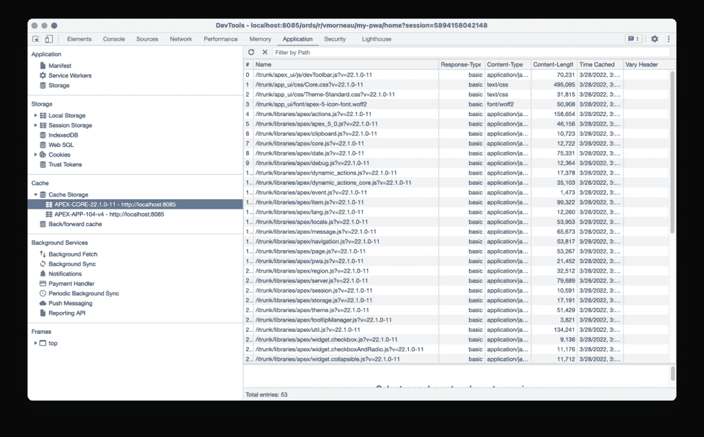
应用在第一次加载时不太可能需要所有这些文件，这就是为什么 PWAs 可以选择在首次安装应用时加载批量缓存，然后仅当服务器上的资源发生变化或用户请求时才缓存后续资源。

一些有用的缓存事件包括:

*   PWA 安装时
*   用户导航到另一个页面
*   用户空闲(预加载潜在的新数据)
*   用户请求尚未缓存的资源

假设有一个电子商务购物应用程序显示一个产品列表，每个产品都有一个特定的图像。在加载第一个页面时，服务人员将拦截从客户端到服务器的下载产品图像的请求。因为图像还不存在于缓存中，所以服务工作者将从服务器获取图像并将图像存储在本地缓存中。一旦在本地设备上，图像就被发送到客户端进行显示。

下次加载该页面时，服务人员将首先查看应用程序映像缓存，并会发现请求的映像已经存在。服务工作者将直接从缓存中返回图像，而不是将请求传递给服务器，因此避免了与服务器之间的往返。

这个例子使用了缓存优先的方法，这是可以用于服务 web 应用程序的许多服务工作者策略之一。其他战略包括:

*   网络优先
*   重新验证时过时
*   仅网络
*   仅缓存

在 web 上缓存资源有两个目标。首先是加快响应时间，一般是做一个更快的 app。缓存的资源越多，我们对服务器的压力就越小，而且效果是立竿见影的。第二个目标是离线运行的能力。如果应用程序开发人员越来越多地利用这些缓存，他们最终会达到一个点，即大多数应用程序逻辑都可以在本地使用，网络连接变得可选。拥有一个离线应用程序并不是所有业务用例都必须的，但这肯定比让应用程序抱怨应用程序无法连接到服务器要好。

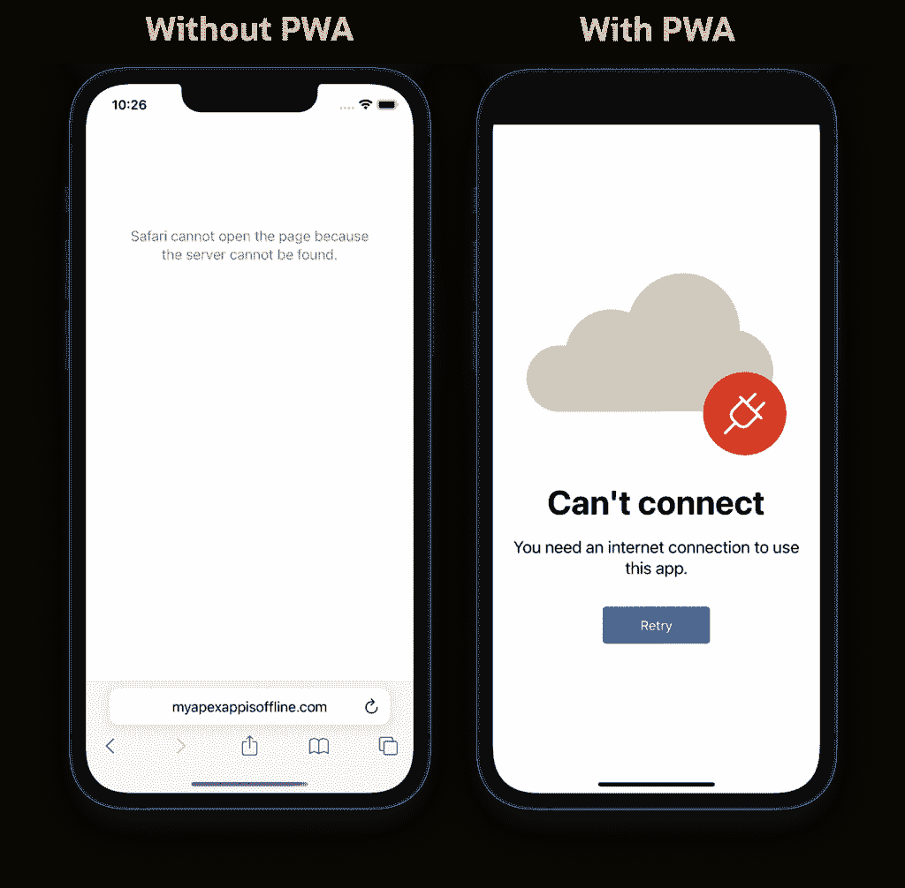

## 推送通知

Chrome 用户体验报告发现，用户普遍认为推送通知有用，在移动设备上更是如此。设计良好的推送通知可以增加用户对 web 应用的参与度，因为它激励用户快速返回到应用程序的特定区域。推送通知允许用户一目了然地阅读消息，跟踪订单状态或提醒他们完成忘记填写的表格。因为推送通知会在屏幕上停留几秒钟，很容易被忽略，它们不像电子邮件那样碍手碍脚，而且已经被证明是一种有效的沟通方式。

使用 PWA，web 应用程序可以请求向用户发送推送通知的权限。

与特定于平台的应用程序不同，它们被授予隐式推送通知访问权限，PWAs 必须被授予提供这些通知的权限。一旦被接受，PWAs 就可以继续向他们的用户发送推送通知。

## 低代码 pwa

如果对 HTML 和 JavaScript 有基本的了解，并且对服务人员的功能有透彻的了解，那么本文中的所有特性都可以手工编写。在许多情况下，向现有应用程序添加 PWA 支持只是在现有代码上添加另一层应用程序逻辑。

还有一个更简单的选择:使用低代码平台创建一个定制的 PWA。在这种方法中，开发人员可以减轻编写诸如创建 web 应用程序清单和服务人员等日常任务的负担，转而专注于设计应用程序的业务逻辑。换句话说，开发人员可以创建 PWA，而无需实际编码 PWA，只需从用户友好的应用程序构建器中启用或禁用选项。

一个生成 PWAs 的低代码平台是 Oracle APEX。这是可用的最成熟和最受 T2 欢迎的低代码平台之一。您现在就可以创建一个免费帐户。

## PWAs 的下一步是什么

pwa 正在成为特定平台应用的合法替代品，但它们还没有完全到位。一个原因是:用户已经养成了通过搜索应用商店来获得他们想要的应用的习惯，而 pwa 不是这样工作的。相反，用户需要安装一个网站，这是一个新的过程。

用户熟悉并习惯安装 PWA 只是时间问题，但与此同时，开发人员面临着创建直观的 PWA 安装用户体验的额外挑战。

此外，可能更令人困惑的是，在 PWA 支持方面，并不是所有的浏览器和平台都是平等的。如今，谷歌 Chrome 和微软 Edge 以最简单、最完整的 PWA 体验独领风骚。苹果的 Safari 在支持核心 PWA 功能方面也做得不错，但只有时间才能证明苹果是否会投资一个竞争更激烈的网络应用市场。

<svg xmlns:xlink="http://www.w3.org/1999/xlink" viewBox="0 0 68 31" version="1.1"><title>Group</title> <desc>Created with Sketch.</desc></svg>