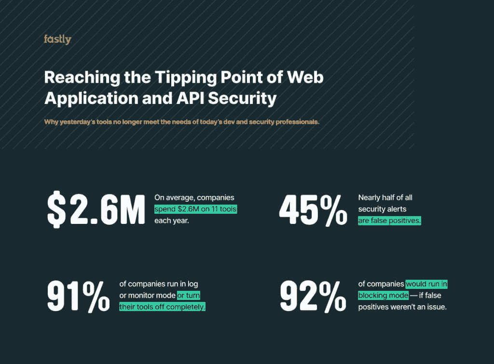

# 是时候整合您的 Web 应用程序和 API 安全混乱了

> 原文：<https://thenewstack.io/its-time-to-consolidate-your-web-app-and-api-security-mess/>

[Sean Leach](https://www.linkedin.com/in/seanleach/)

[Sean 是 Fastly 的首席产品架构师，他主要负责围绕大规模关键任务基础设施构建和扩展产品。他之前是 Verisign 的技术副总裁，提供产品和技术架构的战略方向，是公司的主要发言人。Sean 之前是排名前 15 的域名注册和虚拟主机公司 name.com 的首席技术官，也是 Neustar 的高级主管。他拥有特拉华大学的计算机科学学士学位。他目前的研究重点是 DNS、DDOS、Web/网络性能、互联网基础设施和应对大规模互联网安全流行病。](https://www.linkedin.com/in/seanleach/)

当穆罕默德·阿里在著名的“丛林隆隆”中训练与乔治·福尔曼对抗时，他挥去了对手著名的击倒力量，宣称“他的手不能击中他眼睛看不见的东西。”

快进到现在，阿里的观察在描述当代安全世界中没有人谈论的最大问题之一时仍然很有冲击力:在保护应用程序和 API 时完全缺乏可见性。

简单来说，不可能保护你不知道的东西。但是很多时候，组织根本不知道他们的网络上运行着什么。随着新型威胁成为头条新闻，以一次性方式添加安全工具(例如，由于一段时间内的多次收购)的公司发现自己的防护能力平平。此外，传统的工具并没有考虑到现代的、分散的企业，并且经常会导致比它们解决的问题更多的问题。

现在，每个移动应用程序和单页应用程序都专门调用一个 API。如果企业要保护现在对他们的成功如此重要的 API 和应用程序，他们需要开始重新思考他们的安全状况的某些部分，并解决这些差距。

## 我们是如何走到这一步的

几年前，内部开发的应用程序数量开始激增。根据研究公司 ESG 的数据，本土应用的平均数量从两年前的 139 个增加到 195 个，现在预计在未来几年内将飙升到 263 个。

与此同时，API 的数量比以往任何时候都多。但是当他们在压力下匆忙完成任务时，开发人员经常绕过已建立的公司渠道(理解为:缓慢和官僚)在网络上发布 API。在没有首先得到 IT 或安全部门的代码支持的情况下，这种继续前进的渴望增加了新的安全风险。结果是 API 无序蔓延，没有统一的保护和策略。假设你有 20 个 API，分别由 20 个不同的小组开发，他们都提出了 20 种不同的安全模型和保护。如果攻击者找到利用它的方法，这种脱节的情况会带来严重的风险。

与此同时，企业界继续大举收购。ESG 调查了一些企业客户，他们表示现在平均使用 11 种独立的安全工具来管理他们的 web 应用程序和 API 安全性。

我非常欣赏构建一个深度防御战略，将在特定任务中表现出色的单个产品整合在一起。问题是，这些产品很少以集成的方式运行，甚至很少能相互交流。相反，他们各自为政，经常不在一起工作。所以，你可能会问自己这有什么意义？

最后，购买的许多工具并不是为 GraphQL 或 REST APIs 等较新的架构设计的。换句话说，它们现在构成了业内所谓的[技术债务](https://www.fastly.com/blog/more-is-less-stop-adding-to-your-security-tool-technical-debt)。

## 需要:有远见的领导者

要改变这种局面，首先要从那些对首席信息官或 CISO 的判断有信心的首席执行官开始，这样他们就可以告诉董事会，放慢脚步，不要玩“今日威胁停止”游戏，这符合公司的长期利益。

从表面上看，这听起来可能有违直觉。但是想想看；DevOps 运动证明了快速自动化和测试以及快速迭代将转化为更多的创新。但是充满风险的创新并不是最终的游戏。下一个关键步骤是将安全性直接实施到内部应用和 API 工作流流程中，这样它就不是一个绕过的障碍，而是流程的一部分，如果做得正确，它可以像其余部分一样快速移动。否则，它只是更多的相同，安全将仍然难以捉摸。

你可以先慢慢来，用一个小项目来证明你的论点，展示它是如何工作的。我已经在好几个场合这样做过了。最后，我能够证明，尽管实施变更有短期的减速，但我们很快就回到了正常状态，以与以前相同的迭代速度推出了相同的创新。

这就是领导力决定一切的地方。安全性不再是 CEO 不了解或没有足够动力去了解的话题之一。它需要有远见的管理人员，他们了解大的安全形势，并能清楚地说明为什么改进整体流程和清除混乱是至关重要的。

## 起泡，冲洗，重复

忘记掏出公司支票簿，去另一个购买狂欢。在我刚刚提到的 ESG 调查中，93%的受访者表示有兴趣部署整合的 web 应用和 API 安全解决方案。他们正确地将该策略视为在降低成本的同时跨不同的应用程序体系结构和环境提供一致保护的最佳方式。

在您实现这一提升之前，请盘点一下您的 API。完成全面审计后，创建一个计划来保护您系统上的内容。开发团队和安全团队应该一起工作，这样无论何时创建新的 API，他们都可以应用适当的风险状态。

不要试图一下子保护好一切。根据风险对项目进行优先级排序。然后沿着列表前进。不幸的现实是，你将会妥协。您想要做的是最大限度地减少潜在的损害，这来自于确保最珍贵的数据和系统首先得到最大程度的保护。

接下来就是起泡，冲洗，重复。

相信我，会有一段时间，你真的很庆幸自己没有还在把意大利面往墙上扔，看看粘着什么。

*阅读 Fastly 的[新报告](https://www.fastly.com/blog/new-research-shows-security-tooling-is-at-a-tipping-point)关于保护网络应用和 API。*

<svg xmlns:xlink="http://www.w3.org/1999/xlink" viewBox="0 0 68 31" version="1.1"><title>Group</title> <desc>Created with Sketch.</desc></svg>