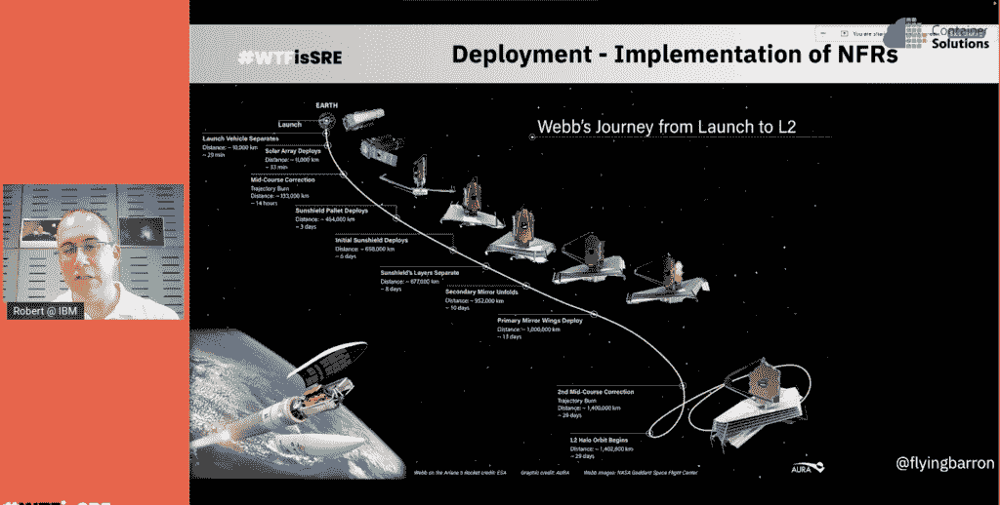

# 詹姆斯·韦伯太空望远镜和 344 个单点故障

> 原文：<https://thenewstack.io/james-webb-space-telescope-and-344-single-points-of-failure/>

本帖更新于 2022 年 7 月 14 日。

今年早些时候，最伟大的站点可靠性工程(SRE)课程[在太空中展开](https://jwst.nasa.gov/content/features/origami.html)。上周，我们从 T4 的詹姆斯·韦伯太空望远镜或 JWST 的 T5 上看到了第一张比预期更好的 T2 图片。

经过 10 年的设计和 90 亿美元预算的构建，这是在部署到生产之前测试 344 个单点故障的努力——分布式系统[还有 100 万英里](https://www.livescience.com/james-webb-telescope-reaches-destination)和[还有一个月](https://www.theverge.com/2022/1/24/22895050/nasa-jwst-space-telescope-final-orbit-lagrange-point)。

不用说，从这一努力中可以学到很多可靠性的经验。在他上个月的 [WTF is SRE](https://www.cloud-native-sre.wtf/) 演讲中， [Robert Barron](https://www.linkedin.com/in/flyingbarron/) 带来了他作为 IBM SRE 建筑师、[业余太空历史学家](https://flyingbarron.medium.com/)和业余太空摄影师的视角，来揭示实现这一壮举的可靠性模式。以及美国国家航空航天局是如何如此信任它的自动化，以至于它发布了一些没有修复希望的东西。这是一次真正的大规模观察之旅。

## 全域范围的功能和非功能需求

“这是一个展示现场可靠性工程概念的伟大平台，因为这是可靠性的极致，”巴伦在谈到詹姆斯韦伯太空望远镜(JWST)时说。“如果出了问题，如果它不可靠，那么它就不起作用。我们不能再部署它了。这不是逻辑上的东西，而是必须正常工作的物理上的东西，我认为我们可以从这项工作中获得很多教训和灵感，并将其应用到我们的日常生活中。”

在哈勃望远镜拍摄了 30 年的惊人照片后，人们需要新的商业和技术能力，包括能够在云形成时看穿和穿过云。

在设计 JWST 时，设计工程师从功能性需求开始，这反过来又驱动了许多非功能性需求。例如，它需要比哈勃更强大，更大，但要实现这一点，它需要一个明显更大的镜子。然而，操作上的限制出现了，镜子太大了，它不适合任何火箭，所以它需要被分解成碎片。非功能性需求变成了创造一个可折叠的镜子。一种解决方案出现了，将镜子分成更小的六边形，这些六边形可以排列在一起形成蜂窝形状的镜子。

JWST 的第二个非功能性要求是超越哈勃，不仅能看到不可见光，还能看到热红外光。但是，准确地说，镜子需要保持低温。“不仅仅是变冷，我们还需要能够控制温度。没错。因为任何变化，我们都会看到一些东西，然后想‘哦，这是一颗恒星。这是一个星系。这不仅仅是 JWST 本身的问题，它比正常情况稍微冷一点或热一点，”巴伦解释道。

与绕地球运行的哈勃不同，JWST 不能绕地球运行，因为那样的话它的温度在阳光和阴影处会有很大的变化。此外，它需要比哈勃去过的地方离地球更远。考虑到这一点，控制和天线面向地球，望远镜背向蜂窝镜组，反射到第二组镜子，然后将图像发送回位于蜂窝镜中间的相机。在它的后面是一组巨大的遮阳篷，用来控制望远镜的温度。

## 当间接成本飙升时

当美国宇航局在 1995 年决定制造下一代太空望远镜时，该机构认为它的成本约为 10 亿美元。2003 年，他们开始设计它，“他们意识到这不仅仅是扩大哈勃，我们需要技术突破——可折叠的镜子，精确控制温度，展开隔热板，等等，”巴伦说。在接下来的四年高层设计中，他们将预算增加到 35 亿美元，并计划再增加 10 亿美元用于十年的运营。

然后在 2007 年至 2021 年间，美国宇航局进入了詹姆斯·韦伯太空望远镜的设计、建造和测试阶段。

“就像我们测试的好的 SREs 一样，因为我们需要实现十项技术突破，所以我们有很多失败，”Barron 说。“所以我们重复测试失败，再重复测试失败。而且这要花很多时间，很多次项目都差点取消。最终仅仅建造它就要花费 95 亿美元。我们原以为 10 亿美元足够运营 10 年，但实际上只够运营 5 年。”

从各方面考虑，JWST 于去年 12 月发射升空，开始了它的运行，巴伦称之为太空中的“回旋和芭蕾动作”。

“你可以看到，在 13 天的时间里，望远镜像蝴蝶一样张开翅膀，开始向家里报告。然后开始远离地球，直到它到达下一个十年的位置，”他解释说。这段旅程总共花了 30 天。

Barron 在 4 月底的 WTF is SRE 活动中表示，JWST 被认为处于部署中期，“在生产之前，我们正在进行最后的测试，然后我们才能说该系统正在工作，可以开始提供实际的科学数据。”

在这个部署阶段，有如此多的组件和部件在移动和变化，它暴露了许多故障点—确切地说是 344 个。

巴伦解释说，JWST“以在这 30 天的过程中有 300 多个单点故障而闻名，每个单点都必须完美无缺，如果每个单点都出现故障，整个望远镜将无法正常工作”。

当第一批出色的照片传回，发现新的、更暗的星系时，这是运气还是极端站点可靠性工程的壮举？

> “美国国家航空航天局是如何做到这一点的，他们可以将价值 100 亿美元的卫星送入太空，却无法修复任何东西，也无法联系宇航员说，‘哦，我需要移动一些东西，我需要重启一些东西，我需要手动操作一些东西。’该系统如何实现完全自动化？我能相信没有龙会从外太空来对望远镜做些什么导致它失灵吗？"
> <txt class="quote-attribution">—罗伯特·巴伦 [@FlyingBarron](https://twitter.com/flyingbarron)</txt>

## 冗余。可修复性。可靠性。

你可以说这不仅仅是信仰的飞跃。Barron 认为，NASA 在所有这些工作中的信任来自于它几十年来将飞船送入太空的历史，这是基于以下价值观:

*   裁员
*   可修性
*   可靠性

前往木星、土星、天王星和海王星的旅行者号飞船和[火星漫游车](https://mars.nasa.gov/mars-exploration/missions/mars-exploration-rovers/)实际上是一组相同的双飞船，以防其中一个发生故障。类似地，卫星星座作为故障保险协同工作。这种冗余早就被美国宇航局所接受，但不是 JWST 价格标签的选项。

当冗余被排除后，NASA 下一步就要考虑可修复性。哈勃望远镜已经修复和升级了多次，包括修复和预防性维护。而且，根据巴伦的说法，宇航员在国际空间站上 50%的时间实际上是在辛苦工作中度过的。

“如果宇航员离开国际空间站，那么，在很短的时间内，它就会分解，他们将被迫把它送回大气层烧毁，”他解释说。

但是，再一次，可修复性的非功能需求也不是 JWST 的选择，因为它远远超出了宇航员目前的能力。

因此，可靠性的下一步来自于用组件架构构建 JWST。

巴伦回顾了苏联和美国从 1960 年到 1988 年的太空竞赛简史。他发现了冗余实际上并不重要的模式，因为每次两种飞行器都有相同的故障模式，比如合金不够耐用或者发射是在沙尘暴期间。他确实注意到苏联太空计划选择不公布他们的错误，所以他们比 NASA 更不可能从中吸取教训。

“冗余非常好，但有时在系统层面上，它并不能解决问题，因为问题要广泛得多，”Barron 说 SREs 也是如此。例如，Kubernetes 内置了组件化、冗余和负载平衡功能，但如果问题出在 DNS 或应用程序缺陷上，这并不重要。通常可靠性要求的不仅仅是简单的冗余。

整块哈勃望远镜从一开始就考虑到了可修复性和可升级性。由于这种可修复性不存在，对于每一个单一的故障点，JWST 和哈勃必须进行更多的测试。例如，每个镜子都是一个较小的组件，可以远程重新调整。他将此与 Kubernetes 进行了类比，在 Kubernetes 中，您希望为每个微服务分配适量的 CPU、内存和可用资源。

事实上，JWST 看到了一些可观测性的权衡，因为它只能允许这么多自拍相机来观察自己的状况，因为添加更多相机可能会影响温度并改变其观察结果。

## JWST·SRE 战略

毫无疑问，詹姆斯·韦伯太空望远镜的 SRE 战略比地球上任何一项战略都有更大的利害关系。它仍然是一个极好的例子，说明了现场可靠性工程和可观测性需求在不同的环境中是如何变化的。有时混沌工程只能在投入生产之前进行。

巴伦观察了 JWST 的一些 SRE 战略:

*   目标是 100%的可用性(没有错误预算的余地)
*   拥抱新产品的新技术
*   全力投入一次重大部署
*   通过减少监控和可观察性负载，最大化功能容量
*   区分非功能性需求的优先级，平衡功能性需求
*   尽可能创建冗余系统
*   减少技术债务，避免以前部署中发现的问题
*   尽可能多地识别单点故障，然后反复测试它们
*   平衡可观察性要求——成本、负载、复杂性——与收益
*   总是测试并认识到测试如何增加商业价值

JWST 实验也很好地提醒了我们，与 NASA 相比，它的风险更小，部署频率更高，部署节奏更小，所需的正常运行时间不到 100%，因此您可以在冗余性、可修复性和可靠性方面进行更多的实验，以不断改进您的系统。在理想的小得多的压力下。

“作为 SREs，我们不想追求 100%的可用性。我们需要适量的可用性，我们不希望为了达到这一目标而超支，无论是资源还是预算。我们不想为新产品拥抱太多新技术，”巴伦说。“JWST 的很多教训都是不要做什么。”

[https://www.youtube.com/embed/257aFMZciYI?feature=oembed](https://www.youtube.com/embed/257aFMZciYI?feature=oembed)

视频

*披露:这篇文章的作者是 WTF is SRE 会议的主持人。*

<svg xmlns:xlink="http://www.w3.org/1999/xlink" viewBox="0 0 68 31" version="1.1"><title>Group</title> <desc>Created with Sketch.</desc></svg>