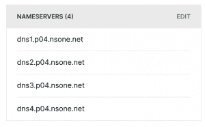
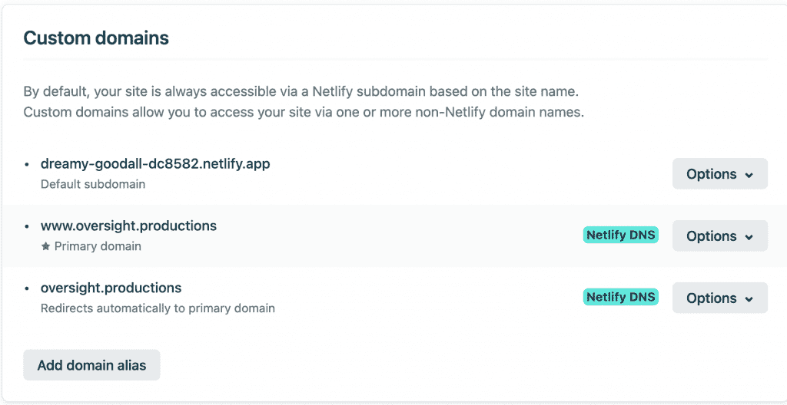
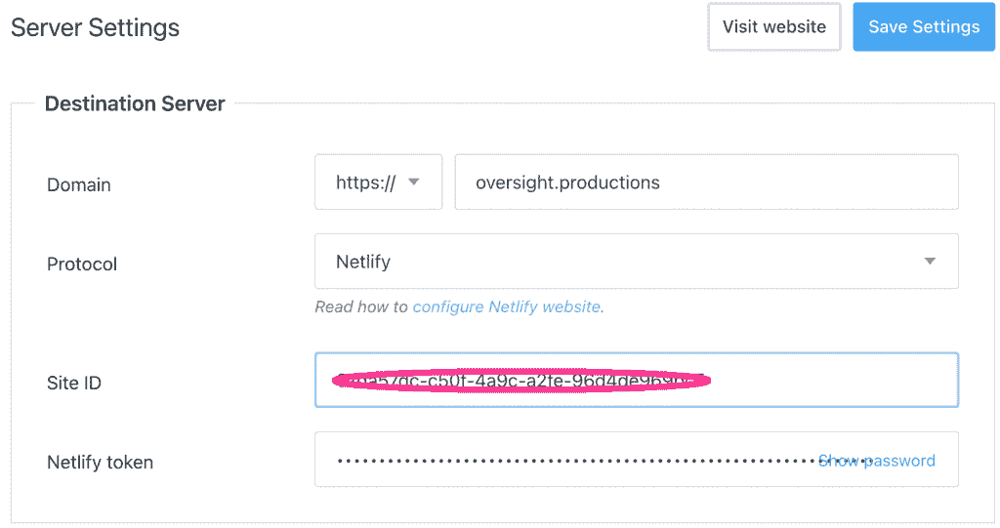
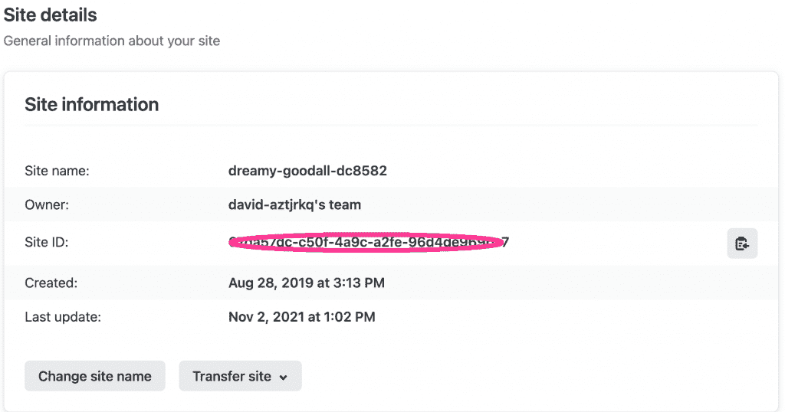

# Jamstack 风格:用 Netlify 和 Publii 构建一个网站

> 原文：<https://thenewstack.io/jamstack-style-build-a-website-with-netlify-and-publii/>

对于我们中的许多人来说，各种前端技术的命运看起来就像流行音乐排行榜一样狂热。大量的能量和兴奋爆发在与旧事物非常相似的新事物上。与此同时，有许多潜在的趋势正在悄然演变。这篇文章谈到了其中的一个，并鼓励你去尝试一下。

互联网从来没有“目标设计”；它只是一系列的管道。但是随着时间的推移，我们已经接受了网站是好的，如果每个人都遵循 HTTP 请求的规则并提供 HTML 页面，这是满足大多数临时用户需求的最佳方式。

网络服务器、提供商和开发者的生态已经形成。基本上，用户在浏览器中键入一个 URL，然后请求被路由到 web 服务器，服务器检查用户的凭证并创建适当的页面，然后通过管道发送回来。如果某个页面正是您所需要的，那么稍微等待一会儿总是可以接受的。

然而，相当多的网站根本没有个性化信息。如果网站将总是向任何人显示相同的信息，为什么我们需要去 web 服务器生成它？

这就引入了**静态**网站的思想。就像所有的行业术语一样，根据上下文的不同，它可能意味着稍微不同的东西，但是在最初的 web 上，一切都是静态的站点。当时的创新是“超链接”，或者无缝跳转到不同服务器上的不同页面的能力。

从技术上讲，一个站点有三个很好的理由与它的原始服务器通信:

*   必须检查用户的凭证，
*   该网站显示定期变化的信息，
*   或者页面从用户那里收集信息供服务器使用。

有了像 javascript 和现代浏览器这样的工具，页面本身可以很容易地通过它的 **API** 与服务直接通信。因此，静态页面更准确的定义是，页面和站点的结构是固定的，任何注入的动态信息都不会改变这一点。一个站点如何出现在特定的设备显示器上也是由页面本身决定的，可能与 javascript 媒体查询有关。

我们大多数人都知道，有些网站的加载速度比其他网站快得多。今天的互联网仍然是一系列管道，但有很多收集、存储(即缓存)甚至加速某些内容的中途站，以便更容易地进行本地访问。这并不奇怪——如果我想看最新流行和大量传播的猫迷因，它肯定比一篇关于巴塔哥尼亚铺路石匮乏的学术论文更容易找到或回忆起来。

事实上，互联网依靠**内容交付网络** ( **CDN** s)来帮助加速大多数请求。CDN 支持“边缘”是缓存文档的有效位置，这样就不必追踪原始来源。

因此，我们有了理解 **Jamstack** (或者越来越多的只是 **Jamstack** )所需的一切。Jamstack 就是创建预建的静态页面，直接从 CDN 提供服务。

如果你想知道，缩写是 **J** avascript(用于脚本)， **A** PI(如果需要)， **M** arkup(如在 HTML 和 CSS 中)。如果一个网站不再有网络服务器支持，那么恶意攻击的切入点就不那么明显了——简而言之，Jamstack 被认为更加安全。

好吧，但是如果我们不使用 web 服务器来动态生成和提供页面，我们如何建立网站呢？这就是**静态站点生成器**的用武之地。虽然这些通常是需要模板和框架知识的以开发人员为中心的工具，但是有一些生成器是有效的桌面应用程序。一旦您定义了您的站点，生成器将为部署到 CDN 做好准备。

总之，你需要做的就是:

*   向 CDN 托管服务注册。
*   静态站点生成器。
*   你控制的域名。

例如，我使用 [**Netlify**](https://netlify.com) 和站点生成器 [**Publii**](https://getpublii.com/) 与我的域名 **oversight.productions** ，从 [**Hover**](http://hover.com) 购买。我用 Publii 建立并更新了这个网站，把它推送到 Netlify，然后 Netlify 把它发布到他们的 CDN 上。

Publii 是一个易于使用的应用程序，让你建立一个网站很像一个经典的 CMS。定义主题和布局，然后添加内容。你不能很好的控制，但是这是一个快速创建站点的好方法。但是无论你尝试了哪一种生成器，确保它可以用你所拥有的技能创建你想要的网站类型。

您需要在您的域提供商和 CDN 服务之间建立信任关系。这应该是一个文档化的过程，尽管在技术上有点复杂。

我改变了悬停控制面板，将 DNS 流量重定向到 Netlify:

我将我的自定义域添加到 Netlify 中，因此它被注册为外部提供者。然后，您可以根据需要对 DNS 记录进行任何更改。

有了 Netlify，你就有了一个本地生成的名字和域名(恐怕这都是“空想的好东西”),这有助于测试；然后在旁边添加您的自定义名称:

在 Publii 应用程序上，可以显式设置为 Netlify 构建。注意需要一个站点 ID 和一个令牌:

回到 Netlify 站点，您可以获取该站点 ID:

在另一个屏幕上，您将能够创建新的访问令牌。

不要太担心具体的零零碎碎——一旦你在工具之间建立了信任关系，你就能够建立一个站点，然后将它部署到边缘。

虽然这样做需要一些技术上的敏锐度，但不需要编写任何代码，对于个人项目来说，唯一的成本就是域名。在这一带玩，也让你对“无服务器”的意义有了真切的感受。

所以试一试，享受你最喜欢的任何口味的果酱。

<svg xmlns:xlink="http://www.w3.org/1999/xlink" viewBox="0 0 68 31" version="1.1"><title>Group</title> <desc>Created with Sketch.</desc></svg>