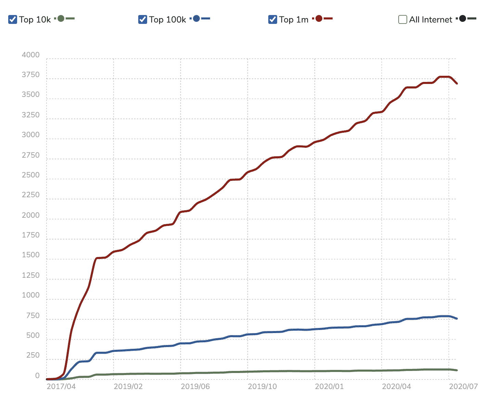

# Jamstack vs. WordPress，第二轮:两个 Matts 的辩论

> 原文：<https://thenewstack.io/jamstack-vs-wordpress-round-2-the-two-matts-debate/>

就在一个多月前，我发表了 WordPress 联合创始人[马特·莫楞威格](https://twitter.com/photomatt)关于 Jamstack 的第一篇公开评论[，jam stack 是新兴的网络出版架构，代表了](https://thenewstack.io/wordpress-co-founder-matt-mullenweg-is-not-a-fan-of-jamstack/)[对 WordPress](https://thenewstack.io/jamstack-vs-wordpress-which-is-the-future-of-web-architecture/) (更一般地说，是 LAMP stack)的直接挑战。Mullenweg 告诉我，Jamstack 是“绝大多数采用它的人的倒退”，这在 Twitter 上引发了 Jamstack 支持者的反弹。可以预见的是，在社交媒体的战场上，人们的想法并没有改变。但随后，一个令人惊讶的发展:Mullenweg 接受了参加 [Jamstack Conf](https://jamstackconf.com/virtual/) 的邀请，这是 Netlify 周二举办的为期一天的虚拟活动。

与 Netlify 首席执行官马特·比尔曼的“炉边谈话”结果证明是……嗯，激烈的，比尔曼在一封公开信中特别批评了穆伦韦格。

 [理查德·麦克马努斯

Richard 是 New Stack 的高级编辑，每周撰写一篇专栏文章，探讨云计算原生互联网的未来。此前，他在 2003 年创立了读写网，并将其打造为全球最具影响力的科技新闻和分析网站之一。](https://twitter.com/ricmac) 

在炉边聊天之前，网上已经有一些关于 WordPress 和 Jamstack 社区应该如何合作而不是争斗的讨论。Netlify 甚至发表了一篇名为“没有对抗”的博客文章但是当炉边谈话开始时，很明显两个参与者都将对方视为竞争对手。

争论的焦点围绕着开发者。正如我在之前的专栏中提到的，[开发者在当今云驱动的互联网中有着巨大的影响力](https://thenewstack.io/developers-are-in-charge-again/)。然而，比尔曼声称开发者不再对 WordPress 生态系统感兴趣，他反复地给这个生态系统贴上“铁板一块”的标签。

“也许 10 年前，当我和开发者交谈时，他们喜欢成为 WordPress 生态系统的一部分，”比尔曼说，“但今天，当我和开发者交谈时，我很少能找到同样的感觉。”

他将开发者对 WordPress 的喜爱程度下降归因于“现代前端生态系统中正在进行的非常快速的迭代和创新”——这显然是指 Jamstack，但也可能是因为过去十年中 React 和 Next.js 等创新 JavaScript 框架的出现

“你一定是在和不同的开发商说话，”穆伦韦格反驳道。“如果你看看数字——人们实际采用的是什么——我将使用集成方法而不是单一方法，这种方法是成功的。”

Mullenweg 接着声称 WordPress 已经“在过去的几年里加速了它的增长”，但是 Netlify 最近已经衰落了。他后来在 Twitter 上澄清他指的是世界顶级内容管理系统(CMS)的调查。毫无疑问，WordPress 是这项研究(以及大多数其他调查)中占主导地位的内容管理系统，而且它的市场份额还在继续增长。然而，他提到的净寿命的下降只是从 2020 年 7 月开始的——在此之前，已经有几年的增长了。

为网络生活构建图表

辩论结束后，比尔曼给我发了电子邮件，进一步回应了穆伦韦格对内置数据的引用。

他说网络使用率正在下降，这是不正确的。我们通常不分享这些指标，但仅在过去 28 天内，我们的用户就增加了超过 481，000 个网站。”

## 谁的开发者体验更好？

从任何统计数据来看，很明显 WordPress 目前都比 Netlify 大得多——无论是基于它的网站数量还是它的开发者数量(这两个数据点显然是相关的)。但一个更有趣的问题是:哪个平台的开发者体验更好？

在撰写关于 Jamstack 的[系列](https://thenewstack.io/why-netlify-is-tech-agnostic-and-its-role-in-jamstack-development/)[专栏](https://thenewstack.io/strapi-headless-cms-and-lessons-learned-from-docker/)时，我很快意识到这确实是一个吸引开发者的 web 架构。这主要是因为它将前端和后端分开，而且 Jamstack 可以利用一些令人惊叹的前端工具(如 React 和 GraphQL)。

在 Jamstack Conf 后给我的电子邮件中，比尔曼认为 WordPress 的情况正好相反。他写道:“根据世界上最大的开发者社区 Stack Overflow 的年度调查，67%的 WordPress 开发者不再想使用该平台，而 React、Vue.js 和 Angular 是最受欢迎的三大 web 框架。”

他提到的调查确实将 WordPress 列为“最可怕”的平台。然而，在炉边谈话中，Mullenweg 指出 WordPress 利用了许多与 Jamstack 相同的前端技术。

“我们有一个漂亮的 REST API，我们有一个 GraphQL API，你可以解耦使用它，还有像 [Frontity](https://frontity.org/) 这样的东西，允许你使用 React 构建 WordPress [with]无服务器预渲染。有太多的方法来整合它。”

然后，Mullenweg 指出了两个 WordPress 项目， [Calypso](https://developer.wordpress.com/calypso/) 和 [Gutenberg](https://wordpress.org/gutenberg/) ，作为“我们热爱 JavaScript，我们热爱 API，我们热爱标记”的证明

在这种情况下，Calypso 特别有趣，因为它支持 WordPress.com，并被描述为“一个依靠 WordPress.com REST API 与 WordPress 核心通信的 JavaScript 应用程序”所以 Mullenweg 有一个很好的观点，这是 web 开发中最现代的方式。

WordPress 中的模块化编辑界面 Gutenberg 在 WordPress 社区中更有争议——但它也是使用 JavaScript 和 React 构建的。

虽然很难反驳 Stack Overflow 社区对开发者体验的看法，但至少 WordPress 不能被指责忽视现代 web 开发趋势。

也许是参考了当前开发者对 WordPress 的看法，Mullenweg 后来在讨论中承认“WordPress 在开发者营销方面做得很差。”

## 对推销持怀疑态度

当炉边谈话接近尾声时，比尔曼和穆伦韦格最终达成了共识:他们都在为一个开放、独立的网络而努力。然而，穆伦韦格无法摆脱之前的挖苦——比尔曼的公开信——即我们正处于“WordPress 时代的终结”

“我鼓励你持怀疑态度，”Mullenweg 说，“当有人在向你推销一种更现代的建筑时，看看他们想向你推销什么。他们是不是想卖给你一些需要更多供应商的东西？”

他敦促开发者也要“考虑你的最终用户”

“他们是打算使用 git 进行部署，还是打算引入像 Contentful 这样的专有 CMS 堆栈？或者你想建立一个完全开源的，自上而下的，拥有现代 web 开发中最友好的用户体验的东西吗？这就是为什么我认为 WordPress 正在被采用，也是为什么我不认为 WordPress 的时代已经结束。我认为我们将在未来几年内达到 50%以上的市场份额。”

比尔曼有自己的“买家当心”信息要传达。

“作为一名开发者，看看其他人试图向你推销什么——不仅仅是作为开源框架的 WordPress，而是作为一家真正依赖于当前 monolithic 的公司的 WordPress.com——”

在这里，比尔曼控制住了自己，转而使用穆伦韦格喜欢的术语。

“当前的*集成*方法，在他们的插件之间，在他们的模板之间，在所有这些之间，以便让你构建东西。”

比尔曼最后呼吁“一个真正由开源驱动的网络版本，但也是一个由许多不同的供应商组成的非常活跃的生态系统，这些供应商为每一个不同的部分和部件提供良好的合作，这将对你作为开发人员更好，对网络也更好。”

炉边谈话结束了，但是任何关于合作的谈话看起来都像空话。这两个 mat 仍然相差太远。

## 那么，我们处于哪个时代呢？

我的总体印象是，Matt Biilmann 真诚地相信 Jamstack 产品(包括他自己的 Netlify)可以与 WordPress 和谐地向前发展。但是马特·莫楞威格还没有被说服——拥有 30-40%的 CMS 市场，我不怪他对一个市场份额不到 1%的新贵声称 WordPress 时代已经结束敏感。

就我个人而言，我不认为 WordPress 的时代已经结束——远远没有结束，因为它的市场份额每年都在增长。然而，同样明显的是，开发人员对 Jamstack 很好奇，因此他们对 Netlify 和 Gatsby 等公司的兴趣也在增长。

最终，这两种方法对开放网络都有好处。真正的*战役是吸引开发者远离像脸书这样的围墙花园平台以及苹果和谷歌的移动操作系统双头垄断。因此，开发者越多使用现代网络开发工具，如 Jamstack 和 WordPress，对网络越好。*

<svg xmlns:xlink="http://www.w3.org/1999/xlink" viewBox="0 0 68 31" version="1.1"><title>Group</title> <desc>Created with Sketch.</desc></svg>