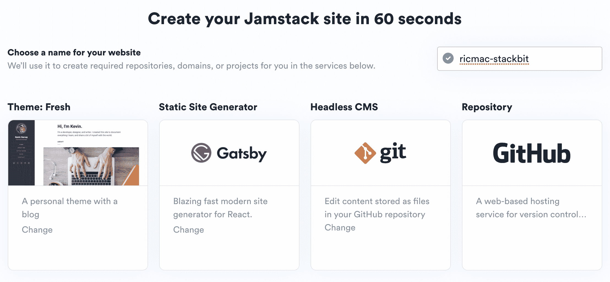

# JAMstack vs. WordPress:哪个是 Web 架构的未来？

> 原文：<https://thenewstack.io/jamstack-vs-wordpress-which-is-the-future-of-web-architecture/>

几周前，当 WordPress 联合创始人马特·莫楞威格[告诉我“JAMstack 对绝大多数采用它的人来说是一种倒退”时，我预料会有一些来自 JAMstack 社区的反驳。](https://thenewstack.io/wordpress-co-founder-matt-mullenweg-is-not-a-fan-of-jamstack/)[萌芽 JAMstack 平台](https://twitter.com/ohadpr) [Stackbit](https://www.stackbit.com/) 的首席执行官 Ohad Eder-Pressman 排在第一位。他给 Mullenweg 写了一封公开信，总结说 JAMstack 将成为“网络的主导架构”

 [理查德·麦克马努斯

Richard 是 New Stack 的高级编辑，每周撰写一篇专栏文章，探讨云计算原生互联网的未来。此前，他在 2003 年创立了读写网，并将其打造为全球最具影响力的科技新闻和分析网站之一。](https://twitter.com/ricmac) 

我和 Eder-Pressman 进行了一次电话会谈，讨论为什么他认为 JAMstack 最终会取代 WordPress monolith 模型。

Eder-Pressman 在这场比赛中有不止一匹马。他是 [Netlify](https://www.netlify.com/) 的董事会成员，这家公司[创造了](https://medium.com/@alexsanchezdesigns/what-the-hell-is-jamstack-5ef002963f26)一词“JAMstack”Netlify 的创始 CEO 马特·比尔曼也批评了穆伦韦格，甚至将他的评论与史蒂夫·鲍尔默 2007 年对 iPhone 臭名昭著的批评相提并论(“我们可能刚刚见证了网络架构世界的史蒂夫·鲍尔默时刻”)。

在 Twitter 上，Eder-Pressman 和 Mullenweg 礼貌地互相嘲讽，并最终就 JAMstack 和 WordPress 的未来打了一个绅士的赌。

他们确定的问题是:到 2025 年 9 月，Alexa 排名前 10，000 的网站中有多少将在 WordPress 或 JAMstack 上运行？根据 Mullenweg 的说法，目前 WordPress 的这一数字约为 37%。博客 [WordPress Tavern](https://wptavern.com/matt-mullenweg-and-jamstack-community-square-off-making-long-term-bets-on-the-predominant-architecture-for-the-web) 将其定为 39.75%(通过 BuiltWith)和 [38.4%](https://w3techs.com/technologies/details/cm-wordpress) (通过 w3techs)。

虽然很难给出 JAMstack 网站的当前比例，但 Eder-Pressman 在我们的采访中告诉我，它“非常接近 2%。”然而，他认为五年后会超过 10%，其中一部分是“蚕食 WordPress 世界”的结果

如果 JAMstack 真的突破了 10%的大关，那将是一个不小的成就。特别是因为 JAMstack 目前更适合开发者，而不是 WordPress 的(更多的，T4 更多的)内容创建者用户群。所以我问 Eder-Pressman，他预测 JAMstack 的增长动力是什么？

“首先，我只想指出，这不是苹果与苹果的比较，”他回答道，并指出“WordPress 是一个平台，而 JAMstack 是一个工具集。”

尽管如此，他确实认为使用 JAMstack 工具建立的网站在未来五年内数量会迅速增长。

“从我的角度来看，”他说，“如果它使用那些现代组件中的一个，它就是一个 JAMstack 网站——比如它可能使用 Hugo 作为静态网站生成器，[或者]它可能使用 Contentful 来管理内容，或者它可能使用 Netlify 来进行部署。”

就什么会吸引人们使用这些 JAMstack 工具而言，Eder-Pressman 认为这将是开发者驱动的。他注意到 Netlify 最近的[声明](https://www.netlify.com/blog/2020/08/03/celebrating-1-million-developers-whats-next-for-netlify-and-the-jamstack/)称其平台上有超过 100 万的开发者，他估计像 Next.js 和 Gatsby 这样的平台上的开发者数量在“几十万”随着 JAMstack 开发工具的持续增长——我要补充的是，这得益于对 Netlify、Gatsby 和 Vercel 等公司的大量风险投资——Eder-Pressman 相信越来越多的网站将使用这些工具创建。

“这就像，嗯，每天早上有 x 个开发人员醒来，他们的任务是建立一个网站——他们会选择什么？”

## 与灯的比较

这就引出了一个问题:从 web 架构的角度来看，在当今以云为主导的环境中，是什么让 JAMstack 比 WordPress 模型更受开发者欢迎？

言归正传，WordPress 是使用 [LAMP](https://tedium.co/2019/10/01/lamp-stack-php-mysql-apache-history/) web 服务栈构建的。LAMP 是四个领先开源工具的首字母缩写:Linux、Apache、MySQL、PHP(或者 Perl 或者 Python)。JAMstack 架构直接针对这四个组件中的两个:web 服务器(Apache)和数据库(MySQL)。在 JAMstack 中，网站是静态生成的，然后通过边缘网络部署，这意味着不需要 web 服务器，并且对数据库的调用次数是有目的地限制的。

这种方法使得 JAMstack 网站非常快，但我问 Eder-Pressman，就开发者体验而言，它与 LAMP 相比如何？

“在我们今天所处的位置，世界上有许多云提供商，我们不一定都觉得有必要维护服务器，并在不同的服务器和服务之间提供不同的集成，我认为人们现在希望能够用更少的时间做更多的事情。以及启动和关闭服务器、配置服务器、修补安全性等繁琐工作的投资回报率(ROI)…就像，没有投资回报率一样。”

他还声称，相比传统的 LAMP 方法，现在的开发人员“更有可能选择现代的开发方法和方法论”。作为现代工具的例子，他引用了 git——他说 WordPress“很难集成到核心工作流中”——以及 JavaScript 框架和运行时，如 React 和 Node.js

“我只是向前看，”他说，“我看到 WordPress 越来越没用了。它不会明天就消失——它可能会在这里存在一段时间，因为它迄今为止一直非常成功——但我真的不认为它会采用对他们有非常明显好处的更现代化的方法。”

这是一个公平的论点，我已经在[之前的](https://thenewstack.io/strapi-headless-cms-and-lessons-learned-from-docker/) [专栏](https://thenewstack.io/gatsbys-content-mesh-and-its-role-in-jamstack/)中指出，JAMstack 对开发人员很有吸引力，原因同上。但是 JAMstack 不太强的地方，尤其是与 WordPress 相比，是在内容管理方面。简而言之，在 WordPress 上管理你的内容要容易得多，因为它都是在一个地方管理的(monolith 模型)。但是使用 JAMstack，有不同的服务来管理不同的组件——例如，您可以在 Contentful 这样的无头 CMS 中输入内容，在 Gatsby 这样的静态站点生成器中构建它，使用 Github 进行版本控制，并使用 Netlify 部署它。事实上，这是马特·莫楞威格的批评之一:JAMstack 系统是“脆弱的”，因为它依赖于太多的服务。

## Stackbit 在 JAMstack 生态系统中的位置

这是 Eder-Pressman 的公司 Stackbit 试图解决的问题，它提供了一个平台，将所有不同的服务连接在一起。它类似于传统的网站建设服务，如 SquareSpace 或 Wix，只是它是为 JAMstack 服务的。

果然，在我自己的测试中，我能够在 Stackbit 上在几分钟内建立并运行一个站点。

Stackbit 的用户界面

但是我们又回到了这个问题:为什么内容创建者会选择像 Stackbit 这样的 JAMstack 网站构建服务，而不是 WordPress.com 或者 Squarespace？对 Eder-Pressman 来说，一切都始于开发者。

“随着它被越来越多的人采用，越来越多的开发者选择建立 JAMstack 网站，我一直在问自己——那么，非技术人员将会使用什么工具呢？因为我们不希望一家公司的营销人员在 GitHub 中编辑 markdown 文件。”

因此，他将赌注压在了未来五年蜂拥至 JAMstack 的开发者身上，这将反过来刺激对内容创作者更易于使用的界面的需求(这正是 Stackbit 正在构建的)。这是一个不错的赌注，但它也可能被翻转:WordPress 已经有了一个庞大的内容创建者用户群，那么为了吸引更多的开发者，有什么可以阻止它更新其网络架构呢？

Mullenweg 在[最近的一条推特](https://twitter.com/photomatt/status/1306368508792504321)中暗示这是一种可能性，他说“我们正在建立和重建 WordPress，使之具有时代性。过去，我们已经导航并创造了更大的架构转变，未来也将如此。”

## 哪种 Web 架构会占上风？

如果要我下注，我会选择 WordPress。100 万 Netlify 开发人员是一个好的开始，但是 JAMstack 架构还没有在接近 WordPress 近 20 年来所达到的规模上得到验证。

正如 Netlify 的 Matt Biilmann 暗示的那样，我几乎没有看到 JAMstack 是 web 架构的 iPhone 式革命的证据。然而，我已经看到了足够多的东西，知道它有相当大的希望。例如，最终用户的速度优势就是 JAMstack 的一个显著优势。

我同意 Eder-Pressman 的观点，即开发人员是 JAMstack 未来的关键，但是让我们收回炒作。让开发人员用 JAMstack 进行试验，也许会把其中的一些特性带到 WordPress(毕竟这是开源的——所以他们不需要 Mullenweg 的许可)。web 架构的未来掌握在那些开发者的手中；我很好奇他们会把它带到哪里。

通过 Pixabay 的特征图像。

目前，新堆栈不允许直接在该网站上发表评论。我们邀请所有希望讨论一个故事的读者通过 [Twitter](https://twitter.com/thenewstack) 或[脸书](https://www.facebook.com/thenewstack/)访问我们。我们也欢迎您通过电子邮件发送新闻提示和反馈: [feedback@thenewstack.io](mailto:feedback@thenewstack.io) 。

<svg xmlns:xlink="http://www.w3.org/1999/xlink" viewBox="0 0 68 31" version="1.1"><title>Group</title> <desc>Created with Sketch.</desc></svg>