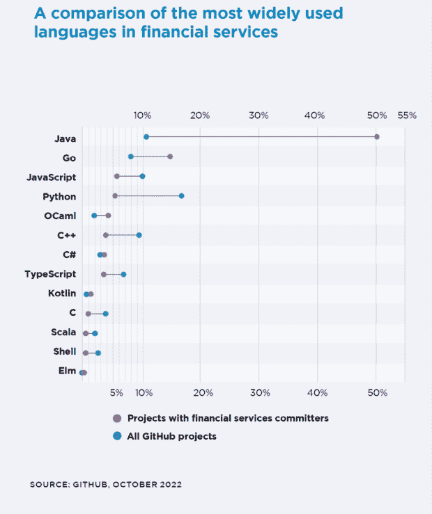

# 根据新的调查，Java 的使用持续攀升

> 原文：<https://thenewstack.io/java-usage-keeps-climbing-according-to-new-survey/>

根据 SlashData 在 T2 发布的 2022 年第三季度“开发者国家状况”报告的结果，Java 可能不是对云最友好的语言。

全球不到一半的活跃开发人员(49%)表示他们使用 Java，而 2020 年第三季度这一比例为 39%，增加了 26%。

自 2020 年第三季度以来，调查中出现显著增长的其他语言包括:

*   [Kotlin，](https://thenewstack.io/this-week-in-programming-all-aboard-the-kotlin-train/)兼容 Java 生态系统的移动开发者的最爱(从 11%到 18%，增长了 64%)。
*   [Python，](https://thenewstack.io/an-introduction-to-python-for-non-programmers/)对数据分析和自动化至关重要(从 42%到 50%，跃升 19%)。
*   [Rust，](https://thenewstack.io/adoption-of-rust-whos-using-it-and-how/)备受喜爱的[c++替代品(从 4%上升到 8%，增长 100%)。](https://survey.stackoverflow.co/2022/?utm_source=so-owned&utm_medium=announcement-banner&utm_campaign=dev-survey-2022&utm_content=results#section-most-loved-dreaded-and-wanted-programming-scripting-and-markup-languages)

根据全球开发者社区分析师 Slash Data 的说法，这项调查在 6 月至 8 月期间进行，覆盖了全球 163 个国家的 26，000 多名参与者。

## Java 在金融服务领域的主导地位

另外两项研究证实了 Java 的优势。根据 Tidelift 的[《2022 年开源软件供应链调查报告》，](https://tidelift.com/2022-open-source-software-supply-chain-survey) 49%的开源开发者认为他们的组织依赖 Java，高于 2020 年的 42%。该报告还显示，最大的组织更倾向于依赖 Java，而较小的组织则倾向于 JavaScript。

金融服务组织与 Java 有着非同寻常的联系。[“金融服务中的开源状态”](https://www.linuxfoundation.org/research/the-2022-state-of-open-source-in-financial-services)报告称，50%与金融服务开发者相关的存储库使用 Java，而所有 GitHub 项目中只有 11%使用 Java。

## 省道和飘动流行度检查

今年使用量没有明显增长的一种语言是 Dart，在 Slash 数据研究中，它的使用量在 2021 年保持不变，为 6%。

乍一看，这似乎与 SonarSource 产品副总裁[法布里斯贝林加德](https://www.linkedin.com/in/bellingard/?originalSubdomain=fr)在新堆栈中的断言相矛盾，即[对移动](https://thenewstack.io/industry-observer-sees-growing-interest-in-dart-flutter/)的 Dart 和 Flutter 越来越感兴趣。因此，我们查看了 Stack Overflow 的年度“开发者调查”以获得第二种意见。原来 2022 年 Stack Overflow 调查的开发者也是在同样的 6%水平上使用 Dart。

Dart 继续受到移动项目开发人员的关注，Stack Overflow 调查的 7，634 名移动开发人员中有 27%使用该语言，高于 2021 年调查的 24%。在移动开发者中，开发框架 Flutter 的使用从 2021 年的 27%上升到 2022 年的 30%，增长了 11%。然而，在所有开发者中， [Flutter 使用率](https://thenewstack.io/google-flutter-now-rivals-facebooks-react-in-developer-use/)与去年相比下降了不到一个百分点，为 13%。

<svg xmlns:xlink="http://www.w3.org/1999/xlink" viewBox="0 0 68 31" version="1.1"><title>Group</title> <desc>Created with Sketch.</desc></svg>