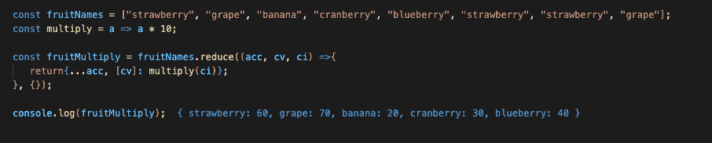
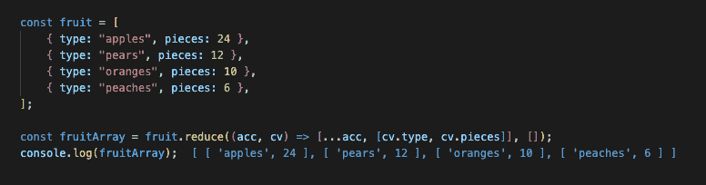

# JavaScript:用 Reduce()构建对象并消除循环

> 原文：<https://thenewstack.io/javascript-build-objects-and-eliminate-looping-with-reduce/>

JavaScript reduce 方法将一个数组简化为一个值，但是这到底意味着什么，为什么有用？JavaScript 包含了很多遍历数组的方法，那么为什么要使用 reduce 呢？

reduce()方法类似于内置的[数组映射](https://www.w3schools.com/jsref/jsref_map.asp)方法，但是有更多的内置功能。

让我们从基础开始。reduce 所需的参数是累计值、当前值和初始值。函数的基线看起来会像这样。

**累加器**(在 MDN 文档中称为前一个值)是设置所有前一个值和初始值(如果需要初始值)的值。

**当前值**，在该值上执行减速器功能中的回调或后续动作。

**初始值**是累加器的起始值。如果数组要归约的单个值是一个数字，那么初始值将是一个整数。如果正在创建对象，初始值将是对象。如果正在创建一个数组，那么初始值将是一个数组。

还可以指定其他选项，如当前索引或数组，但这不是必需的。

为了简化这一点，请看这个简单的循环函数作为例子。sum 变量执行累加器的功能。数组[I]是循环每次迭代的当前值。

上面表示为 reduce 方法的循环如下所示:

处理对象数组时，Reduce 也有效。需要注意的一点是，当有多行代码时，return 语句是绝对必要的。以下示例显示了 reduce 回调函数中的累加器 console.log 和第一个多行 reduce 示例。

## **减少建筑物体**

与前面的示例类似，初始值将为 reduce 函数的剩余部分设置速度。所以当初始值为 0 时，所有其他值都加到那个 0 上。当初始值为空对象时，剩余的值将被添加到空对象中。基线缩减器函数如下所示:

如果我们想把这个例子中的水果数组转换成一个单独的对象，它的长格式应该是这样的。

有一种方法可以让它变得更短。这是语法上的糖版本。它看起来像这样。

上面的例子复制了前一个累加器，并将当前值的键/值对添加到其中。

但是如果所讨论的数组是字符串数组而不是对象数组呢？没问题！结构差不多。Reduce 可用于创建元素及其索引的对象。

额外的回调也可以传递给 reducer 函数。这是一个非常基本的例子。

对象构建的最后一个示例是 count 对象示例。在这个例子中，正在构建的对象将记录每个水果在数组中出现的次数。

下面是计数对象的一个版本:

有一种方法可以让这个解决方案稍微优雅一些。与上面的语法相似，spread 操作符将复制前面的 accumulator 对象，并向其中添加新的键/值对。括号中的值具有以下含义:要么将该项的值设置为该项的当前值，要么设置为 0，然后加 1。这也适用于减速器功能之外的情况。

## **用 Reduce 构建数组**

Reduce 可以用来构建一个数组。通过将初始值设置为空数组，reduce 函数将在一个数组中累加值。骨架看起来会像这样:

数组构建类似于对象构建。Reduce 可以构建数组和数组的数组。下面是 reduce 方法构建数组的一个示例:

这是一个如何使用 reduce 构建数组的数组的例子:

回调也可以传递到数组中:

## **结论**

谈到 JavaScript 中遍历数组的许多方法，Reduce 是另一个有用的工具。Reduce 在链接高阶函数和抽象出循环过程时非常有用。时间复杂度是 O(n ),因为它遍历数组的所有元素，所以在 reduce 函数中添加额外的进程时要注意这一点。

<svg xmlns:xlink="http://www.w3.org/1999/xlink" viewBox="0 0 68 31" version="1.1"><title>Group</title> <desc>Created with Sketch.</desc></svg>