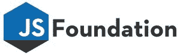

# JavaScript 长大了，有了自己的基础

> 原文：<https://thenewstack.io/javascript-grows-gets-foundation/>

目前，JavaScript 领域为构建、测试和部署应用程序提供了多种多样的开源选项。可能太多样化了。考虑到这一点，[Linux 基金会](https://www.linuxfoundation.org/)推出了 JavaScript 基金会，据该组织称，这是一个“致力于在指数级扩张的 JS 生态系统中创建一个重心”的实体。

该基金会旨在帮助从混乱中争取一点秩序，同时确保开源贡献者感到被重视和被包含。更正式地说，基金会的目标是“推动关键 JavaScript 解决方案的广泛采用，同时促进 JavaScript 开发社区内的协作，以确保这些项目保持质量和多样化的贡献基础，从而提供长期的可持续性。”

对于 [JavaScript](/tag/javascript/) 来说，这的确是有趣的时代。早在 1995 年，网景公司想让新生的万维网活跃起来，就委托布伦丹·艾希为其导航浏览器开发一种脚本语言。仅仅在十天的时间里，艾希——他后来共同创建了 Mozilla 帝国——就创造出了这种短小精悍的编程语言。剩下的你都知道了:JavaScript 如何与 HTML 和 CSS 一起，最终成为今天健壮的 web 的前端基础。这当然是大多数人对 JavaScript 功能的理解。

然而，在幕后，开源和开发者社区正忙于革新 JavaScript 的功能。 [Node.js](/tag/node.js/) 开启了服务器端 JavaScript 的美丽新世界，从跨平台原生应用开发到物联网(IoT)小型化，这种语言的灵活性正被广泛应用。JavaScript 甚至已经从浏览器跳到了桌面；例如，目前最热门的工作场所聊天应用 Slack 在其桌面客户端下运行 JavaScript。

开发人员欣然接受了 JavaScript，因为用同一种语言编写客户端和服务器端代码实在是太有用了。

## 安慰

这是一个有机进化的、开源驱动的去中心化过程的自然结果，但它也产生了一个严重分裂的意想不到的后果:每个人对 JavaScript 开源的兴奋产生了大量的重复工作。有更多的框架和模板引擎，以至于“我正在构建我自己的节点框架”已经变成了一种时髦的编码笑话。

典型的例子:上周由[何塞·阿吉纳加](https://hackernoon.com/@jjperezaguinaga)撰写的令人捧腹的博客文章，标题是[“2016 年学习 JavaScript 的感受”](https://hackernoon.com/how-it-feels-to-learn-javascript-in-2016-d3a717dd577f#.2n5r26pis)

Aguinaga 查看了令人眼花缭乱的一系列库、任务管理器、包管理器、模块管理器、任务运行器和其他小工具，它们都在努力让我们的 JavaScript 生活变得更快、更简单、更性感。这篇文章对 JavaScript 生态系统的持续分裂提出了重要的观点，但是你和你认识的其他 webdev 看到的事实表明，这个社区仍然在可管理的范围内相互联系。

进入全新的 JavaScript 基础。这个非营利组织在伦敦的 [OSCON](http://conferences.oreilly.com/oscon/open-source-eu) 正式宣布成立，在 Linux 基金会的支持下成立，与 [Node.js 基金会](https://nodejs.org/en/foundation/)同属一个组织，也由 Linux 基金会监管。JavaScript 基金会的首份新闻稿称，其使命是“培养最佳实践和政策，促进高质量标准和对长期可持续发展的多样化贡献。”

换句话说:找出一些标准和最佳实践，也许可以开始把我们最好的玩具放在一个公共的玩具箱里。让我们作为一个团体一起行动。更好地了解哪些可行，哪些不可行，哪些方法和实现应该被合并，哪些应该被丢弃，以及开源社区应该应对哪些新的挑战。安慰一下，伙计。

该基金会还宣布了一项导师计划，旨在从功能上支持“鼓励整个 JavaScript 社区的合作和可持续发展文化”的双重目标，同时培育“推动 JavaScript 生态系统边界的技术”。该计划从代表整个 JavaScript 领域的七个初始项目开始，从客户端和服务器端应用程序库到移动应用程序测试框架再到 JavaScript 引擎。最初的导师制项目有 [Appium](http://appium.io/) 、 [Interledger.js](https://interledger.org/) 、 [JerryScript](http://jerryscript.net/) 、 [Mocha](https://mochajs.org/) 、 [Moment.js](http://momentjs.com/) 、 [Node-RED](http://nodered.org/) 和 [webpack](https://webpack.github.io/) 。

这些具体的项目只是一个起点，Kris Borchers 强调“我们欢迎任何希望帮助支持 JavaScript 社区并激发应用开发下一波增长的项目、组织或开发者，”他说。

Borchers 已经在 Linux 基金会拥有终身职位，因为当决定将该实体扩展并更名为 JavaScript 基金会时，他是 jQuery 基金会的负责人。这是一个全新的基础，有新的治理、成员结构和董事会，甚至是新的技术治理结构，它将仍然支持所有当前的 JQuery 项目，同时添加新的计划。“长期以来，jQuery Foundation 的范围已经远远超出了 jQuery 项目，”Borchers 解释说，他说他过去常常在每次会议的前十分钟解释说，该组织“不仅仅是 jQuery，所以这有望使我的生活更轻松。”

JavaScript 基金会的人员配备和各种监督委员会仍在建设中，但随着实体的增长和发展，重点将放在开放的治理和健康的社区发展实践上。他补充说，为个人和组织捐助者/合作者建立一个前门是基金会结构的一个重要组成部分。

该基金会有三个目标受众，首先是应用程序开发人员。“我们的目标是覆盖整个范围，从我们每天使用的工具和低级实用程序，如 [Lodash](https://lodash.com/) ，一直到测试工具，如 Appium 或 Mocha，并超越非典型应用程序的范围，”Borchers 说。这意味着支持像 JerryScript 和 NodeRED 这样的项目，在像物联网这样的领域，JavaScript 已经开始站稳脚跟，尽管人们通常不认为 JavaScript 在那里有作用。"

JavaScript 基金会也瞄准了更大的组织。事实上，该实体是一个成员支持的组织；创始人包括 IBM、StackPath 和三星等。作为一个非营利组织，基金会是最初由盈利公司创建的开源项目的吸引人的中立宿主，这可能会将监督权，有时甚至版权所有权转移到非营利组织。

“这意味着所有参与者对项目的走向都有平等的发言权。Borchers 解释说:“当他们知道版权的公司所有者无法将项目带走或迫使它朝着主要为他们服务的方向发展时，我们会从贡献者那里获得更强的支持，从而获得更强劲的项目增长。”

## 你就是生态系统

跨浏览器测试套件提供商[酱实验室](https://saucelabs.com/)已经作为成员组织加入，并向新基金会捐赠了 app ium——开源移动测试软件。[乔纳森·立普斯](https://github.com/jlipps)是流行的跨平台、语言不可知框架的架构师和项目负责人，但偶尔发现自己很沮丧，因为想要做出贡献的有才华的开发人员被他们日常工作的公司政策所阻止，阻止他们为其他盈利公司拥有的开源项目做出贡献。“转向以基金会为基础的管理显然成为正确的事情，”立普斯说。

“作为一家两个主要产品都基于开源实体的公司，是时候把我们的开源资金投入到我们开源的地方，并将版权捐赠给非营利组织。”

立普斯说，酱油实验室被基金会的口号“共同创新”所吸引非常有必要将做着或多或少相同事情的项目整合到对话和协作中，并且——当知识产权由非营利组织持有时——“所有不同的发明者可能会更愿意团结起来，有一个共同的愿景，并开始标准化。”

总而言之，立普斯说，他很高兴看到 JavaScript 基金会吸引了如此广泛的企业支持。“企业已经从 JavaScript 生态系统中获利颇丰，”他说。“因此，现在有一个地方可以让他们把一些钱重新投入其中，这太好了。”

事实上，经常提到的 JavaScript 生态系统是基金会的第三个也是最后一个目标受众。

Borchers 说，通过与 Node.js 基金会的合作，JavaScript 基金会将有效地代表整个 JavaScript 社区的声音。“我们希望确保语言以有利于开发者的方式发展。我们将与 W3C 合作，确保这些改变能够改善开发者的体验，”他说。

简而言之，“我们的目标是在运行 web 的语言标准方面成为应用程序开发人员的驱动力。

<svg xmlns:xlink="http://www.w3.org/1999/xlink" viewBox="0 0 68 31" version="1.1"><title>Group</title> <desc>Created with Sketch.</desc></svg>