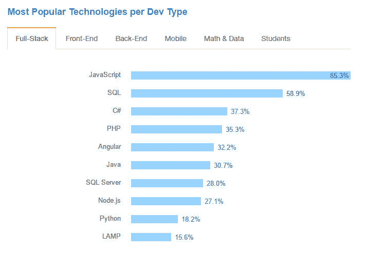

# 在栈溢出开发者调查中，JavaScript 受欢迎程度超过 Java，PHP

> 原文：<https://thenewstack.io/javascript-popularity-surpasses-java-php-stack-overflow-developer-survey/>

JavaScript 主要被认为是 Web 应用程序的前端语言，它不仅迅速超越了 PHP 等其他 Web 语言，甚至超越了 Java 等传统的后端编程语言，至少根据 Stack Overflow T3 的最新年度调查结果是这样的，Stack Overflow T3 是开发人员和周末黑客的热门问答网站。

栈溢出调查被描述为“有史以来最全面的开发者调查”，它统计了来自 173 个国家的 56，033 名开发者的回答。

虽然这项调查不是科学样本，但它是一组有趣的数据，因为该网站至少从 2013 年开始每年对其用户群进行一次调查。一些调查结果似乎显而易见——例如，薪酬和工作满意度之间有很强的相关性。但是其他数据要精细得多，也更有用。

28%的受访者认为自己是全栈 web 开发人员，12.2%是后端开发人员，5.8%是前端开发人员。

但是在所有的*三个*群体中，JavaScript 是迄今为止最受欢迎的技术——对于 85.3%的全栈开发者，90.5%的前端开发者，甚至 54.4%的后端开发者。

[Node.js Foundation](https://nodejs.org/en/foundation/) 的社区经理 Mikeal Rogers 在一封电子邮件中写道:“将全栈开发人员视为最大的职业，并将 JavaScript 视为后端和前端的顶级语言，这与我们一直以来看到的 JavaScript 整体采用情况是一致的。

在所有开发人员中，Rust 是最受欢迎的语言(79.1%的受访者引用)，其次是 Swift(72.1%)、F #(70.7%)和 Scala。虽然 Node.js 排名第 11(59.6%)，但 Node。Js 基金会的罗杰斯很高兴。“这是我们第二年上榜，而且我们的排名还在上升。我们在 2014 年或 2013 年都没有入围。”

Stack Overflow 还报告称，Swift 2 是今年增长最快的语言。在调查结果中，Stack Overflow 指出，随着基于 JavaScript 的 Node 和 Angular 越来越受欢迎，PHP 似乎正在失宠。

## 规划和多样性

这项调查不仅仅涵盖了正在使用的技术。它还揭示了关于程序员本身的数据。

92.8%的受访者是男性——这似乎甚至让 Stack Overflow 的编辑们感到惊讶。他们在调查结果中指出，“我们知道女性在开发人员中所占的比例比这一数字更大，”并指出，根据 Quantcast 的数据，Stack Overflow 的读者中约有 12%是女性。“我们也知道，这项调查没有充分代表那些女性开发人员较多的国家的人，比如韩国、印度和中国等亚洲国家。”

在公布结果的新闻稿中，Stack Overflow 补充说:“调查数据表明，男性和女性与入门级开发人员的薪酬大致相同，但薪酬差距可能会扩大，男性收入更多，因为双方都获得了经验。”

但他们的调查表明，该网站希望提供自己的支持。“我们不能声称知道弥合科技领域性别差距的答案，但我们认为与公众分享数据是推进整个行业更多对话的富有成效的一步，”声明中写道。

在他们收到的 56，033 份回复中，13，540 份来自美国，约占 24%，另有 4，573 份来自英国(8.1%)，4，193 份来自印度(7.4%)，2，024 份来自加拿大(3.6%)，1，117 份来自澳大利亚(2%)。但不到 4%的受访者年龄在 50 岁以上，52.0%的人年龄在 20 岁至 29 岁之间。“开发人员的平均年龄是 29.6 岁，”Stack Overflow 报告说。"中位数是 27 岁。"事实上，7.1%的人年龄在 20 岁以下(可能其中一些是学生)。

此外，69.1%的受访者表示他们至少部分是自学的，全球 13%的受访者甚至表示他们只是自学的。

“教育数据对我们真的很重要，”罗杰斯补充道。“69%的受访者是部分自学的，但只有 25%的人使用在线培训，只有 7%的人参加过行业认证计划，这一事实证明了 Node.js Foundation 确实需要扩大我们的教育资源和培训机会。

这似乎也导致了一个关键的极客问题上的明显年龄差距:*《星球大战》*还是*《星际迷航》*？50 岁以下的每一组都以很大的优势选择了《星球大战》,但随着年龄的增长，这一优势开始缩小。在 50-59 岁年龄段的受访者中，更多的人选择了《星际迷航》(52.5%)而不是《星际迷航》*(31.4%)，而在 60 岁以上的群体中，《星际迷航》*只获得了 29.3%的选票(而《星际迷航》*获得了 47.0%的选票)。***

 ****《萤火虫》*是入围最多的，接下来是*星际之门*、*神秘博士*和*巴比伦 5* 。

## 在桌面上

在过去的四年里，越来越少的受访者提到了 Windows 桌面平台，现在只有 52%(低于 2013 年的 60%)。与此同时，Linux(22 %)和 Mac OS(26 %)在该网站用户中的受欢迎程度有所上升。

是的，第一次有更多的开发人员使用 Mac OS 而不是 Linux 作为他们的主要操作系统。“然而，在我们 2016 年的调查中，Windows 10 是增长最快的桌面操作系统，”Stack Overflow 的一份声明称，“在发布后不到一年的时间里，吸引了近 21%的开发人员。”

他们的调查结果显示，去年 Mac 已经取代 Linux 坐上了第二把交椅，但是“今年很明显这种趋势是真实的。”但是在他们的操作系统数据中隐藏着一个更重要的趋势。“如果操作系统的采用率保持稳定，到明年的调查时，可能只有不到 50%的开发人员在使用 Windows。”

一个可能相关的琐事是，56033 个回复中只有 59 个来自 Windows Phone 手机开发者，占 0.1%。

来自调查的其他有趣数据:

*   Ubuntu 占据了整个操作系统市场的 12.3%，是目前为止最受欢迎的 Linux 版本。
*   “嵌入式应用开发人员最有可能被视为工程师。图形程序员最有可能认同自己是程序员。”
*   "与其他开发人员职业相比，高管们更愿意使用更多的语言和框架."
*   "大约每 8 秒钟，一个开发人员会问一个关于堆栈溢出的问题."

<svg xmlns:xlink="http://www.w3.org/1999/xlink" viewBox="0 0 68 31" version="1.1"><title>Group</title> <desc>Created with Sketch.</desc></svg>***