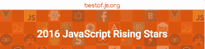
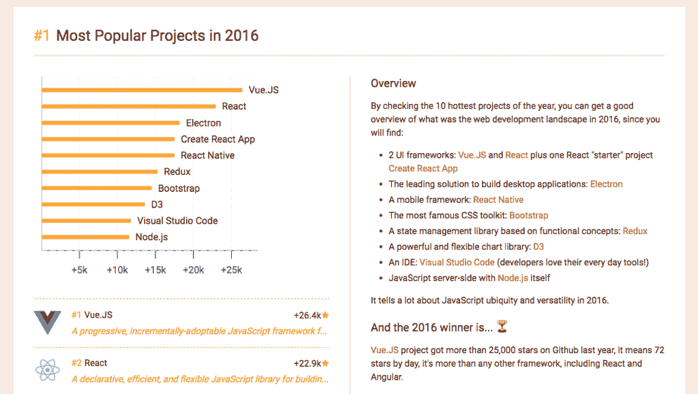

# js:一群冉冉升起的 JavaScript 新星

> 原文：<https://thenewstack.io/javascript-rising-github-stars-bestof-js-org/>

为了纪念 JavaScript 的 20 岁生日，[迈克尔·兰博](http://michaelrambeau.com/)决定为。JS 和前端工程世界。这家总部位于日本大阪的网络开发商热衷于跟上 JavaScript 的[快速发展的生态系统](/tag/javascript/)的最新发展，但厌倦了用书签标记和记下关于不断增加的有趣开源项目的笔记。

因此，Rambeau 决定需要一种工具来跟踪开源 JavaScript 领域的不断变化和补充，并帮助开发人员做出明智的选择，为他们的项目提供最佳资源。

那个工具并不存在，所以兰博造了一个:[bestof.js.org](http://bestof.js.org/)。这款网络应用基于 Rambeau 的想法，即利用一个项目在 GitHub 上从用户那里获得的星级数，作为检查当前受欢迎程度和长期持久力的一种方式。毕竟，一个过时的项目可能会有一船的遗留问题，比尚未出现的更好的新人解决方案还要突出。Bestof.js 旨在对 300 多个项目的 GitHub 明星进行每日快照，并使用这些信息来展示趋势和识别后起之秀项目。

该应用有两个类别:20 个最受欢迎的项目，根据 GitHub 上的星总数排名，以及 20 个最热门的项目，根据过去 24 小时内获得的星数排名。结果进一步分为 50 多个类别，从宽泛的类别(框架、测试工具)到狭窄的类别(React UI 组件、游戏引擎)。

Bestof.js 经过深思熟虑，条理清晰——但即便如此，它仍然包含大量信息。因此，Rambeau 深思熟虑地为 JavaScript 世界准备了第二份礼物:2016 年年终趋势综述。这份名为 [2016 JavaScript 明日之星](https://risingstars2016.js.org/#ide)的报告详细、系统地审视了哪些项目是明日之星，哪些项目可能正在衰落。他提出了一个十点概述，其中包括 2016 年最受欢迎的项目，以及各种框架(node.js、React、前端、测试)和实用程序项目(编译器、IDE、静态站点生成器)。Rambeau 还记录了 2016 年的主要主题，从他所谓的“JavaScript Fatigue”到 [LeftPad Gate](https://thenewstack.io/the-kik-kerfuffle/) 和[微软终于要开源了](https://thenewstack.io/microsoft-hones-visual-studio-cross-platform-open-source-development/)(嗯，不管怎样，有一点)。

2016 年的大赢家？从数字来看，[vue . js](https://vuejs.org/)——渐进的、可增量采用的 JS 框架——是遥遥领先的赢家，有 26，400 颗星。React 获得了三个十佳作品； [React](https://facebook.github.io/react/) 本身排名第二，拥有 23000 颗星，[创建 React App](https://github.com/facebookincubator/create-react-app) 和 [React Native](https://github.com/facebook/react-native) 分别排名第四和第五。容器化趋势出现在第六位，有[Redux](https://github.com/reactjs/redux)(2016 年有 15300 个 GitHub stars)，古老的 [Bootstrap](https://getbootstrap.com/2.3.2/) 继续在第七位蹒跚前行。微软的开源入门项目——[Visual Studio 代码](https://github.com/Microsoft/vscode)——排在第九位。关闭前十是每个人最喜欢的小 JS-runtime-engine-that-could， [Node.js](https://github.com/nodejs/node) 。

前十名是严格按数字排列的 GitHub 星级；另外九个分类深入探讨了各种网络平台相关项目的细节。Rambeau 在每一部分都附有令人信服的评论和分析，表明他真正致力于研究、理解和阐明所有这些数据点，为我们这些幸运的读者。

兰博也给出了他个人对 2017 年继续成功的选择。参赛作品包括 Vue.js —“势头不会停止！”—并创建了 React App，他用它来构建 Bestof.js 本身。他对脸书的精英们提供给开源世界的包管理器 [Yarn](https://www.npmjs.com/package/yarn) 很感兴趣，它似乎已经准备好超越 [npm](https://www.npmjs.com/) ，至少对于基于 JavaScript 的企业应用程序来说是如此。

Rambeau 对 all things Node.js 的发展也有很好的看法，从 Node 本身的最新版本如何有效地与 ES6 结合到新兴的卫星项目，如[现在托管解决方案](https://zeit.co/now)，使 Node.js 微服务易于部署。

Rambeau 说，JavaScript 作为一种让服务器生成的静态网页载歌载舞的手段，已经走过了令人难以置信的漫长道路，当时它被视为某种“玩具语言”。如今，试图跟上 JS 的最新发展就像试图用消防水管喝水一样。迈克尔·兰博的《Bestof.js.org》是有思想的 web 开发人员宝库中真正有价值的工具。

专题图片:[三角座星系](https://www.nasa.gov/multimedia/imagegallery/image_feature_1841.html)，鸣谢:NASA/雨燕科学团队/Stefan Immler。

<svg xmlns:xlink="http://www.w3.org/1999/xlink" viewBox="0 0 68 31" version="1.1"><title>Group</title> <desc>Created with Sketch.</desc></svg>