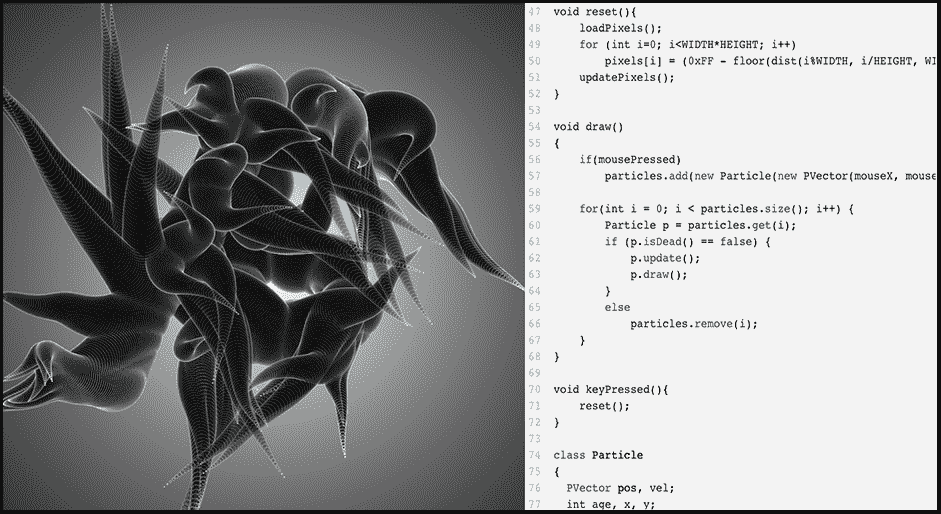

# JavaScript:用 P5.js 释放你内心的杰森·布拉克

> 原文：<https://thenewstack.io/javascript-unleash-inner-jackson-pollack-p5-js/>

大多数程序员通过学习语法和数据结构来学习编程。写代码，代码做东西，结果在控制台返回。然而，您可能需要编写相当多的代码，才能最终在控制台中获得一些好的东西。P5.js 颠覆了这种方法:写一行代码就能在屏幕上得到即时的——通常是华丽的——结果。

是的，是的，我们都是有创造力的程序员。我们甚至可能偶尔喜欢把自己想象成以代码为媒介的艺术家——T2 c#的塞尚，或者 T4 Python 的毕加索。然而，P5.js 使用 Javascript 来呈现文字艺术作品。

P5.js 是一个[客户端 JavaScript 库](https://p5js.org/download/)，用于创建图形和交互作品，这是一个完全开源的项目，刚刚庆祝了它的第三个生日。P5 的方法基于[处理](https://processing.org/)，这是一个基于 Java 的“[软件 sketchbook](https://www.openprocessing.org/) ”平台，自 2001 年就已经存在。两者都是为了让艺术家、设计师、教育工作者和其他无法想象自己是潜在程序员的人学习编码不那么令人生畏。然而，Processing 的输出仅限于虚拟绘图板(并且在很长一段时间内依赖于 Java 小程序，而 Java 小程序不再受到广泛支持)。P5.js 是作为原生 JavaScript 平台构建的，它利用整个浏览器，包括 HTML5 对象，如交互式网络摄像头、视频、声音和交互式用户输入。

“对于一个初学计算机科学的学生来说，让一个程序打印出一些数字感觉相当令人兴奋。但是对于一个学习编程的艺术学生来说，就没那么容易了，”P5.js 的创建者劳伦·麦卡锡说。“用 P5 你写‘10 ^ 10 ^ 10 椭圆’,你马上就能在屏幕上看到图形。它吸引了他们，在他们意识到之前，他们就开始编码了！”

事实上，该平台使用起来简单直观。P5.js 有一个大约 [200 个容易理解的命令库](https://p5js.org/reference/) : triangle()绘制三角形，fill()用颜色填充形状()。像 deviceShaken()或 keyPressed()这样的事件会在 DOM 中触发相应的反应，一旦您的杰作被创建，就会有包括 saveJSON()在内的各种导出选项。

麦卡锡第一次接触处理是在麻省理工学院，她获得了艺术和计算机科学的学士学位。“我有点陷进去了，”她说。“草图的隐喻让我感觉很舒服，这种方式让很多可能对代码感到不舒服的人感到熟悉和容易理解。”她在读研究生时广泛使用它作为一种创造性工具，毕业后在她的专业工作中也使用它。

那时，麦卡锡对处理的开源方面产生了兴趣。“我开始想，‘这些工具是免费和开源的，太酷了，现在我在我的专业工作中用它们赚钱。我敢打赌，我的公司会付钱给我，让我花些时间为他们工作并回报他们。"

Ale González 于 2013 年创作的交互式 P5.js 项目“deeps”中的一段源代码。

然而，一开始，麦卡锡很难找到进入开源生态系统的方法。“刚进来时，我在很多方面都很不传统，当我着手我感兴趣的项目时，真的很难被认真对待，”她说。幸运的是，麦卡锡认识凯西·里斯，她在加州大学洛杉矶分校读研究生时，凯西是她的老师之一。Reas 和 [Ben Frey](http://benfry.com/) 共同创造了 Processing，McCarthy 说，“他告诉我，‘我有一个你可以参与的项目！’"

麦卡锡的任务是:从理论上概念化 JavaScript 中的处理过程。“起初，我几乎像涂鸦一样工作。我对自己在做什么知之甚少，因为我对事情几乎一无所知，对自己的能力也没有信心，”她回忆道。“我只是勾勒出一些东西。但如果你有好奇心，想学习，你可以投入进去，边学边做，如果你周围有人支持的话。”她的第一次 [P5.js GitHub 提交](https://github.com/processing/p5.js)是在 2011 年 2 月 13 日。到 2014 年 8 月，她拥有了该平台的测试版。

P5.js 是真正的社区成果。该项目的 GitHub repo 列出了 160 个贡献者，他们总共提交了 4，174 个项目。麦卡锡说:“人们贡献了核心功能、错误修复、示例、文档、设计、想法和讨论。她将该项目的广泛支持归功于“处理社区的远见和精神，他们在向网络过渡方面投入了很多。”

P5.js 旨在成为一种学习资源——特别是对于那些认为自己无法学习编码的人。她解释说:“包容性和可及性是最重要的，我们以此为重点进行建设。”为此，一个即将发布的 web 编辑器应该会进一步提高 P5.js 的可访问性，特别是对于那些不习惯命令行或者安装软件有问题的人。例如，使用学校配发的计算机的学生通常被禁止将程序下载到他们借来的机器上。

尽管如此，当前版本的 P5.js 现在已经在世界各地的教室中使用，尽管主要是大学水平。不仅仅是在艺术和人文课程中。“大学计算机科学和工程项目已经发现这是一种友好的方式，可以让人们非常快速地绘制草图，而无需学习复杂的系统或语言，”她说。

然而，麦卡锡强调，P5.js 并不是一些可爱的新的学习代码的策略。对于在数字媒体领域从事严肃和前沿工作的人来说，这也是一个合法的艺术工具。(如果你想看看麦卡锡利用这个平台创作的一些作品，请访问她的主页。

“你不必成为一个真正的艺术家来使用它，”她说。“因为这个项目是如此的 web native，我们也为那些有编码背景但不太熟悉艺术制作部分的 web 开发人员制作它。”麦卡锡建议，以全新的方式使用标准浏览器功能，例如触摸屏和加速度计等原生移动功能，可以为他们的专业工作释放创造力和想法。

麦卡锡说:“有太多的方式来探索和利用这一工具固有的技术。她希望看到该平台未来发展的方向包括利用[Web GL](https://developer.mozilla.org/en-US/docs/Web/API/WebGL_API)(Web Graphics Library，一种用于渲染交互式 3D 图形的 JavaScript API)。“现在对虚拟现实的所有兴趣——探索 P5 在那个领域将如何发挥作用，”她沉思道。“例如，使用 Raspberry Pi 控制器的学生，以及这些控制器如何协同工作以突破图形和在屏幕上绘制图像的限制……”

麦卡锡总结道:“网络变化如此之快，而我们试图教授的最终内容是对实验感到舒适。”“因为在网上，没有一本巨大的教科书能让你在阅读时感觉‘我已经准备好掌握它了’。”"

专题图片:来自 P5.js [开源在线画廊](http://openprocessing.org)的艺术家 Koi Koi 的《彩色面孔》。

<svg xmlns:xlink="http://www.w3.org/1999/xlink" viewBox="0 0 68 31" version="1.1"><title>Group</title> <desc>Created with Sketch.</desc></svg>