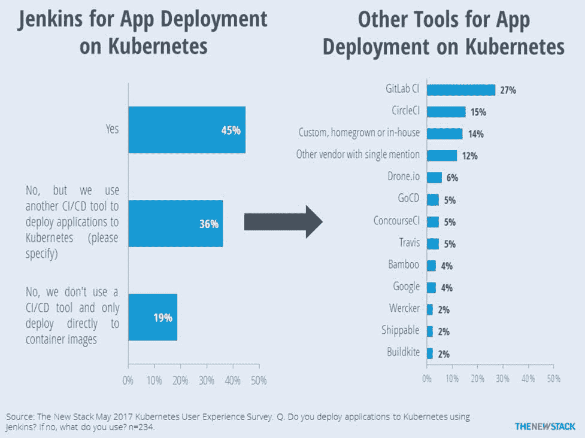

# Jenkins 和 Kubernetes 负责应用程序部署

> 原文：<https://thenewstack.io/jenkins-kubernetes-cd-pipelines/>

新的堆栈不断地交付 [Kubernetes](/category/kubernetes/) 开源容器编排引擎的内容。本周我们将报道应用程序实际上是如何部署到 Kubernetes 的。当在容器编排、连续交付管道或配置管理工具之间进行选择时，我们 2017 年 5 月 Kubernetes 调查的受访者经常表示他们使用编排器进行应用部署。尽管有些人认为 Kubernetes 是一把无所不能的瑞士军刀，但事实上他们对它在应用程序部署中的作用有更细致的认识。

当被问及是否使用 Jenkins 在 Kubernetes 上部署应用时，45%的人回答是。另外 36%的 Kubernetes 用户通过另一个持续部署(CD)管道向 Kubernetes 部署应用程序； [GitLab CI](https://about.gitlab.com/features/gitlab-ci-cd/) 和 [CircleCI](https://circleci.com/) 在这个群体中被提及的次数最多。请注意，调查问题的性质意味着它们不能用于确定市场份额。其他工具的总体采用率可能高于下图所示。

也就是说，Jenkins 仍然是目前最常用的持续集成(CI)工具。未来的研究将询问 Jenkins 在组织渠道中的中心地位，而不是询问 Jenkins 是否被使用。在许多情况下，同一家公司的不同团队会使用一种竞争产品。在其他情况下，Jenkins 是更大工作流程中的一个小组件，而另一个供应商的工具是 CD 管道图中的中心焦点。

再深入一点，我们发现与平均值相比，较小的公司(2 到 100 名员工)不太可能使用 Jenkins(38%对 45%)，这可能是因为他们没有以前需要部署工作流的大型组织。这与我们上周写的[趋势一致](https://thenewstack.io/week-numbers-not-developers-use-ci-cd/)，其中不同规模的团队倾向于使用不同的 CI/CD 工具。

受访者认为应用程序部署自动化是成熟的 Kubernetes 应用程序的主要优势。许多受访者描述了交付渠道如何与 Kubernetes 带来的更大的组织变革相关联。一个人说，“在我们的早期阶段，改善开发人员的工作流程，让开发人员能够思考他们的代码在生产中是如何运行的，这是我们希望用 Kubernetes 实现的最重要的事情。”

我们知道 65%的生产用户在 Kubernetes 上运行应用程序开发工具。在这方面，Kubernetes 对于持续部署和供应“基础设施即代码”是至关重要的。

<svg xmlns:xlink="http://www.w3.org/1999/xlink" viewBox="0 0 68 31" version="1.1"><title>Group</title> <desc>Created with Sketch.</desc></svg>