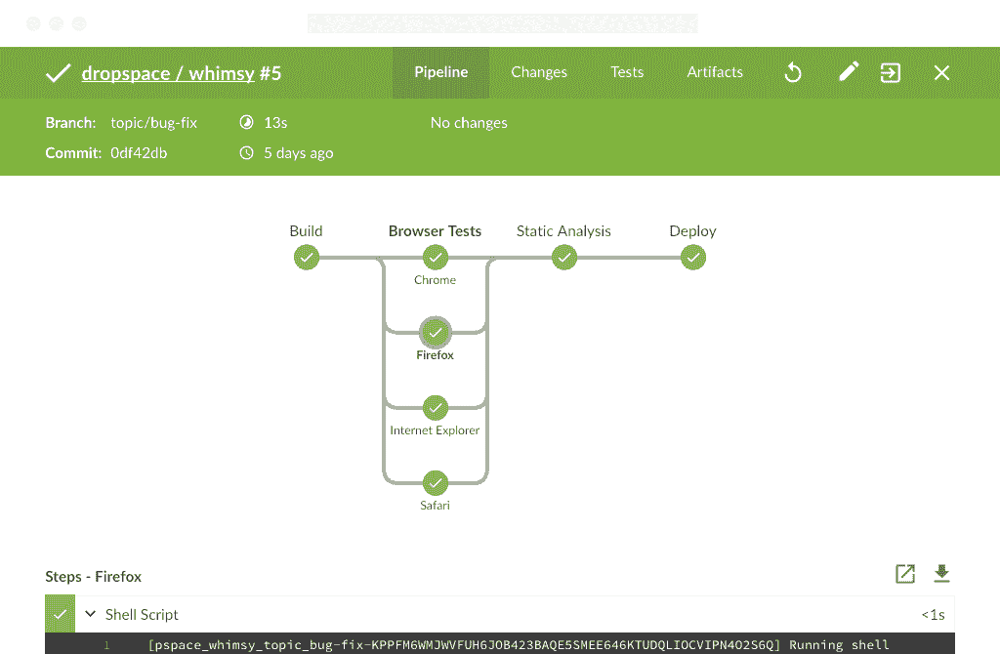

# 詹金斯得到一个蓝海用户界面改造

> 原文：<https://thenewstack.io/jenkins-overhauls-user-interface-blue-ocean/>

[詹金斯项目](https://jenkins.io/)发布了一个新的用户体验(UX)，被称为蓝海，用于在 [DevOps](/category/devops/) 环境中使用的流行的詹金斯自动化服务器。

詹金斯公司(Jenkins company)旗下的 CloudBees 去年发起了蓝海项目，后来对其进行了开源。蓝海 1.0 将 Jenkins 带入现代，将持续交付置于最前沿，并使 DevOps 团队的所有成员都能够参与创建、可视化和诊断持续交付管道。

新的 UX 也带来了个性化的，现代的设计给詹金斯，这本身就是十多年前。Jenkins 于 2005 年发布，最初是作为 Sun Microsystems 的 Hudson 项目开发的。

CloudBees 的首席执行官和联合创始人 Sacha Labourey 告诉 New Stack 说:“Jenkins 已经 10 岁了，当你使用它时，你会感觉到它的存在。“感觉像是 10 年前的软件。所以，我们决定在这方面努力。”

CloudBees 的 Jenkins 创始人兼首席技术官 Kohsuke Kawaguchi 在一份声明中说:“全新、非常现代和直观的 UX 使 Jenkins 更加平易近人，并继续增强 Jenkins 的功能和可用性。

## 不仅仅是一个新界面

然而，蓝海不仅仅是现代化的詹金斯用户界面；詹金斯福音传播者和社区经理 r·泰勒·克罗伊说，它通过关注软件发展趋势的走向，而不仅仅是它们现在的位置，更新了使用软件的整个体验。

“我们开始围绕未来的发展方向而不是现状来设计新的用户体验，”他说，并指出当 Jenkins 在 2005 年发布时，持续交付还不是一个概念，所以重点是持续集成。然而，现在的重点不仅仅是持续交付，而且还在于持续部署。

“这个行业已经变得专注于持续交付，并把更多的利益相关者带入软件开发过程，”克罗伊说。

因此，蓝海有两个设计原则。一个是让团队中的每个人都可以访问交付过程中正在发生的信息，“因为这就是当今软件的构建方式——跨职能、敏捷的团队。我们需要支持完整的从代码到生产/部署的连续交付流程。因此，该项目也建立在 Jenkins pipeline 的基础上，并在 Jenkins 的基础上创造了这种真正引人注目且易于使用的用户体验。”

克罗伊说，连续输送管道可能是复杂的，特别是非专家。然而，Blue Ocean 简化了软件管道的开发，它允许开发人员使用可视化管道编辑器创建管道，然后以直观的方式可视化流程，不需要代码或文本编辑。

“在 Jenkins 最初的经典 UI 中，有这样一个所见即所得的作业配置屏幕，它在那些知道要检查什么框、要更改什么设置等的团队中的发布工程师或开发人员中培养了这种部落知识。，”克罗伊说道。

蓝海消除了对这种部落知识的需求，并提供了所有团队成员都能理解的管道的公共视图。

克罗伊说，有一个中间步骤，让更多的人更容易为詹金斯的持续交付过程做出贡献。

“然后蓝海在此基础上引入了管道编辑器，这是一个所见即所得的非常光滑的界面，用于添加到管道上或从头创建管道，”他说。“当你保存它时，蓝海会像 GitHub 一样将它提交回你的源代码库，这样整个组织，而不仅仅是开发者，都可以理解它。”

## 管道作为代码

根据蓝海项目，UX“由管道作为代码支撑，这使得管道定义能够与应用代码和基础设施作为代码一起存储；允许团队在出现问题时轻松重现之前的配置和流程。”

然而，它不能取代詹金斯的任何东西。克罗伊指出，在同一个詹金斯系统上，你可以同时拥有经典的詹金斯用户界面和蓝海用户体验。

克罗伊指出，为了形象化，蓝色海洋让东西更容易找到。“从可视化的角度来看，蓝海通过个性化功能或通过重新设计管道流程的显示方式，将更多重要的相关信息带到了用户界面的最前端，”他说它试图将相关信息呈现给用户，比 Jenkins classic UI 要快得多，也更令人愉快。"

Pund-IT 的首席分析师[查尔斯·金](https://twitter.com/pund_it)说:[蓝海 UI 插件的首次亮相强调了 DevOps 流程和文化的一些显著变化。](http://www.pund-it.com/)

“蓝海补充了十年前为有经验的开发者和组织设计的用户界面，”他说。“由于许多从业者正在利用持续交付模型，该模型利用与非专家团队成员(包括 IT 运营和管理专业人员)的协作，因此必须利用帮助他们了解项目进展情况的工具。蓝海的目标是通过提供一个用户友好的、图形化的项目管道端到端视图来实现这一目标。

## 詹金斯企业

Labourey 表示，在 CloudBees 发布其[cloud bees Jenkins Enterprise](https://www.cloudbees.com/products/cloudbees-jenkins-enterprise)平台约一个半月之后，Blue Ocean 发布，该平台为企业软件商店提供所有组件，以实施连续交付流程。

该解决方案采用分布式管道体系结构(DPA ),将连续交付工作负载分布在多个隔离的服务器上，以提供高级别的可扩展性。它运行在各种平台上，包括亚马逊 Web 服务、Red Hat OpenStack 平台、VMware vSphere 和 Red Hat Enterprise Linux。

它还利用了 Jenkins 可用的 1，300 个集成，使企业能够对其整个软件组合(从传统应用程序到基于云的微服务)有一个统一的视图。

“你可以启动十年前建立的项目，一方面像旧的 Java 应用程序，另一方面你可能有很酷的 Docker 容器到 AWS，”Labourey 说。“有了这个新平台，所有这些都有可能实现——在传统应用和新型技术之间架起了一座桥梁。”

CloudBees 成立于 2010 年，专注于平台即服务市场，但到了 2014 年，该公司将重点转向了 Jenkins 及其最初的持续集成计划。

然而，随着持续集成，Jenkins 的目标是自动化软件生命周期的开始，在过去的几年中，DevOps 运动变得专注于持续交付，试图自动化整个应用程序生命周期。

持续交付是指自动化整个应用程序流程，直到您有了可以投入生产的东西。您可能不希望一定要投入生产，但是您希望处于发布就绪阶段，并且能够手动决定是否要将新版本投入生产。而持续部署则更进一步，自动将这些产品投入生产。

Labourey 说，10 年前，持续集成没有任何价值，但持续交付的增加改变了这一点，因为它支持所有应用程序的交付。它已经成为向客户提供价值的新方式，并且是所有 It 职能部门(开发、QA、运营等)之间的统一层。

“如果你的管道或支持你的管道的工具是把你所有的软件带到生产中，那么你的管道就变得和生产本身一样重要，”他说。

事实上，如果你的管道中断了，你就没有办法将新软件推向生产，包括错误修复和安全修复。Labourey 指出，连续交付已经成为对 IT 至关重要的核心功能，不再是一项次要活动。

这就是为什么许多组织正在实施中央开发运维团队来运行他们的企业开发运维环境。

这是 CloudBees Jenkins 企业的目标。“CloudBees Jenkins Enterprise 是一个新平台，不仅仅是 Jenkins ++，”Labourey 说。“它实际上是一个完整的平台，可以掌控您的基础架构，并提供一个环境来进行大规模的连续交付。这使得加入新团队变得容易。它在您的服务器之间共享所有资源。它使该集群的运营和管理完全集中化。”

通过 Pixabay 的特征图像。

<svg xmlns:xlink="http://www.w3.org/1999/xlink" viewBox="0 0 68 31" version="1.1"><title>Group</title> <desc>Created with Sketch.</desc></svg>