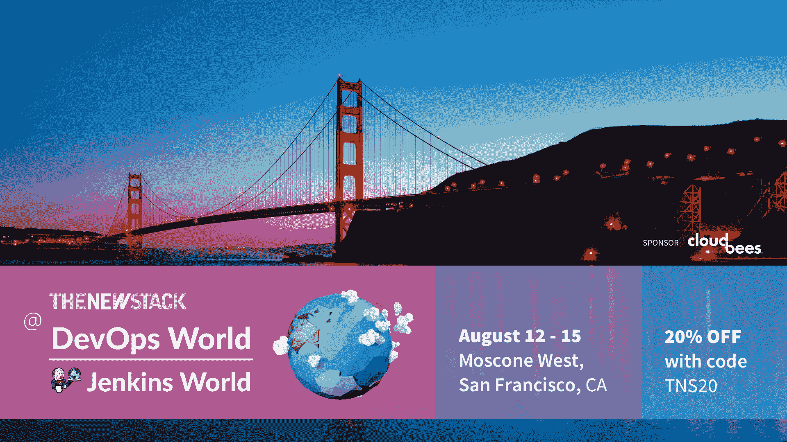

# Jenkins X 和 CD 基金会:在混乱的云世界中帮助开发者的框架

> 原文：<https://thenewstack.io/jenkins-x-and-the-cd-foundation-a-framework-to-help-developers-in-a-chaotic-cloud-native-world/>

我们都知道开源工具的爆炸式增长如何为开发运维团队提供了前所未有的自由，让他们可以自由选择云原生和本地应用开发和部署。然而，这种丰富的选项构成了自由的深渊——其中的陷阱是，鉴于可供选择的选项范围很广，很难找到适合您组织特定需求的正确工具集和过程。

然而。

对于评估和测试工具的组织，特别是对于云原生部署，有一些基本的方法可以开始或简化您的遗留工具和流程，以实现更快、更强大的持续集成和持续交付(CI/CD)。这也适用于那些计划保留其本地或云中裸机服务器运营的组织。

在本文中，我们将探讨开源软件 [Jenkins X](https://github.com/jenkins-x) 如何在整个生产和部署流程中实现 CI/CD 的自动化，该软件面向云原生应用以及现有的遗留应用部署。Jenkins X 旨在自动化组织可能采用的一系列管道类型，也适用于 Jenkins 和 Tekton，这是 Google 最近为云原生 CI/CD 创建的框架。

“总的来说，Jenkins X 的想法是提供全面的自动化，以帮助开发人员更快地工作，并尽可能多地消除管道和它们的库的无差别繁重工作，” [CloudBees](https://www.cloudbees.com/) 的高级架构师、 [Jenkins X](https://github.com/jenkins-x) 的项目负责人 [James Strachan](https://www.linkedin.com/in/jstrachan/) 说。

我们还退一步概述了组织将如何利用[持续交付基金会(CDF)](https://cd.foundation/) 提供的框架和指导。通过这种方式，DevOps 可以依靠 CDF 来更好地导航可用工具和平台的广阔西部，以实现广泛的部署结构。

## 为什么詹金斯 X 意味着自动化

Jenkins X 是一种在通常由微服务和 Kubernetes 组成的云原生平台上编排生产管道的方法。由于它也与现有的 Jenkins 管道兼容，Jenkins X 不仅仅是 Jenkins 在云原生部署方面的扩展。

除了 Jenkins 之外，Jenkins X 还位于现有和未来的执行引擎之上，例如，可以扩展到 [Tekton](https://github.com/tektoncd) Kubernetes 管道工具。Jenkins X 背后的想法是让 it 避开使用 Kubernetes 开发云原生应用程序的大部分复杂性，以及对受限于特定工具集和相关基础设施的困惑和担忧。当然，您也可以自动化和改进 CI/CD 流程。

除了作为一个组织可能选择的任何 CI/CD 实现的编排工具，“Jenkins X 提高了易用性和抽象性的标准，”监督 Jenkins X 管理的公司 [CloudBees](https://www.cloudbees.com/) 的首席科学家 [Kohsuke Kawaguchi](https://www.linkedin.com/in/kohsukekawaguchi/) 说

“开源生态系统是混乱的，因为许多新技术不断涌现。开发人员在部署应用程序时，没有时间搞清楚一切，”Kawaguchi 说。“这个想法是让开发人员专注于更高层次的概念，而 Jenkins X 让 Jenkins 或 Tekton 做幕后工作。”

自动化从一开始就是显而易见的。例如，只需一个命令，就可以在云原生平台上部署应用程序，而不必直接配置 Kubernetes 集群和必需的 YAML 文件。正如 Strachan 在[博客文章](https://jenkins.io/blog/2018/03/19/introducing-jenkins-x/)中描述的那样，Jenkins X 的主要优点在于它自动化了开发人员原本必须手动完成的工作。这包括自动将代码打包为 Docker 映像，创建 YAML 文件以便代码可以在 Kubernetes 集群和预览环境上运行，以及使用声明性管道代码 Jenkinsfiles 实现 CI/CD 管道。

“Jenkins X 本质上专注于允许人们在 Kubernetes 上制作微服务，并将这一切自动化，这样开发人员就不必手动编写 CI/CD 管道和 Jenkins 文件，”Strachan 说。

## 用例

理想情况下，与管理不同的声明性管道相比，DevOps 团队可以依靠 Jenkins X 花费更多的时间来完成更高级的任务——当然在智力上更有成就感。

例如，一个组织可能将 Jenkins X 用于某些云本机部署的 Jenkins 执行引擎管道，同时在另一个平台上编排 Tekton 层。除了云原生部署之外，DevOps 团队可能还有 Jenkins 管道来管理本地裸机部署。此外，一个组织拥有 1，000 多名 Jenkins masters 来创建虚拟机和大型机应用程序的情况并不少见。

相反，另一个组织可能会寻求部署其创建的应用程序，并且主要希望以尽可能低的成本在纯云原生平台上进行部署。

有了 Jenkins X 和 CloudBees 的服务支持业务模型，上述两种情况都可以实现。斯特拉坎说，CloudBees 正在“关注光谱中的每一个人”。

“我们试图让每个人都进步，并试图让每个人都尽可能多地使用自动化。同时，我们试图尽可能少地使用技术，因为您拥有的技术越多，您需要管理的就越多，”Strachan 说。“我们试图简化技术体系，同时提供更高质量和更高价值的软件。这种方法也让我们更容易维护。”

## 基础帮助

作为避免许多 DevOps 团队在非常广泛的开源和平台选择中感到困惑的另一种方法，CDF 旨在为寻求工具集、标准和流程指导的 DevOps 团队介绍流程、标准和其他支持和管理。

虽然有人担心与另一个 Linux 基金会管理的项目[云原生计算基金会(CNCF)](https://www.cncf.io/) 的潜在重叠，但 CDF 特别适合那些计划或已经依赖于 [Jenkins](https://jenkins.io/) 、Jenkins X、 [Spinnaker](https://www.spinnaker.io/) 和 [Tekton](https://github.com/tektoncd) 的团队。今年早些时候宣布，CDF 还没有准备好开始发布规范和原语。在此之前，该基金会正在帮助促进詹金斯，詹金斯 X，Spinnaker 和 Tekton 之间的整合，以及其他选择。

Kawaguchi 排除了与 CNCF 潜在重叠的影响，他说 CDF 应该帮助组织更清楚地了解什么样的工具集组合最适合他们。“我认为 CNCF 和中国发展基金是互补的，”川口说。"综合发展基金的总体影响将是帮助组织进行自我改造."

Strachan 说，在不久的将来，CDF 将寻求创建“测试、开发、代码覆盖报告和部署工具之间的大量集成”。Strachan 说，CDF 已经“显著增加”了 Jenkins、Jenkins X、Spinnaker 和 Tekton 社区之间的合作。

“我看到这些正在完美地加速，还会有更多的项目出现，”他说。“由于 Jenkins、Jenkins X、Spinnaker 和 Tekton 之间的密切合作，这将鼓励其他项目参与进来——但基本上，这一集成层现在正在发生。”

Strachan 说，在许多方面，CDF 将帮助指导开发团队“从哪里开始，因为那是另一个挑战”。“我们今天有四样东西，明年，我们可能有 10 样，我也希望我们不要去 CNCF，那里有 5000 样东西，”Strachan 说。“我们希望帮助指导人们完成这一旅程，因为有太多的技术存在，要知道从哪里开始可能会令人难以置信。”

以“转型和交付”为主题，组织可以通过参加[devo PS World | Jenkins World 2019](https://www.cloudbees.com/devops-world)(2019 年 8 月 12 日至 15 日，旧金山)来了解 Jenkins X 和 CDF 如何作为 CI/CD 的基础构建模块。会议的高级别和具体细节讲座以及实践研讨会面向新来者以及已经在运营成熟的内部部署和云原生部署的 DevOps 团队。

*[了解更多关于 DevOps World | Jenkins World](https://www.cloudbees.com/devops-world/san-francisco) 。然后[注册并使用这个特殊代码](https://web.cvent.com/event/eac49765-9235-4b96-aaba-3bcb9cc837c3/summary?RefId=SiteButton)给 TNS 阅读器:TNS20。你会得到 20%的折扣。*

<svg xmlns:xlink="http://www.w3.org/1999/xlink" viewBox="0 0 68 31" version="1.1"><title>Group</title> <desc>Created with Sketch.</desc></svg>