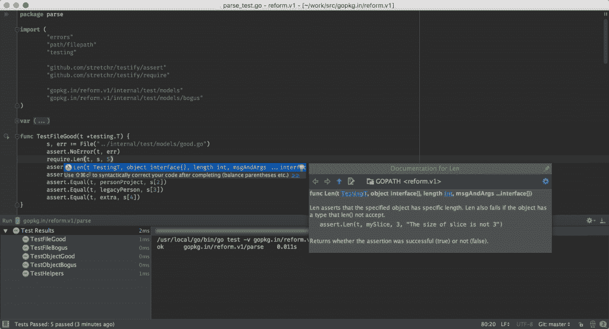

# JetBrains 为围棋制定了一个 IDE，叫做 Gogland

> 原文：<https://thenewstack.io/jetbrains-formulates-ide-go-called-gogland/>

广受欢迎的[IntelliJ IDEA](https://www.jetbrains.com/idea/?fromMenu)Java 集成开发环境背后的公司 JetBrains 已经正式注意到，许多开发人员和管理员正在生产中使用 [Go 编程语言](/tag/golang/)，因此已经采取措施为 Go 构建一个专用的 IDE。不要管它古怪的代号， [Gogland](https://www.jetbrains.com/go/) 通过为 Go 带来完整的 JetBrains 开发者体验，为 Go 及其社区带来了巨大的飞跃。

据该公司称，对类似 IntelliJ 的开发体验的需求在过去几年一直在增长。2013 年 12 月，Go 社区的成员开始为 Go 开发一个名为 [go-lang-idea-plugin](https://github.com/go-lang-plugin-org/go-lang-idea-plugin) 的 IntelliJ 插件。JetBrains 表明 initiative 成为了该项目的主要贡献者之一，并在过去三年的插件发展中发挥了重要作用，同时还跟踪了它的使用情况。

“去年，我们开始跟踪该插件的独立用户数量。仅去年一年，这个数字就翻了一番，达到每月活跃用户 30，000 人。JetBrains 产品营销经理 Andrey Cheptsov 在一封电子邮件中写道:“这一事实，以及许多用户要求我们将类似 IntelliJ 的编码体验带到 Go 中，说服我们最终在半年前分叉该项目，并推出我们自己的 Go IDE。

由于如此高的需求，JetBrains 预测，为 Go 开发一个专用的 IDE 几乎是不可避免的(尽管它在云应用程序中的大量使用也确保了 Go 上的许多工作是在命令行或文本编辑器中完成的)。然而，该公司并不轻视开发新产品的承诺。它希望绝对确保用户获得最好的开发体验。

“这个工具不能只是现有 IDE 的插件。整个环境应该为特定的任务和配置项目的方式而设计，”切普佐夫写道。

Gogland 将其 IntelliJ 平台的基本功能与代码辅助、错误分析和自动重构等功能相结合。然而，最重要的是，它记住了一种人体工程学的开发体验，这种体验是围绕这样一个原则设计的:“开发人员在流程中度过的每一刻都是好的时刻，而让你脱离流程的事情是不好的，应该避免，”Cheptsov 写道。

目前，Gogland 仍处于测试阶段，只能通过邀请下载。该公司计划将 Gogland 作为付费产品提供，并且没有开源 IDE 的计划。您可以订阅 [JetBrains 早期访问计划](https://www.jetbrains.com/go/#early-build)以了解最新信息，并为公共 EAP 预留一个位置。关于 [go-lang-idea-plugin](https://github.com/go-lang-plugin-org/go-lang-idea-plugin) 和 Gogland 之间的差异以及其他信息的完整列表，可以在 [Gogland](https://www.jetbrains.com/help/go/1.0/faq.html) [FAQ](https://www.jetbrains.com/help/go/1.0/faq.html) 上找到。

根据 TIOBE 的数据，Go " [在 2016 年获得了所有编程语言中最受欢迎的](http://www.tiobe.com/tiobe-index/)"，TIOBE 通过其月度 TIOBE 指数估计全球编程语言的使用情况。

“围棋成功背后的主要驱动力是它的易学性和务实性。这不是关于虚拟遗传和单子等理论概念，而是关于实践经验，”TIOBE 指出。

<svg xmlns:xlink="http://www.w3.org/1999/xlink" viewBox="0 0 68 31" version="1.1"><title>Group</title> <desc>Created with Sketch.</desc></svg>