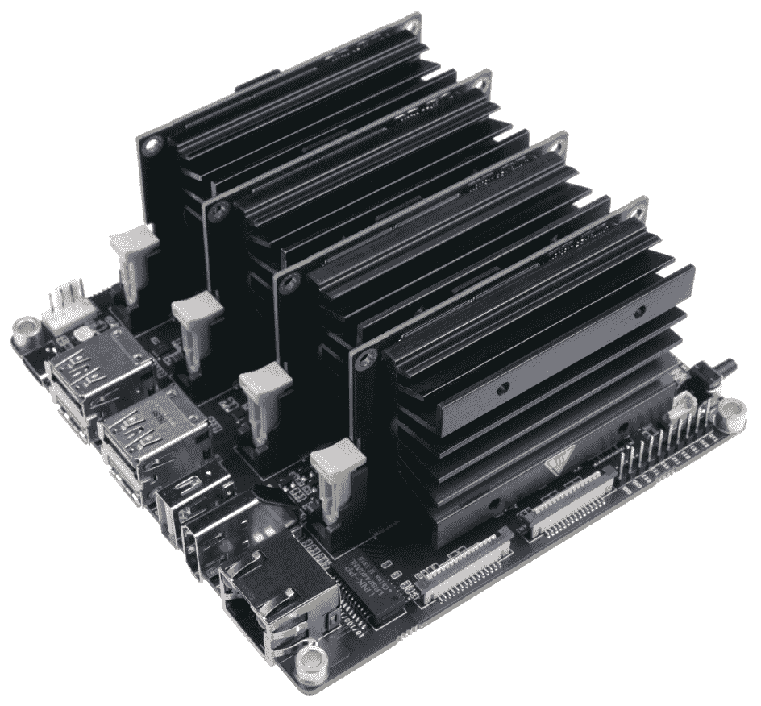
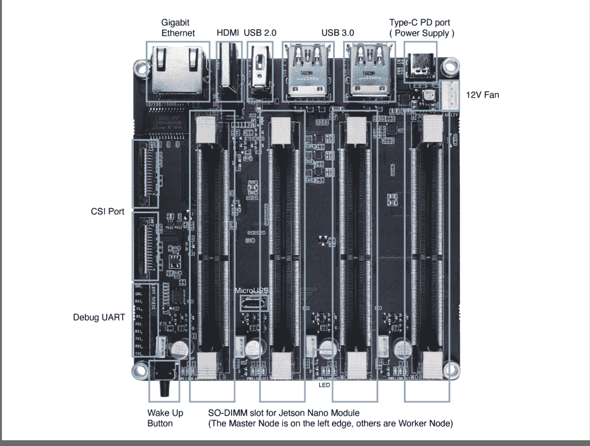
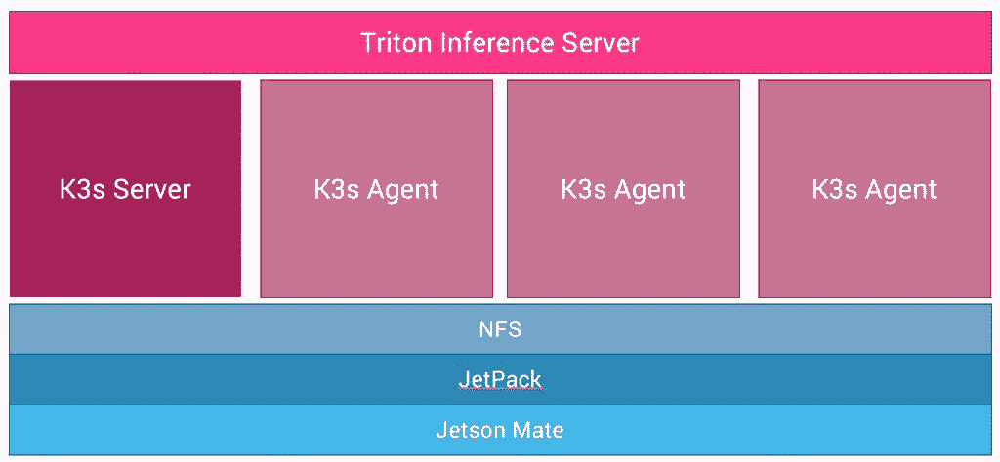

# Jetson Mate:用于 Jetson Nano/NX 系统级模块的紧凑型载板

> 原文：<https://thenewstack.io/jetson-mate-a-compact-carrier-board-for-jetson-nano-nx-system-on-modules/>

容器不仅已经成为数据中心和云工作负载的部署单位，也成为边缘应用的部署单位。与容器一起， [Kubernetes](https://thenewstack.io/category/kubernetes/) 已经成为基础设施的基础。K3s 等发行版推动了 Kubernetes 在边缘的采用。

在与大型零售商和系统集成商合作推出基于 Kubernetes 的边缘基础设施时，我看到了许多挑战。其中之一就是能够混合搭配 ARM64 和 AMD64 设备来运行 AI 工作负载。客户通常运行异构(AMD64/ARM64)多节点 Kubernetes 集群来实现可扩展性和高可用性。AMD64 设备通常基于英特尔 NUC，而 ARM64 设备由英伟达的 Jetson Nano 和 Jetson Xavier NX 系统级模块(SOMs)提供支持。

[面向制造商和开发商的物联网套件领导者 seed studio](https://www.seeedstudio.com/)推出了一款可以容纳四个 Jetson Nano 或 Jetson Xavier NX SOMs 的载板。该套件被命名为 [Jetson Mate](https://www.seeedstudio.com/Jetson-Mate-p-4899.html) ，是在边缘构建和部署人工智能工作负载的理想选择。它可以是运行 Kubernetes 基础设施的独立设备，也可以加入现有的集群，为深度学习模型提供人工智能加速。

去年年底，SeeedStudio 给我送来了 Jetson Mate Cluster Mini，它配有载板、冷却风扇和一个外壳。这款设备拥有构建由 Jetson SOMs 和 Kubernetes 提供支持的端到端人工智能推理测试床所需的一切。

Jetson 模块可通过 SOM 和载板组合附带的开发套件获得。Jetson Nano 开发者套件和 Jetson Xavier NX 开发者套件是用于为 edge 构建 AI 解决方案原型的集成设备的一个示例。然而，对于生产用途，NVIDIA 建议将 Jetson 模块与合作伙伴提供的生产级加固硬件设备相集成。

Jetson Mate 支持开发套件中可用的模块以及生产级计算模块。制造商和开发人员可以将 SOM 直接插入 Jetson Mate 载板，并通过运行在不同机器上的 NVIDIA JetPack SDK 引导它们。

使用开发套件时，您可以通过 NVIDIA 提供的预配置 SD 卡映像直接启动它们。对于单独配置每个模块，然后简单地将其插入 Jetson Mate 载板，这是最方便的选择。

多亏了板载千兆以太网交换机，使 4 个 som 能够相互通信，您可以只使用一根网线将 Jetson Mate 连接到互联网。其中一个模块被认为是主节点，而其他模块是 Kubernetes 集群的工作节点。

所有三个外设 som 都可以单独开启或关闭。使用用于 Jetson Nano SoMs 的 65W 2 端口 PD 充电器或用于 Jetson NX SoMs 的 90W 2 端口 PD 充电器以及 CAT6 以太网电缆，您可以轻松构建自己的运行 Kubernetes 的 Jetson 集群。

RGB 冷却风扇安静高效，有助于我们保持集群的温度。我买了一个 USB-C PD 适配器，通常用于戴尔笔记本电脑，为整个集群提供稳定可靠的电源。

## 用 Jetson Mate 构建云原生 AI 推理机

我很高兴能够基于 4 个 NVIDIA Jetson Nano 模块、SeeedStudio 的 Jetson Mate Mini、NVIDIA Jetpack 4.6 和 NVIDIA Triton 推理服务器构建一个强大的人工智能推理引擎。Kubernetes 基础设施基于[K3s](https://k3s.io/)——一个 Kubernetes 轻量级发行版。

在 Jetson Nano 上安装 K3s 时，必须将默认容器运行时指向 NVIDIA 容器工具包。第一个 SoM 配置为 K3s 服务器，其余三个配置为 K3s 代理。我们强制 K3s 使用 NVIDIA 容器工具包，并在配置中设置了`--docker`开关。禁用默认情况下 K3s 安装附带的 servicelb 负载平衡器和 traefik 入口也是一个好主意。在这一步的最后，我们有了一个完全配置好的 4 节点 Kubernetes 集群。

一旦安装了 K3s，我在主节点上配置了一个 NFS 共享，并在每个节点上挂载它。Triton 使用这个共享文件系统来加载用于推理的模型。在一个典型的部署场景中，NFS 被一个对象存储服务取代，比如 MinIO 的亚马逊 S3。为了简化设置，我使用 NFS 作为 Triton 的共享模型库。

Triton 推理服务器是 NVIDIA 提供的可扩展模型服务器。它支持多种深度学习框架和运行时，包括 TensorRT、TensorFlow、PyTorch 和 ONNX。从 Jetpack 4.6.1 开始，NVIDIA 在 Jetson 上支持 Triton。但是没有现成的容器映像或舵图来将其部署到运行在 Jetson Mate 上的 K3s 集群中。我决定自己为 Triton 构建一个容器映像，以便在边缘运行推理引擎。

为了确保 Triton pod 利用底层 GPU 在每个节点上运行，我将其部署为 daemonset。这将强制 Triton pod 在每个节点上运行一个 pod，同时变得高度可用。我们将 Triton 的 REST 和 gRPC 端点公开为 Kubernetes 服务，供客户端调用 AI 模型。模型是从前面配置的分布式 NFS 共享中加载的。

最后，我将一个 inception 模型图复制到 NFS 共享，并为 Triton 配置它。当客户机通过调用 REST 端点请求这个模型时，它被路由到 daemonset 的一个 pod。

在本文的下一部分，我将介绍在 Jetson Mate 上部署 Triton 推理服务器所需的所有步骤。敬请期待！

<svg xmlns:xlink="http://www.w3.org/1999/xlink" viewBox="0 0 68 31" version="1.1"><title>Group</title> <desc>Created with Sketch.</desc></svg>