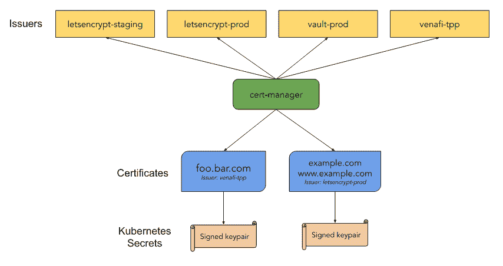

# Jetstack 的 cert-manager 加入了云原生技术的 CNCF 沙盒

> 原文：<https://thenewstack.io/jetstacks-certificate-management-project-joins-the-cncf-sandbox-of-cloud-native-technologies/>

[Honeycomb](https://www.honeycomb.io/) 正在赞助新 Stack 对 Kubecon+CloudNativeCon 北美 2020 的报道。

[云原生计算基金会(CNCF)](https://www.cncf.io/) 为其新兴的云原生计算技术组合增加了又一个沙盒项目: [cert-manager](https://cert-manager.io/docs/) ，这是一个用于 Kubernetes 和 Red Hat OpenShift 的原生证书管理控制器。沙箱是早期项目在进入孵化器状态之前进行实验的地方。

由总部位于伦敦的专业服务公司 [Jetstack](https://www.jetstack.io/) 在三年前创建的 [cert-manager](https://github.com/jetstack/cert-manager) 自动管理 Kubernetes 和 OpenShift 中的 x509 机器身份。

盐湖城的 Venafi 是一家机器对机器连接的证书和密钥管理的供应商，它在五月收购了 Jetstack。该项目最近发布了 [v1.0](https://blog.jetstack.io/blog/cert-manager-1.0/) ，Jetstack 宣布了企业支持。

“1.0 的推出历经数年，我们非常感谢由 250 多名贡献者和许多最终用户组成的社区，让它成为今天的样子。这是许多 Kubernetes 和 OpenShift 集群的基础插件，该项目将受益于成为 CNCF 及其生态系统的一部分，”Jetstack 的首席技术官兼联合创始人 [Matt Bates](https://twitter.com/mattbates25?lang=en) 说。它在 GitHub 上有 6600 颗星。

他说，Jetstack 团队在帮助客户使用 Kubernetes 的同时，认为证书管理是 GitHub 上提出的一个有趣的问题。他们把这个问题交给了一位求职者，James Munnelly，他在一个周末提出了 Kube-Lego(T21)的早期雏形，用于自动化 Kubernetes 上运行的 TLS 网络服务。(是的，他得到了这份工作！)

虽然 Kube-Lego 流行了几年，但该团队希望扩展该项目以支持各种类型的证书颁发机构(ca)，包括公司内部使用的私有证书颁发机构。

这涉及到使用 Kubernetes 中内置的定制资源定义来扩展 Kubernetes API。

“我们的目标是可扩展的，我们可以让认证机构成为 Kubernetes API 的一部分。因此，让他们成为一等公民，这样他们就可以像开发人员管理基础设施一样得到管理，”贝茨说。

借助 cert-manager，安全团队可以提供自助式“证书即服务”，让使用 Kubernetes 集群的开发人员能够轻松请求机器身份以保护应用。单个 API 与多个公共和私有证书管理机构交互，证书管理器处理证书生命周期的自动化。用户可以从各种颁发者那里获得证书，并确保它们是有效的、最新的并在配置的时间更新。

它支持 ACME (Let's Encrypt，HasiCorp Vault，Venafi，自签名和内部认证机构。它还可以支持自定义的、内部的和不受支持的 CAs。

这只是最新的 CNCF 沙盒项目。最近加入的其他人:

*   [LitmusChaos](https://thenewstack.io/litmuschaos-brings-chaos-engineering-to-cncf-sandbox/) ，6 月 Kubernetes 的云原生混沌工程框架。
*   8 月，Rancher 的 [Rancher 的 K3S，](https://thenewstack.io/ranchers-k3s-joins-cncf-sandbox-as-first-kubernetes-distribution/)一个精简的 Kubernetes 发行版，用于资源受限的环境，如边缘部署。
*   11 月初， [Kyverno](https://thenewstack.io/kyverno-a-new-cncf-sandbox-project-offers-kubernetes-native-policy-management/) ，由 [Nirmata](https://nirmata.com/) 构建的开源 Kubernetes-本地策略引擎。

“我们只是将 cert-manager 视为许多 Kubernetes 和 OpenShift 集群的一个非常基础的组件……它应该属于基金会，可以与希望使用它的其他项目一起合作，”Bates 说。

“我们已经参与了许多项目；我们已经集成了微软的[开放服务网格](https://openservicemesh.io/)。我们期待着与像 [SPIFFEE 和 SPIRE](https://www.youtube.com/watch?v=Q2SiGeebRKY&feature=emb_title) 以及 [Kyverno](https://kyverno.io/) 这样的项目进行一些整合。我认为成为基金会的一员给了很多人信心，他们可以使用这些代码，这个项目是为了社区的最大利益而管理的，它是供应商中立的。”

图片来自 Pixabay 的 Manfred Richter。

<svg xmlns:xlink="http://www.w3.org/1999/xlink" viewBox="0 0 68 31" version="1.1"><title>Group</title> <desc>Created with Sketch.</desc></svg>