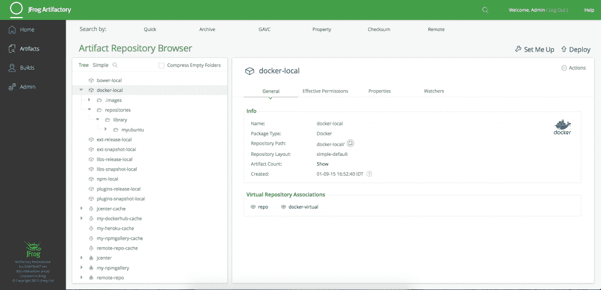
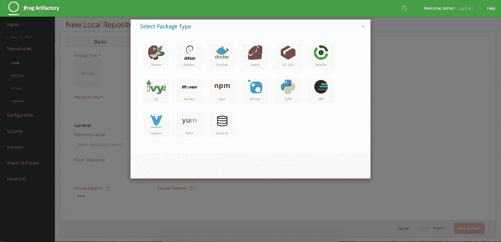
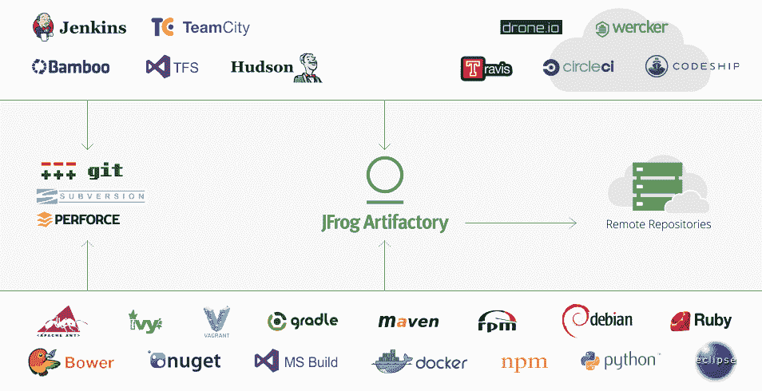

# JFrog 的新 Artifactory 4.0 与 Docker Trusted Registry、CoreOS 和 Google 竞争

> 原文：<https://thenewstack.io/jfrog-announces-artifactory-4-0/>

JFrog 的 Artifactory 4.0 将该公司置于容器生态系统中，与 Docker Trusted Registry 和其他服务(如 CoreOS 和 Google 的服务)竞争。Artifactory 的新版本在注册表之间保留容器的副本，这意味着一个团队可以有一个专用的注册表，开发人员可以在其中推送和编译新代码，以及一个 QA reg，其中包含开发团队正在处理的容器的副本。这是为那些一天要进行多项更改，或者要解决最近产品补丁或客户端更新中可能导致各种代码破坏错误的更改而设计的。

这项新服务为在基于容器的环境中工作的开发团队提供了提供二进制存储库管理服务的能力，该服务建立在 JFrog 在市场上的长期地位之上。其中包括自动将元数据附加到注册表的能力、多平台记录系统以及在 Artifactory UI 中附加项目注册表元数据的 API。

## 更聪明地工作，而不是更努力

Artifactory 通过重用尽可能多的代码，改进了曾经繁琐耗时的跨平台编译代码的过程。在 CI 中工作时，开发人员需要记住他们使用的服务的版本，以及它在项目中的位置。当面临创建一个必须在多个平台上以相同方式运行的产品时，当必须重新编写代码来处理大量可能运行在技术前沿或远远落后于行业标准的系统时，重新编译代码很快成为一个问题。

这在某种程度上是一种 IP 的再利用方式。它在避免重建。从源代码开始，然后在不同的环境中重用组件。驱动程序需要在数百种不同的环境和完全相同的二进制文件中进行部署和测试——返回源代码并重新编译是不可行的。

使用 Docker 时的一个常见痛点是 Docker 图像的大小。有些可能超过 1 GB，这通常会降低运行同一应用程序的虚拟机或多个群集的系统性能。Artifactory 4.0 为开发人员提供了将应用程序映像分发到位于其他地区的数据中心的机会。

带有 Docker 的 Artifactory 4.0 UI 截图

JFrog 营销副总裁 Adam Frankl 及其联合创始人兼首席架构师 Fred Simon 就 Artifactory 4.0 如何塑造容器工作的未来提出了见解:Artifactory 消除了复制二进制文件的猜测，提供了编译元数据并对其进行标记以便于搜索的能力。在 JFrog 团队开发 Artifactory 4.0 时，大型 Docker 映像的安全访问和供应也至关重要。

当开发团队处理变更并在专用的开发人员注册中心进行编译时，会在 Artifactory 4.0 中创建这些容器的副本，并由 QA 团队进行测试，以确保应用的变更按预期运行。这些更改是在 Artifactory 内部完成的，这意味着不需要重新映像容器，从而节省了宝贵的资源。Artifactory 还可以控制谁可以部署到生产中，这意味着团队可以确保所有代码都是安全的，并在投入使用之前验证它们是否按预期工作。

## 集装箱的过去、现在和未来

在工件库出现之前，开发人员将它们放在源代码控制中，这实际上并不起作用。这是因为源代码控制没有提供跨平台管理多个注册表所需的工具。工件存储库的另一个前身是版本控制，它对于维护源代码很有用，但并不是为了满足那些使用大型二进制文件的人的需求而设计的。版本控制为管理存储库提供了有限的功能，尤其是在元数据的处理方面。如果不能清楚、快速地确定项目是在什么基础上构建的，它的源代码，以及它来自哪里，那么使用版本控制的过程很快就不能作为管理二进制存储库的一个选项。

在 Artifactory 4.0 中选择包类型

> “版本控制不可伸缩。他们为一两个文件工作，但不是为 1000 或 10000 个文件工作。另一个选择是 s3，它仍然不允许附加元数据、绑定或安全控制。西蒙说:“S3 也不能保证每个人都在同一时间看到同一个版本。

在基于容器的工作流中前进意味着开发人员必须能够在需要时访问他们需要的工具。这包括来自整个开发者生态系统的组件，包括内部和外部来源。Artifactory 4.0 将为用户提供一个虚拟的工件注册表，使他们能够与 Docker Hub 以外的东西进行交互。

通过 Artifactory 4.0 新的集中式注册表，可以从整个开发人员社区中聚合图像。这意味着他们不仅能够从 Artifactory 内部访问 Docker Hub，还能够从他们的本地环境、开源社区、他们的公司注册表、Google Cloud 或 Amazon 获取注册表。这简化了新工作流的配置，消除了从不同位置拼凑注册表源的需要。

为初创公司启动应用程序或开发服务需要开发人员和 QA 团队在一天内可能会多次变化的环境中共享、编译和调试代码。Artifactory 自 2009 年以来一直在使用，为那些在基于容器的工作流边缘工作的人提供了一个平台，让他们能够跨平台高效地工作。

 
随着越来越多的开发人员开始学习 DevOps 的角色，并且除了自己的技能之外还掌握了这些技能，这就需要一个要求更高的工具来管理存储库、调试容器以及管理谁可以访问公司的重要信息。

Artifactory 和 Docker 的设计是为了相互补充，在开发工作流程中与其他工具结合使用。任何工具都不可能存在于真空中，Artifactory 4.0 采用 Docker 中的工作方式，并在已经简化且高效的工作流程基础上进行改进。容器正迅速成为企业级开发的标准，包含了它们自己独特的风险、挑战和棘手问题。

很少有私有 Docker 注册中心可以满足企业级开发人员的需求。其中包括 2014 年被 CoreOS 收购的[quay . io](https://quay.io/)；直到 2013 年还包括谷歌。Google 在 2013 年宣布改变其处理二进制托管的方式,这让 JFrog 有了一个独一无二的机会来利用二进制存储库的未来。由于谷歌条款的改变，Artifactory 注册量上升，为 Artifactory 4.0 利用开发人员日常工作流程中的缺失部分铺平了道路。

随着基于容器的技术的兴起，开发团队需要能够将为他们工作的组件组合在一起，这对于确定应用程序或服务的生产时间表是至关重要的。JFrog 看起来有独特的定位来服务于容器世界不断增长的生态系统。

CoreOS 和 Docker 是新堆栈的赞助商。

专题图片: [Fabrizio Cornalba](https://www.flickr.com/photos/fabriziocolors/) 的[头脑风暴](https://www.flickr.com/photos/fabriziocolors/7322171646)。由 2.0 在 [CC 下许可。](https://creativecommons.org/licenses/by/2.0/)

<svg xmlns:xlink="http://www.w3.org/1999/xlink" viewBox="0 0 68 31" version="1.1"><title>Group</title> <desc>Created with Sketch.</desc></svg>