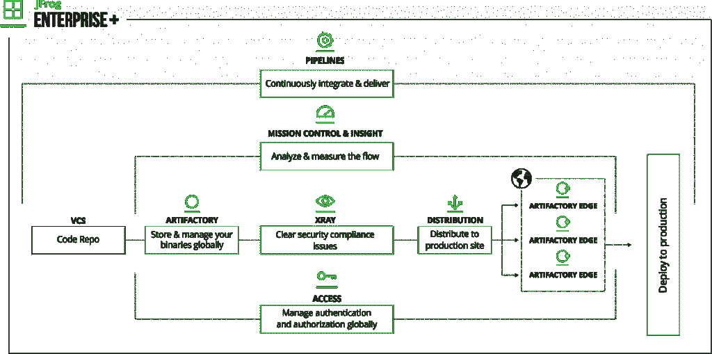

# JFrog 首次推出流水线，旨在提供端到端的 DevOps 自动化

> 原文：<https://thenewstack.io/jfrog-debuts-pipelines-designed-to-provide-end-to-end-devops-automation/>

[JFrog](https://jfrog.com/) 赞助本帖，由新栈工作人员独立撰写。

DevOp 工具提供商 [JFrog](https://jfrog.com) 在其 [JFrog Enterprise+](https://jfrog.com/platform/) 开发工具包中添加了自动化功能。新的能力来自于今年早些时候对 Shippable 的收购。

这项名为 JFrog Pipelines 的新服务可用于自动化开发的每个阶段——从构建时间到产品部署。据该公司称，将该软件嵌入 JFrog Enterprise+的优势在于，它提供了一种集中式服务，可以跨整个组织的 DevOps 实践进行扩展。

> JFrog 首席技术官 Yoav Landman 在谈到此次可发货的收购时表示:“我们需要开箱即用的集成，以便控制流程。

JFrog 已经可以很容易地与许多连续交付平台集成，其 API 也很容易编写，但该公司希望提供内部 JFrog 流程的一致可见性，JFrog 首席技术官 Yoav Landman 解释了将 Shippable 的技术纳入其自己的企业堆栈的必要性。

“我们需要更好的东西。我们需要开箱即用的集成，使我们能够控制过程，而不是[依赖]来自其他产品的证据，”兰德曼在周二的会议主题演讲中说。他说 Shippable 提供了“最好的 CD 引擎”

该公司在本周于旧金山举行的 [SwampUp 用户大会](https://swampup.jfrog.com/agenda/)上首次展示了管道技术，以及许多其他新功能。

在安全方面，JFrog 用来自基于风险的安全的 [VulnDB 漏洞数据库](https://www.riskbasedsecurity.com/vulndb-/)的当前数据增强了 [JFrog Xray](https://jfrog.com/xray/) 安全扫描和合规性工具，因此开发人员将在他们使用的依赖项中获得潜在危险的安全漏洞，而无需额外成本。

该公司还展示了一个新的统一用户界面和所有 JFrog 产品的后端数据平面，包括 Artifactory、Xray、Mission Control、Insight 和 Distribution。用户可以从众所周知的“单一控制台”控制所有这些资产，包和安全元数据将位于中央。到今年年底，这种架构将成为所有 JFrog 产品的默认交互。

JFrog 首席执行官[什洛米·本哈姆](https://www.linkedin.com/in/shlomibenhaim/)在一份声明中说:“这一年来，我们倾听了开发者的意见，并再次自豪地满足他们的要求。”。“谈到他们的目标市场，许多大型、有影响力的公司已经开始说他们是开发者第一……这个广泛的社区越来越需要通用、安全和简化的工具，使他们能够实现无所畏惧、超快的发布周期。”

JFrog 最出名的可能是 Artifactory，一个管理软件二进制文件的仓库。

*本周请继续关注[新堆栈](https://thenewstack.io/)，了解更多来自《沼泽》的故事。*

<svg xmlns:xlink="http://www.w3.org/1999/xlink" viewBox="0 0 68 31" version="1.1"><title>Group</title> <desc>Created with Sketch.</desc></svg>