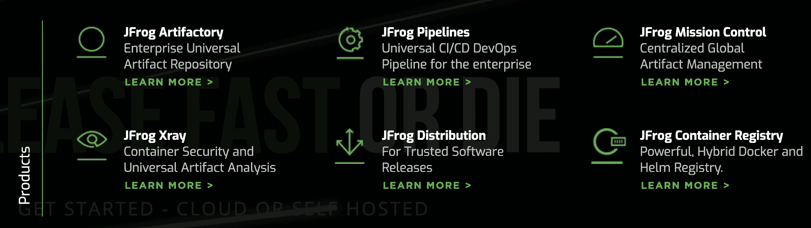

# JFrog:这是一个流动的世界，开发者是造雨者

> 原文：<https://thenewstack.io/jfrog-its-a-liquid-world-and-developers-are-the-rainmakers/>

JFrog 上个月进行了首次公开募股(IPO ),自那以后，其股价几乎翻了一番。对于一个很难向开发者社区之外的任何人解释的软件公司来说，这并不坏。即使是公司的名字也不能说明它实际上做什么。JFrog 联合创始人兼首席执行官[什洛米·本哈姆](https://twitter.com/ShlomiBenHaim)在最近的一次采访中告诉我，如果他的母亲打电话祝贺他公司的成功，“当我们开始谈论二进制时，她就会失去注意力。”

 [理查德·麦克马努斯

Richard 是 New Stack 的高级编辑，每周撰写一篇专栏文章，探讨云计算原生互联网的未来。此前，他在 2003 年创立了读写网，并将其打造为全球最具影响力的科技新闻和分析网站之一。](https://twitter.com/ricmac) 

JFrog 是一个 DevOps 平台，正如本哈姆提到的，它的主要货币是二进制文件。他还指出，“软件包”和“图像”是同一事物的替代术语。无论术语是什么，它都是已经编译好并准备好供计算机系统执行的代码。有人将 JFrog 与 GitHub 相比较，区别在于 GitHub 是源代码库，而 JFrog 是二进制文件库。

“这是你从源代码中构建出来的东西，是你打包在一起的东西，”本哈姆在谈到二进制文件时说，“从这一点开始，这就是你在运行时测试、保护和部署的东西。”

在当前应用程序开发的 DevOps 时代，有很多可移动的部分。当你浏览构成 JFrog 平台的各种软件产品时(见下图)，你会感觉到 DevOps 变得多么复杂，以及为什么公司越来越需要像 JFrog 这样的平台来管理它。

来源:JFrog 网站

JFrog 成立于 2008 年，多年来它唯一的产品是 Artifactory，2011 年在[被贴上了“存储库管理解决方案”的标签后来，JFrog 扩展了管理安全性、CI/CD、分发等的其他产品。](http://web.archive.org/web/20110817082736/http://www.jfrog.com/about.php)

JFrog 的另一个有趣之处是，它的销售是由开发者推动的，你猜对了。决定使用 JFrog 软件的不是企业首席信息官，这在微软和甲骨文等知名软件供应商的产品中很常见。在 JFrog 的例子中，这是一个自下而上的采购过程——开发人员最初选择使用 JFrog，也许后来随着它被更广泛地部署，CIO 会为它买单。本哈姆自豪地告诉我，因为这个原因，JFrog 没有对外销售人员。

“即使在今天，作为一家上市公司，我们甚至没有一名现场直销人员。一个也没有。从来没有人敲过别人的门，主动提供 JFrog Artifactory 这些都是内部安装的，都是内部销售。”

显然，这一策略奏效了。据本哈姆称，75%的财富 100 强公司现在使用 JFrog。

## 你特斯拉的藏物仓库

[戴尔技术资本](https://www.delltechnologiescapital.com/)是 JFrog 的早期投资者，其董事总经理之一[泰勒·朱厄尔](https://github.com/TylerJewell)在他的[开发者主导的景观](https://tylerjewell.substack.com/p/the-developer-led-landscape-20-08-28)论文中写道，“工件仓库”类别每年增长 45%。他说，这是“由软件构造方式的转变所驱动的”，特别是第三方可重用模块(通过低代码、JavaScript 框架等)的使用越来越多。

我问本哈姆，他是否认为工件库的这种增长水平会在未来几年持续下去？

他回答说，这一增长的部分原因也是由于微服务、容器和其他云原生技术的兴起，软件二进制文件“成千上万倍地增长”——“因为运送软件变得如此容易。”

他没有预见到工件库的市场会很快放缓，因为“潜在市场将会显著增长。”原因:非企业用例。

“下一步——想想看——将会在您的组织之外，因为您希望您的特斯拉和您的 iPhone 得到更新。面向物联网的开发运维仍处于非常早期的阶段。”

这引出了 JFrog 一直在其网站上宣传的一个软件理论:流动软件。在其主页上，这被定义为“软件更新过程自动持续运行，就像软件是流动的一样。”

这让我想起了经常被用来比喻互联网就像一个电网——换句话说，一个公用事业。JFrog 提出了同样的建议，只不过它把电换成了水。

本哈姆回到他称之为“有轮子的计算机”的特斯拉，进一步解释。目前，他说，如果你需要在你的特斯拉汽车上运行软件更新，“它需要你的电机关闭两个小时”；有时甚至需要技术人员“上门运行软件更新”

我自己不是特斯拉车主，我无法核实等待时间([这个 Quora 帖子](https://www.quora.com/How-long-does-it-usually-take-to-download-Tesla-software-updates-over-the-air)表明它更像是 30 分钟)，但无论如何，本哈姆的观点是站得住脚的:在软件更新期间，汽车变得不可操作。这是目前的状况，但 JFrog 的目标是让所有软件更新在后台持续进行。

“在灵动软件的世界里，特斯拉会随着 Zoom 应用程序的更新而更新，”本哈姆说，他指的是我们正在进行的 Zoom 视频通话。他推测，特斯拉最终将使用点对点网络技术让汽车相互更新，这样它“不会让网络超载，也不会让我们的基础设施超载。”

这一切都要回到开发人员身上，他们当然要负责维护这个“流动的”软件更新过程。

## 开发商是呼风唤雨者

“JFrog 是由一群本身就是开发者的人[在 2008 年]创立的，”本哈姆说。“主要想法是解决难题—当组织要求我们交付更多、更快、更安全的产品时，我们如何变得更快？”

他继续说道，在 JFrog 成立的时候，软件开发正处于过渡阶段——“从瀑布到敏捷再到 DevOps。”虽然术语 [DevOps](https://en.wikipedia.org/wiki/DevOps) 直到 2009 年才被创造出来，并在那之后几年才获得关注，但 JFrog 围绕着同样的概念建立了自己的公司——或者如本哈姆所说，是“自动化[和]机器的力量，以及开发者的力量”的结合

在我们的谈话中，本哈姆称开发者为商业的“造雨者”。他的意思是，开发人员正在创造所谓的“数字转型”(我不知道这个词在给后疫情时代的新堆栈的电子邮件宣传中被使用了多少次)。

本哈姆用一家现代银行的例子来说明开发者将传统业务转变为大部分数字化业务的力量。

“我认为我已经有三年多没有亲自去过我的银行了，但如果我不喜欢这个应用程序，我会从一家银行转到另一家银行。”

他的观点是，如今银行提供了更好的用户体验，因为你可以在网上做更多的事情。我完全同意这一点，而且我也不怀念那种不得不亲自开车去银行分行办理任何事情的日子。

本哈姆总结道:“开发商成为造雨者，因为他们创造了企业的竞争优势。”。一旦你理解了这个概念，就很容易理解为什么 JFrog 在股票市场上表现如此之好——尽管很少有投资者理解它实际上做了什么。

通过 Pixabay 的特征图像。

<svg xmlns:xlink="http://www.w3.org/1999/xlink" viewBox="0 0 68 31" version="1.1"><title>Group</title> <desc>Created with Sketch.</desc></svg>