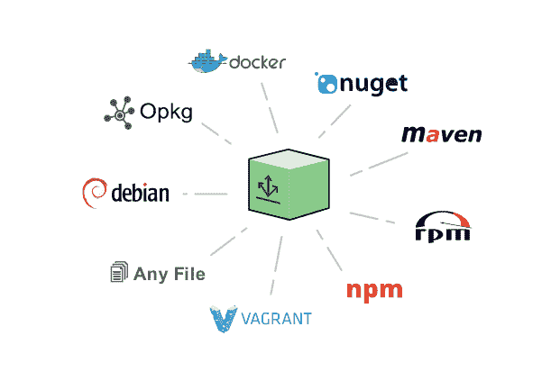

# JFrog 不仅仅着眼于容器，而是着眼于混合云

> 原文：<https://thenewstack.io/jfrog-looks-beyond-containers-address-hybrid-cloud/>

正如最近的许多技术会议一样，容器是本周在加州纳帕举行的 JFrog Swamp UP 会议的热门话题。但是不同于典型的关于它们的优点和缺点的讨论，这次会议上的许多讨论都集中在大规模容器的护理、喂养和管理上。

[谷歌软件工程师马修·摩尔](https://www.linkedin.com/in/mattaaronmoore/)详细解释了谷歌是如何构建容器的。演讲主要集中在谷歌的内部构建系统 [Bazel](https://bazel.build/) ，它也是一个开源项目。摩尔说，在谷歌内部，团队已经构建和使用容器很长时间了。这意味着已经有了一些尝试来平滑处理集装箱的粗糙边缘。

具体来说，Google 使用 Bazel 来帮助构建容器以及简化的无发行版基础组件。然而，这些组件需要一些时间才能恢复正常。摩尔说，最初，谷歌试图获得尽可能小的 Linux 发行版，用于其容器。这是一个巨大的挑战，因为该团队发现，在牺牲系统的实际底层兼容性之前，减少 Debian 或 Ubuntu 的大小只能到此为止。

Alpine Linux 就是这种情况，这个团队曾经考虑过一个超级小的发行版。摩尔说，不幸的是，Alpine 为了提供一个小环境而极大地牺牲了兼容性，这不利于谷歌内部试图制造更小容器的努力。

因此，该小组不得不重新考虑其努力。摩尔将此与亨利·福特的暗示相比较，如果他问人们想要什么，他们不会说更好的车，他们会说更快的马。因此，Google 团队意识到他们的最终目标不是创建一个更小的 Linux 发行版，而是运行他们的应用程序。

因此，Google 花时间构建了基本的无发行版的、以语言为中心的容器组件。这些都是围绕 [C/C++](https://console.cloud.google.com/gcr/images/distroless/GLOBAL/c) 、 [Java](https://console.cloud.google.com/gcr/images/distroless/GLOBAL/java) 、 [Python](https://console.cloud.google.com/gcr/images/distroless/GLOBAL/python) 、 [Node.js](https://console.cloud.google.com/gcr/images/distroless/GLOBAL/nodejs?pli=1) 来构建的。这些无发行版的容器映像库对外部用户也是可用的，并且有各种风格来满足这些语言和从它们派生的其他语言的需求，比如 Scala、D 和 Go。例如，非发行版 Java 组件有多种风格，包括一种专门设计用于将 [Jetty](http://www.eclipse.org/jetty/) 分层到映像中的组件。

[open shift](https://www.linkedin.com/in/jasondobies/)上 [Red Hat](http://www.redhat.com) 的开发者 Jason Dobies 说，构建一个基于容器的基础设施不仅仅是简单地生成容器化的应用程序并把它们扔进 [Kubernetes](https://kubernetes.io/) 。“OpenShift 在 Kubernetes 的基础上又增加了新功能，”Dobies 说，他解释了 OpenShift 滚动更新、管理和控制的能力。

他还提倡使用 JFrog 的 Artifactory(T21 ),一个可以处理容器图像和原始应用程序的仓库。Dobies 说 Artifactory 可以保存“任何东西，从其他 Docker 图像，到 Java JARs，到 Python 文档。他们还可以在我们构建映像时保留我们的映像，管理这些映像，并在我们部署它们时使它们可用。

然而，在两次演讲之间，有一个无名英雄: [Linux 包管理系统](https://thenewstack.io/expect-not-expect-linux-universal-packages/)。而 Google 的解决方案侧重于 Debian，OpenShift 的解决方案自然是用红帽的 Yum。不过，这两个系统都是能够动态自动构建容器映像的核心。

JFrog 首席执行官什洛米·本哈姆表示，公司的成立是为了解决开发者在软件开发生命周期中面临的日常问题。在过去的八年里，JFrog 的产品已经不仅仅局限于存储库，还包括二进制存储库 [Bintray](https://bintray.com/) ，存储库检查工具 [XRay](https://www.jfrog.com/xray/) ，以及用于管理整个数据存储工具套件的总体平台 [Mission Control](https://www.jfrog.com/mission-control/) 。

目前，JFrog 的主 Bintray 存储库每月接收 20 亿个请求。他补充说，该公司在过去四年里收入增长了 1000%，员工人数和全球足迹也有类似的增长。

JFrog Bintray 本身支持所有主要的包格式。

哈伊姆说，JFrog 的成功部分是因为它跳到了技术发展的前沿，比如集装箱的兴起。“当我们在 2014 年将 Artifactory 作为 Docker 注册表发布时，我们看到了完全不同的东西。我们大多数使用 Artifactory 的用户开始在它的基础上使用 Docker，他们中的一些人还使用 RPM、Docker 和一个构建工具，如 Maven、Gradle 或任何其他工具。有趣的是，我们意识到世界上没有一个用户可以只使用 Docker 可以只用容器。这只是一种包装和运输代码的方式。你得把其他的包裹装进这个。”

哈伊姆说，大多数企业目前正在经历的发展阶段的增长在某个时候将不得不回归现实。哈伊姆说:“未来两年，DevOps 面临的最大挑战是，经理们将开始提出问题。”“现在，当你要求预算时，他们会因为压力而给你预算。他们会开始问问题。然后，DevOps 将迎来一个非常重要的商业智能和分析时代。”

在 SwampUP 大会上，JFrog 宣布了一个新的本地版本的 Bintray，以帮助企业管理向最终用户、设备和服务器分发二进制文件。哈伊姆说，该产品的一个大增长领域是物联网。例如，Bintray 允许使用单个存储库来管理对边缘设备的更新。

哈伊姆说，此举是为了应对他在过去两年中看到的一个增长趋势:对混合云解决方案的需求。

红帽公司是新堆栈的赞助商

通过 Pixabay 的特征图像。

<svg xmlns:xlink="http://www.w3.org/1999/xlink" viewBox="0 0 68 31" version="1.1"><title>Group</title> <desc>Created with Sketch.</desc></svg>