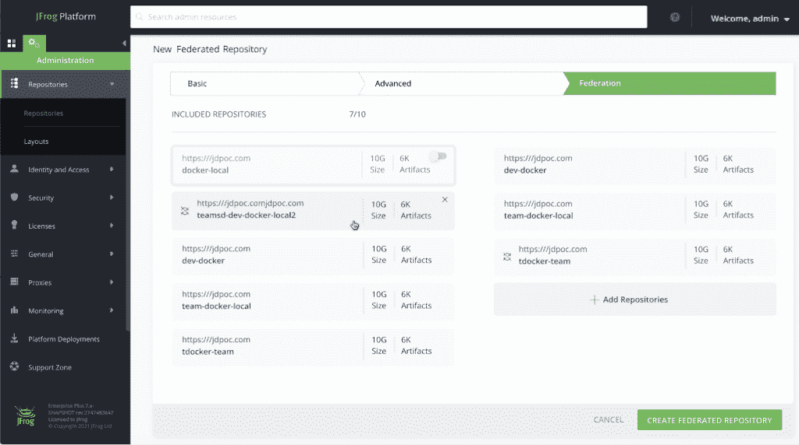

# 用于零信任软件生命周期管理的 JFrog 平台“加密签名”二进制文件

> 原文：<https://thenewstack.io/jfrog-platform-crypto-signs-binaries-for-secure-software-lifecycle-management/>

JFrog [DevOps 平台](https://jfrog.com/platform/)正在使用区块链，对软件二进制文件进行数字签名，以记录和保护它们在整个开发过程中的旅程。

[JFrog](https://jfrog.com/?utm_content=sponsormodule&utm_source=thenewstack&utm_medium=website&utm_campaign=platform) 的加密签名功能可能是区块链技术在 CI/CD 平台上捕捉变化的首次商业应用， [JFrog](https://jfrog.com/) 创始人兼首席技术官 [Yoav Landman](https://www.linkedin.com/in/yoavlandman) 断言。这一更新以及本周虚拟举行的该公司 [SwampUP 用户大会](https://swampup.jfrog.com/agenda/)上公布的其他更新，是 JFrog 总体目标的一部分，旨在为企业及其开发者提供更高效、更安全的方式来管理软件开发生命周期。

兰德曼在接受新堆栈采访时表示，软件二进制文件的管理——代码编译成可执行程序后的实际应用——是这一生命周期管理的一个重要部分。

“开发人员喜欢考虑代码，但实际上，向二进制的过渡几乎是立即的，”兰德曼说。即使在加速的 DevOps 计划中，也需要构建二进制文件作为依赖项。“二进制文件将一直运行到运行时，经过扫描、分发、不同阶段的所有 QA 测试，一直到生产。”

## 零信任管道

软件开发管道本质上是一系列构建应用程序并将其投入生产的事件。出于记录和问责的目的，可以将每个操作记录在日志中。 [JFrog Pipelines](https://www.jfrog.com/confluence/display/JFROG/Pipelines+Developer+Guide) 工作流功能的加密签名增强自动签名持续集成和交付(CI/CD)管道中的每个步骤和结果，实际上创建了一组不可变的工件。该平台使用一个区块链，一个加密签名的只写分类帐来提供每个管道操作的证据。

这种方法有一个明显的安全优势，即只有那些在过程的每一步都经过签名的二进制文件才能进入生产环境。

兰德曼说，它提供了加密的“无可争议的证据，证明后台发生的一切都是真实发生的”。每个操作都用私钥签名，然后处理私钥，只留下相应的公钥来读取只附加日志中的条目。每个条目都采用 JSON 格式，易于阅读和编程。

“创建软件和升级软件的流程中有许多步骤。在一天结束时，您希望验证最终在您的生产运行时中出现的内容与您最初构建、打包和编译的内容完全相同，”Landman 说，并指出人们越来越关注保护软件开发管道免受攻击和恶意代码。

例如，经理可能必须通过 ServiceNow 批准将软件应用程序投入生产。该功能将以防篡改方式获取批准点。它还可以阻止软件漂移，或者一些开发人员所做的小配置，这些小配置在短期内可能是有帮助的，但最终会使软件偏离期望的配置。

## 也在盒子里

DevOps 平台的其他新功能包括冷工件存储，用于归档不再主动需要但法规要求或公司政策仍然需要的软件工件。一个新的安全服务，基于 [JFrog Xray](https://jfrog.com/xray/) ，扫描开源第三方依赖，也将在今年晚些时候推出。

该平台的另一个新功能是 [JFrog Artifactory](https://jfrog.com/artifactory/) 的联合功能，允许组织构建多个软件仓库，并在所有仓库之间同步内容。新的联邦存储库服务提供了跨 JFrog DevOps 平台的独立实例(联邦的不同“成员”)的所有二进制文件的自动镜像双向同步。除了二进制文件，配置和元数据也可以被镜像。

JFrog DevOps 平台既可以作为托管服务，也可以作为可以在内部运行的独立软件。

JFrog 赞助了我们对 SwampUP 的报道，所以请回来这里，在我们的 Twitter 账户上查看全天和未来一周的更新。

<svg xmlns:xlink="http://www.w3.org/1999/xlink" viewBox="0 0 68 31" version="1.1"><title>Group</title> <desc>Created with Sketch.</desc></svg>