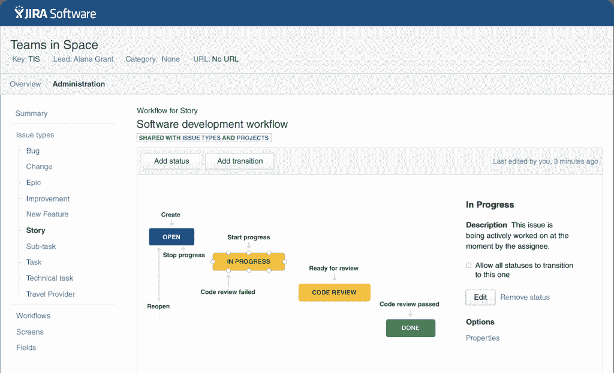
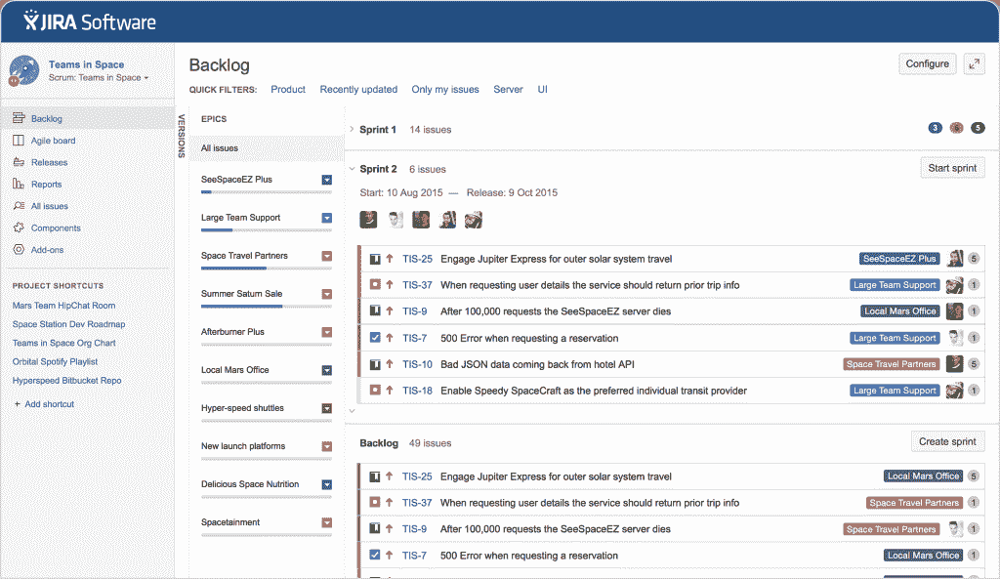
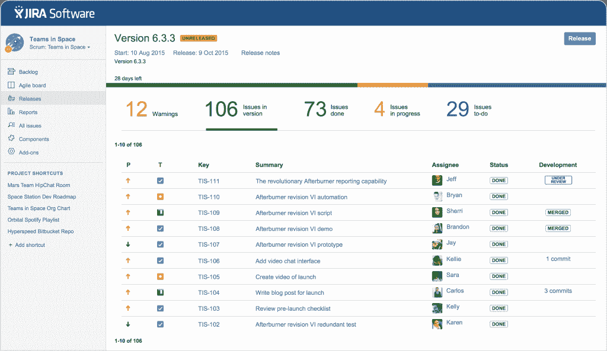

# JIRA 软件为企业简化软件开发

> 原文：<https://thenewstack.io/jira-software-tackles-issue-tracking-enterprise/>

为企业构建和维护软件需要开发人员在完全不同的时区和广阔的地理距离上一起工作。 [JIRA 软件](https://www.atlassian.com/software/jira)为企业级开发运维团队提供协调此类操作的能力。

最近，Atlassian 重新设计了其旗舰产品 JIRA 问题跟踪软件。该公司现在提供三种版本的软件。一个是原来的产品，[，两个新版本是修改版本](http://fortune.com/2015/10/06/keeping-track-cloud-software-reshapes-project-management/)，一个用于管理服务台，另一个用于非技术团队。

[JIRA 软件](https://www.atlassian.com/software/jira/whats-new)旨在帮助软件开发团队管理他们开发过程的工作流程。它具有可定制的协作板，能够创建新的工作流模式以匹配个人的开发流程或实施预设的解决方案。团队经理能够为问题分配状态级别，优先考虑那些需要立即采取行动的问题。

工作流，JIRA 软件

吉拉软件公司在这个领域有一些竞争对手。问题追踪器 DoneDone 也采用了与 JIRA 类似的方法，将传统的问题追踪和客户支持结合起来，对收到的客户电子邮件进行追踪。可以分配给自己选择的团队成员的问题。Lighthouse 还提供了在团队内部设定和实现目标的能力，开发者也可以根据优先级组织任务。

企业级的项目管理要求开发人员知道他们的其他团队成员负责什么，同时仍然可以自由地从事他们的项目工作。大规模开发意味着通常没有时间在一天内多次询问一个公开问题的更新，而不是不断地联系同事来解决问题。推送新代码或解决 bug 需要优先考虑。

“JIRA 软件为用户提供了十几份报告，这些报告跟踪团队表现，并提供实时、可视化的更新，可用于识别趋势，了解最新进展，并提高每次冲刺的生产率，”JIRA 产品营销负责人朱尼·丁达说。

问题积压，JIRA 软件

JIRA 软件通过集成团队已经在使用的所有开发工具，成为软件团队每个成员的中心枢纽。这些深度集成确保 JIRA 软件中的所有信息始终是最新的，让团队成员能够专注于手头的实际工作。

“JIRA 软件的发布中心让团队的每个成员都了解即将发布的版本的健康和状态，甚至主动标记它认为还没有准备好用于生产服务器的工作，”Dinda 说。

JIRA 软件中的一个新的侧边栏提供了软件开发生命周期的每个阶段的摘要——计划、跟踪、发布和报告，所有这些都只需在仪表板上的任何地方点击一下。对于那些在生产的不同阶段需要管理多个版本的团队来说，侧边栏可以节省时间，并让他们有更多的机会关注需要全天关注的问题。这些变化是 Atlassian 根据用户反馈采取行动的结果，其中许多开发人员报告说需要一个侧边栏来快速导航不同版本，而不必关闭项目平台或在项目平台之间切换。

发布中心和侧栏，JIRA 软件

随着越来越多的公司将较大的产品分解成更多微服务类型的产品，JIRA 软件提供了一个灵活的问题跟踪系统来满足这些新兴的需求。这使得软件开发人员不仅可以从用户那里收集有价值的数据，还可以分析和更好地理解这些数据，将其转化为可操作的项目。

Atlassian 将在本周于三藩市举行的年度用户大会上提供更多关于新设计的 JIRA 软件的细节。

*专题图片:[马蒂诺·萨比亚](https://www.flickr.com/photos/ezu/)的[完美软件架构师](https://www.flickr.com/photos/ezu/297634534)在 [CC 下由 2.0](https://creativecommons.org/licenses/by/2.0/) 授权。*

<svg xmlns:xlink="http://www.w3.org/1999/xlink" viewBox="0 0 68 31" version="1.1"><title>Group</title> <desc>Created with Sketch.</desc></svg>