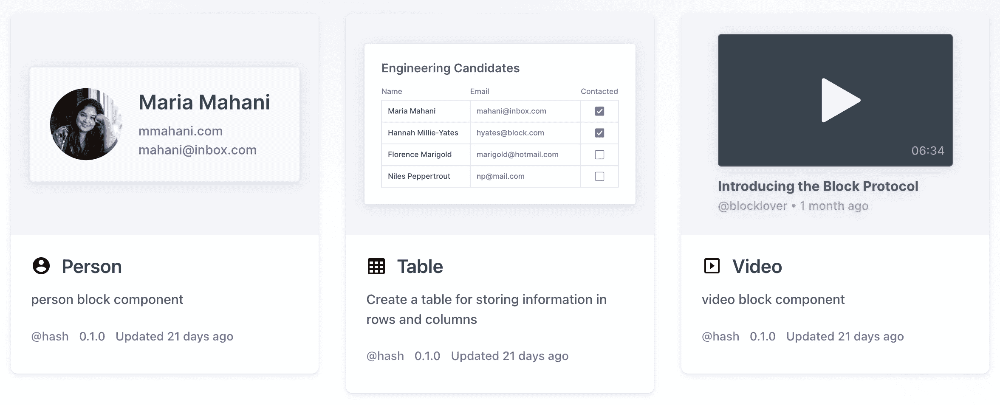

# 乔尔·斯波尔斯基谈用块协议构建网络

> 原文：<https://thenewstack.io/joel-spolsky-on-structuring-the-web-with-the-block-protocol/>

在开放网络和脸书等人创建的专有围墙花园之间的战斗中，乔尔·斯波尔斯基和他在 T2 的联合创始人 T4·大卫·威尔金森站在了开放网络的一边。他们在 HASH 的团队最近[推出了](https://hash.ai/blog/announcing-the-block-protocol)Block Protocol[的初始版本](https://blockprotocol.org/)，这是一个提议的规范，旨在将通常显示在 web 上的数据与其结构和类型相结合——这样不仅更容易跨平台创建和共享数据，而且使该值更容易以各种方式提取和使用。

斯波尔斯基在一次采访中说:“我非常相信网络，我指的是人们制作网站的真实网络，而不是像脸书那样的伪专有围墙花园，它们在某种程度上破坏了网络。”。“当你看网络时，它真正需要的是一点点结构。”

根据 Spolsky 的博客文章“块协议”是“嵌入应用程序可以用来嵌入块的协议”，其中“任何块都可以在任何嵌入应用程序中使用，如果它们都遵循该协议的话。”

积木的例子。

像 WordPress、Medium、concept 或其他内容管理系统和 web 编辑工具这样的工具已经为用户提供了创建内容块的能力，只需快速按下按钮并从块类型列表中进行选择。斯波尔斯基说，问题在于这些系统之间没有统一的共享模式。一个人的待办事项列表不容易转化为另一个人的待办事项列表；这是 Block Protocol 正在寻求解决的问题。

“当 WordPress 的人用 Project Gutenberg editor 添加一个块时，对于 Atlassian Confluence 的人来说是没有用的，他们几乎不得不自己重新实现那个块，”Spolsky 说。“当他们重新实现时，可能会不兼容。它不会使用相同的数据类型。它只是一遍又一遍地重写相同的代码。”

## 这与之前的结构尝试有何不同？

然而，Block 协议并不是第一次尝试将结构化的数据呈现在 web 上。斯波尔斯基说，问题在于，以前的尝试——比如 Schema.org 的 T1 或 T2 的 T3——已经把这个结构作为事后的想法，作为可以不做而对创作者没有任何影响的作业。与此同时，做这些功课的主要好处往往是游戏搜索引擎优化(SEO)算法，而不是向整个网络提供结构化数据。搜索引擎很快就意识到了这一点，并开始完全忽略内容，这导致网络内容创作者放弃了这些结构化的尝试。

斯波尔斯基说，这让他们问了一个简单的问题:“我们有什么办法可以让网络更好地结构化，以一种实际上比他们一开始就忽略结构更容易为网络开发人员编写的方式？”

> “如果块在很多地方都不可用，没人会费心去做块，但是 WordPress 环境中的 Gutenberg 有很多地方都不可用。”

乔尔·斯波尔斯基

网络的基本组成部分——HTML 和 CSS——描述了内容以及它应该如何以人类可读的格式显示，“但它没有描述任何关于这种类型的数据或数据是什么或它做什么，”斯波尔斯基说。“接下来缺少的是添加结构。没有这种结构的最大缺点是，从某种意义上说，网络不是计算机可读的。如果我有一个关于某个事件的网页，上面提到了时间、日期和地点，计算机理解这些内容的唯一方法就是试图猜测它在哪里，也许会使用机器学习或其他方法，但可能会出错。”

对于使用 Block 协议的 web 创作工具，创建的内容将遵循机器和人都能理解的特定格式。通过这种方式，在一个站点上制作的内容(例如，一个事件或一个待办事项列表)可以在任何采用 Block 协议的站点之间移植，也可以被任何希望理解它的应用程序读取。

## 谁在采用块协议

对于任何协议来说，首要的问题之一是获得足够广泛的采用，以使其有价值。但是 Block Protocol 已经表达了对[与古腾堡项目](https://twitter.com/spolsky/status/1486884028443549697)合作的兴趣，该项目提供 WordPress 使用的 Block 编辑器，WordPress 是一个内容管理系统，为大量的网络提供动力。Spolsky 说，一旦 Block 协议进入 Gutenberg，其他网络内容编辑和发布工具将很快受到激励，也采用它。

“如果块在很多地方都不可用，没人会费心去做块，但是 WordPress 环境中的 Gutenberg 有很多地方，”Spolsky 说。“因此，一旦这些区块开始出现，如果你是某种让你在网上写作的工具的创造者，如果你支持这个协议，这将是一个非常非常简单的方法，让你的工具变得更加强大。”

目前，块协议处于非常早期的版本。HASH 的联合创始人大卫·威尔金森(David Wilkinson)也与新的堆栈进行了交谈，他说，当前的目标不仅是增加[块协议中心](https://blockprotocol.org/hub)中可用的块数，而且还要解决样式和安全性等问题。

“我们认为目前概述的方法可能足以实现协议的 v1，但我们希望它们随着时间的推移会完全改变，”威尔金森说。“我们在这些方面有开放的 RFC，我们正在与用户合作开发模块和潜在的嵌入式应用，以及支持该协议。”

<svg xmlns:xlink="http://www.w3.org/1999/xlink" viewBox="0 0 68 31" version="1.1"><title>Group</title> <desc>Created with Sketch.</desc></svg>