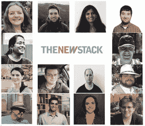

# 加入我们，享受西班牙的小吃和 kube con+CloudNativeCon Europe 2022 的亮点

> 原文：<https://thenewstack.io/join-us-for-tapas-in-spain-and-highlights-of-kubecon-cloudnativecon-europe-2022/>

Kubernetes 根据 [2021 云原生调查](https://www.cncf.io/announcements/2022/02/10/cncf-sees-record-kubernetes-and-container-adoption-in-2021-cloud-native-survey/) 已经达到主流采用，那么接下来呢？正如我们在过去几年中了解到的，用于云原生应用的 Kubernetes 正在快速发展。虽然它带来了灵活性，使企业能够转变其数字运营，但随着团队寻求改善我们在 Kubernetes 上构建和运营的方式，它也在快速转变。这些变化开启了一个新的篇章，将开发人员、技术人员和运营团队聚集在一起，共同应对 Kubernetes 堆栈和应用的复杂性。

加入云原生计算基金会(CNCF)年度旗舰会议的新堆栈，[kube con+CloudNativeCon Europe](https://events.linuxfoundation.org/kubecon-cloudnativecon-europe/)5 月 16-20 日，西班牙瓦伦西亚！我们很高兴通过我们的报道亮点为您带来最新的 Kubernetes 见解。

今年，本着西班牙文化的精神，我们将与我们的赞助商 Spectro Cloud 一起举办我们的首次“Tapas Tuesday”面对面小组讨论，由 New Stack 创始人 Alex Williams 主持。我们还将在展会现场的展位上主持行业专家和云爱好者的播客访谈。顺道拜访一下新的 Stack 团队吧！

### **观看会议预览**

**“kube con+CloudNativeCon 2022 欧洲，在瓦伦西亚:带个口罩****”**

与我们的嘉宾CNCF 执行董事 Priyanka Sharma 和kube con 联席主席兼[CERN](https://home.cern/)计算机工程师 Ricardo Rocha 一起看看今年的 KubeCon EU 2022 有什么期待。NS 主编 Joab Jackson 主持了这个播客，为你带来了虚拟会议的期望，在瓦伦西亚应该做什么，Kubernetes 的现状，并听取了 Sharma 和 Rocha 关于参加什么主题演讲和会议的一些非官方选择。

**[在这里阅读文章并收听播客重播](https://thenewstack.io/kubecon-cloudnativecon-2022-europe-in-valencia-bring-a-mask/)**

### **亲自加入**

**Tapas 周二小组讨论:《蜜月后的 K8s:很复杂》**

 *******时间:**5 月 17 日欧洲中部时间 15:30***

 *****地点:** 礼堂 3A(三楼大厅)*

虽然 Kubernetes 在继续发展，远离我们今天所知的“自己动手”的实验，但要在当今开放源码生态系统的复杂性中航行，还要兼顾 运营团队对控制的期望，以及开发团队对多点云之外的灵活性和优化的期望，包括裸机和边缘位置，这是一个挑战。加入我们备受尊敬的专家小组吧:SingleStore 的首席软件工程师 、p 、Saad Malik 的首席软件工程师、、以及 Spectro Cloud 的联合创始人、和、以及的首席软件工程师 Fabrizio Pandini，我们将深入了解市场趋势、新实践，并回答您提出的需要了解的问题，与此同时，我们也致力于解决在复杂的现代环境中管理 Kubernetes 的难题

您的参与奖是什么？ 今年，我们将赠送 一张 300 美元的 Airbnb 礼品卡，可用于体验！当您 [向我们发送问题](https://docs.google.com/forms/d/e/1FAIpQLSfa56L46ES_1TLheBV_6n9M3lNxfd1X7YTknBGpXbtMrTlKrQ/viewform) 、推文@TheNewStack 或亲自询问您的问题时，您将获得胜利。

**注册**[**ku becon+cloud nativeecon Europe**](https://events.linuxfoundation.org/kubecon-cloudnativecon-europe/)**，然后** [**将事件保存到您的日历中**](https://thenewstack.io/to?url=https://sched.co/11X8S&utm_source=thenewstack&utm_medium=mailchimp&utm_campaign=KCCNC-EU-2022-Registration&utm_content=*%7CCAMPAIGN_UID%7C*&email=*%7CEMAIL%7C*) **。**

### **收听点播播客**

***何时:**5 月 18 日-20 日，任何时候*

我们将在展会现场捕捉来自行业专家的最新见解，比如红帽的库本内斯社区经理乔什·伯克思；VMware 开放源代码总监道恩·福斯特；浮力的营销和社区负责人，凯瑟琳·帕格尼尼；以及 Planet Scale 的 维护人员和技术主管工程师 Deepthi Sigireddi，他们将围绕最新的 技术咨询小组投稿人调查分享他们的见解。 会议结束后，感谢我们的赞助商云原生计算基金会，我们将为您带来采访中的精彩片段，以及其他许多专家。

**官方小吃周二抽奖规则**

与我们的现场 Tapas 周二小组讨论 Spectro Cloud 相呼应，新的 Stack 将向提交活动问题的获胜者提供 Airbnb 体验礼品卡。

任何人都可以参加于 5 月 9 日开始的比赛，方法是填写调查表或在推特上发布他们对周二 Tapas 讨论的问题，并标记@thenewstack，以及注册参加[kube con+CloudNativeCon](https://events.linuxfoundation.org/kubecon-cloudnativecon-europe/)欧洲活动。新的堆栈将通过直接消息联系获奖者，接收他们的姓名和电子邮件地址。

新 Stack 从来没有也永远不会分享您的个人信息，只会将您的电子邮件用于联系获奖者。获胜的可能性将取决于参赛者的总数，估计在 1/100 到 1/500 的范围内。

事件发生后，新堆栈将根据所有参赛日期，在不迟于5 月 27 日 的时间内选择一个获胜者。获胜者将通过他们提供的电子邮件或 Twitter DM 得到通知。将有关调查或抽奖的问题发送至help @ thenewstack . io。

<svg xmlns:xlink="http://www.w3.org/1999/xlink" viewBox="0 0 68 31" version="1.1"><title>Group</title> <desc>Created with Sketch.</desc></svg>****